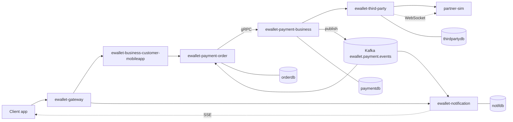

# E-Wallet Business Specs

> Trang gốc của space `EWL`. Đây là **nguồn sự thật nghiệp vụ** của hệ ví điện tử: mọi giá trị trong
> space này là giá trị đúng. Code lệch khỏi tài liệu là drift, và nền tảng v-quality có nhiệm vụ tìm ra.

## Dùng space này thế nào

| Bạn là | Bắt đầu từ |
|---|---|
| BA viết feature mới | Template `VQ - Flow Spec`, đọc trước `[COMMON] Mien nghiep vu va quy uoc` |
| Dev cài đặt nghiệp vụ | Trang flow tương ứng, mục 3 (Business rule) và mục 6 (Bảng liên quan) |
| Tester viết kịch bản | Mục 5 (Acceptance criteria) của trang flow |
| Ops điều tra sự cố | `[CATALOG] Traceability` rồi tới trang flow |
| Lead xem chất lượng | `[CATALOG] NFR` và bảng verdict Jira ở cuối trang này |

---

# 1. Sáu luồng nghiệp vụ

| Mã | Trang | Loại | Endpoint vào | Đặc điểm |
|---|---|---|---|---|
| F1 | [F1] Nap tien vi qua doi tac | ghi | `POST /api/wallet/topup` | Tiền vào ví, đi qua đối tác |
| F2 | [F2] Thanh toan hoa don va nap telco | ghi | `POST /api/wallet/bill/pay` | Tiền ra khỏi ví, có phí, có tra cứu trước |
| F3 | [F3] Chuyen tien P2P | ghi | `POST /api/wallet/transfer` | Nội bộ, không qua đối tác, hai người nhận thông báo |
| F4 | [F4] Giao dich loi va hoan tien | ghi | `POST /api/orders/{id}/refund` | Nhánh bù trừ, đường hay bị bỏ sót khi test |
| F5 | [F5] Thong bao bat dong bo | bất đồng bộ | Kafka | Một topic, hai consumer group |
| F6 | [F6] Tra cuu lich su giao dich | đọc | `GET /api/wallet/transactions` | Flow ngắn nhất, thuần đọc DB |

## 1.1 Bảng tổng hợp flow

> Chèn macro **Page Properties Report** ở đây với:
> - Label: `vq-flow`
> - Cột hiển thị: `Flow ID`, `Flow Name`, `Actor`, `Entry Endpoint`, `Jira Epic`, `Status`, `Doc Version`
>
> Macro này đọc Page Properties của 6 trang flow và dựng bảng tự động. Nếu bảng trống hoặc thiếu dòng,
> nghĩa là trang flow nào đó chưa bọc metadata trong macro Page Properties — sửa ngay, vì Doc Indexer
> cũng sẽ không đọc được trang đó.

---

# 2. Tài liệu nền

| Trang | Nội dung |
|---|---|
| `[COMMON] Mien nghiep vu va quy uoc` | Actor, từ vựng, quy ước tiền tệ, quy ước API, trạng thái, 17 rule dùng chung, bảng phí, hạn mức, dữ liệu seed |
| `[API] Hop dong REST gRPC Kafka` | Toàn bộ interface giữa các service |
| `[CATALOG] Business Rule` | Chỉ mục 62 rule kèm nơi cài đặt |
| `[CATALOG] NFR` | 14 ràng buộc phi chức năng kèm cách đo |
| `[CATALOG] Traceability` | Ma trận rule ↔ code ↔ runtime |

---

# 3. Kiến trúc hệ thống

| Service | Vai trò | Có DB |
|---|---|---|
| `ewallet-gateway` | Route, không có logic nghiệp vụ | không |
| `ewallet-business-customer-mobileapp` | BFF hứng client, validate cú pháp, map DTO | không |
| `ewallet-payment-order` | Điều phối saga, sở hữu vòng đời đơn | `orderdb` |
| `ewallet-payment-business` | Toàn bộ business rule và sổ cái | `paymentdb` |
| `ewallet-third-party` | Ranh giới ra hệ ngoài | `thirdpartydb` |
| `ewallet-notification` | Thông báo bất đồng bộ | `notifdb` |
| `partner-sim` | Giả lập đối tác | không |

---

# 4. Quy ước viết tài liệu trong space này

Tài liệu ở đây **được máy đọc**, không chỉ người đọc. Nền tảng v-quality thu thập space này để đối chiếu
với source code và với hành vi runtime thật. Vì vậy có vài ràng buộc bắt buộc:

1. **Mọi trang flow bắt đầu bằng macro Page Properties** với đủ 14 khoá.
2. **Mọi quy định nghiệp vụ đều có mã** dạng `R-<NHÓM>-<số>`. Quy định không có mã thì không tồn tại
   với nền tảng.
3. **Mọi điều kiện đều có số cụ thể.** Viết "≥ 20.000.000đ", không viết "số tiền lớn".
4. **Mọi ràng buộc hiệu năng đều có đủ 4 phần**: metric, operator, threshold, unit.
5. **Mọi flow đều có sequence diagram bằng Mermaid**, participant ghi đúng tên service.
6. **Tên service trong tài liệu trùng `OTEL_SERVICE_NAME`** và trùng tên Jira Component.

Chi tiết đầy đủ: xem tài liệu `01-CONVENTIONS.md` trong repo `confluence-jira-kit`.

---

# 5. Liên kết Jira

Project Jira tương ứng: **EWL — E-Wallet Quality**.

| Loại issue | Ý nghĩa |
|---|---|
| Epic | một flow (F1–F6) |
| Story | một kịch bản nghiệm thu |
| Task | một rule cần cài đặt, hoặc một ràng buộc hiệu năng cần bảo đảm |
| Bug | vấn đề chất lượng, gồm cả phát hiện tự động của v-quality |

> Chèn macro **Jira Issues** ở đây với JQL:
> `project = EWL AND issuetype = Epic ORDER BY key`

> Chèn macro **Jira Issues** thứ hai để theo dõi verdict của nền tảng:
> `project = EWL AND "Quality Verdict" in (WARN, BLOCK) ORDER BY updated DESC`

---

# 6. Bảng ghi nhận thay đổi tài liệu

| Ngày thay đổi | Vị trí thay đổi | A/M/D | Nguồn gốc | Link CR | Mô tả thay đổi | Phiên bản confluence | Phiên bản mới |
|---|---|---|---|---|---|---|---|
| 16 Sep 2026 | Toàn bộ | A | Stage D specs | | Tạo mới space từ `ewallet-demo/docs/specs/` | 1 | 1.0 |
