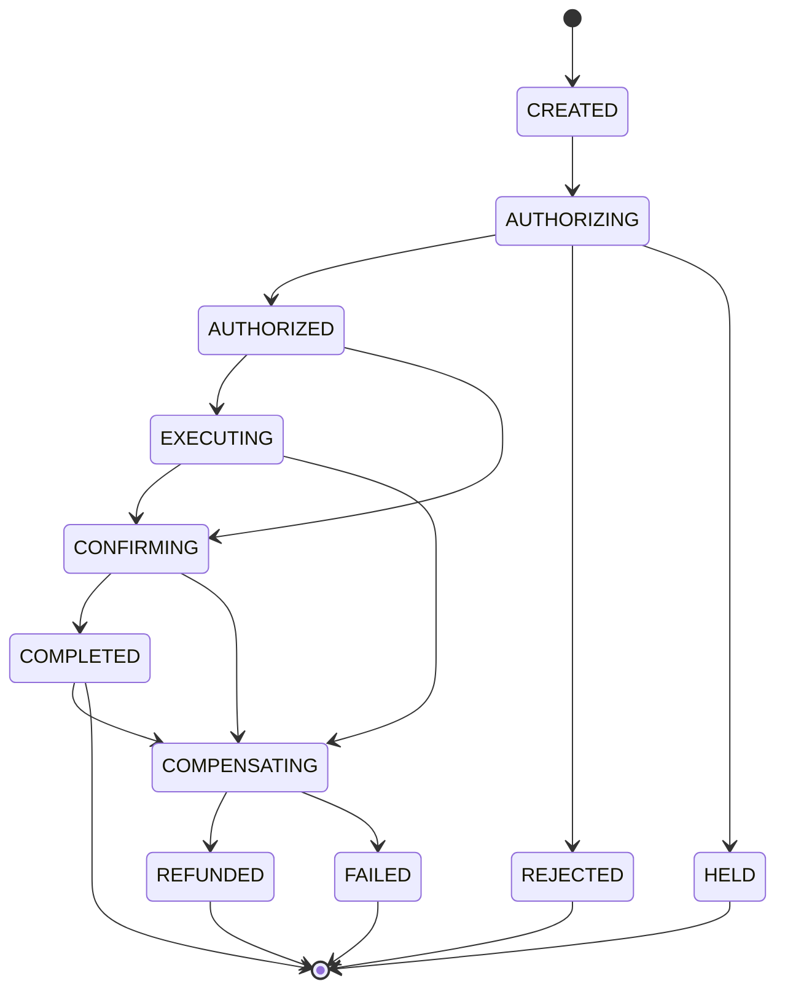

# [COMMON] Mien nghiep vu va quy uoc

> Nguồn gốc: `ewallet-demo/docs/specs/00-domain-and-conventions.md`.
> Nền chung cho mọi flow F1–F6. Đọc trang này trước khi đọc spec từng flow.
> Giá trị trong trang này là giá trị **ĐÚNG theo nghiệp vụ**.

## Page Properties

| Khoá | Giá trị |
|---|---|
| Loại tài liệu | Nền chung |
| Applies To | F1, F2, F3, F4, F5, F6 |
| Spec Source | docs/specs/00-domain-and-conventions.md |
| Doc Version | 1.0 |
| Status | APPROVED |

---

# 1. Bối cảnh nghiệp vụ

Ví điện tử cho khách hàng cá nhân. Khách nạp tiền vào ví qua đối tác, dùng số dư ví để thanh toán hoá đơn
và nạp điện thoại, chuyển tiền cho ví khác, và nhận thông báo cho mọi biến động số dư.

Hệ thống chia theo mô hình microservice: **BFF** hứng client, **payment-order** điều phối giao dịch (saga),
**payment-business** giữ toàn bộ business rule và sổ cái, **third-party** là ranh giới ra hệ ngoài,
**notification** phát thông báo bất đồng bộ.

# 2. Actor

| Actor | Mô tả |
|---|---|
| Khách hàng | Người dùng app ví. Định danh bằng `customerId`, ví dụ `CUST-001` |
| Đối tác | Ngân hàng hoặc nhà cung cấp dịch vụ ngoài (VNPAY, EVN, VTELCO) |
| Hệ thống | Consumer Kafka, job đối soát — chạy không có người bấm |
| Ops / Lead | Tra cứu đơn và hạn mức qua endpoint `/admin/**` nội bộ |

# 3. Sáu flow

| Mã | Tên | Loại | Service đi qua |
|---|---|---|---|
| F1 | Nạp tiền ví qua đối tác | ghi | gateway → mobileapp → order → business → third-party → partner-sim → Kafka → notification |
| F2 | Thanh toán hoá đơn / nạp telco | ghi | như F1, thêm bước tra cứu hoá đơn |
| F3 | Chuyển tiền P2P trong ví | ghi | gateway → mobileapp → order → business → Kafka → notification |
| F4 | Giao dịch lỗi và hoàn tiền | ghi | như F1, thêm nhánh bù trừ ở order |
| F5 | Thông báo bất đồng bộ | bất đồng bộ | business → Kafka → notification (SSE) + order |
| F6 | Tra cứu lịch sử giao dịch | đọc | gateway → mobileapp → order → orderdb |

# 4. Từ vựng miền

| Thuật ngữ | Nghĩa trong hệ này |
|---|---|
| Order (`payment_orders`) | Một yêu cầu giao dịch của khách, do `payment-order` sở hữu, có vòng đời saga |
| Transaction (`payment_transactions`) | Bút toán nghiệp vụ tương ứng order, do `payment-business` sở hữu. Hai pha `AUTHORIZED` → `CAPTURED` |
| Ledger entry | Bút toán kép. Mỗi transaction sinh **đúng 2** dòng: 1 DEBIT, 1 CREDIT, cùng `txn_id` |
| Authorize | Kiểm tra rule và giữ tiền (ledger `PENDING`). Chưa phải kết thúc |
| Capture / Confirm | Chốt giao dịch: ledger `PENDING` → `POSTED`, publish event |
| Reverse | Bù trừ: sinh 2 bút toán ngược chiều với `txn_id` mới, loại `REFUND` |
| Hold (HELD) | Giao dịch vượt ngưỡng rà soát, treo chờ duyệt thủ công. Tiền **vẫn bị giữ** |
| Daily usage | Tổng giá trị quy đổi VND các giao dịch của khách trong ngày, dùng so hạn mức |
| Partner ref | Mã tham chiếu do đối tác trả về, dùng đối soát |
| Settlement | Đối tác xác nhận đã quyết toán, đến qua WebSocket sau khi HTTP đã trả |

# 5. Quy ước tiền tệ và số

- Đơn vị: **VND, số nguyên đồng** (`BIGINT`). Không dùng số thực cho tiền.
- `currency` mặc định `VND`. Hỗ trợ `USD` cho ca khác loại tiền tệ ở F2.
- Quy đổi về VND trước khi so hạn mức, dùng bảng `fx_rates`. Seed: `VND = 1`, `USD = 25.000`.
- Làm tròn phí: làm tròn **lên** bội số 1.000đ.

# 6. Quy ước API

| Hạng mục | Quy ước |
|---|---|
| Base URL demo | `http://localhost:18080` (gateway) |
| Prefix client | `/api/wallet/**` → mobileapp · `/api/notifications/**` → notification · `/orders/**` → order (nội bộ/Ops) |
| Content type | `application/json; charset=utf-8` |
| Idempotency | Mọi request **ghi** bắt buộc header `X-Idempotency-Key` (UUID do client sinh) |
| Correlation | `traceparent` do OTel agent tự gắn. Response luôn có `X-Trace-Id` |
| Khách hàng | Header `X-Customer-Id` hoặc field `customerId` trong body |
| Mã lỗi | `{"code": "...", "message": "...", "traceId": "..."}` |

## 6.1 HTTP status quy ước

| Status | Khi nào |
|---|---|
| `200 OK` | Giao dịch hoàn tất (`COMPLETED`) hoặc truy vấn thành công |
| `202 Accepted` | Giao dịch được nhận nhưng chưa kết thúc — trạng thái `HELD` |
| `400 Bad Request` | Sai định dạng, thiếu field, thiếu `X-Idempotency-Key` |
| `409 Conflict` | Trùng `X-Idempotency-Key` với payload khác |
| `422 Unprocessable Entity` | Vi phạm business rule |
| `502 Bad Gateway` | Đối tác từ chối sau khi đã bù trừ xong |
| `504 Gateway Timeout` | Đối tác timeout, đã bù trừ xong |

## 6.2 Bảng mã lý do

| Mã | Nghĩa | Trả về ở |
|---|---|---|
| `OK` | Hợp lệ | mọi flow |
| `ACCOUNT_NOT_FOUND` | Không tìm thấy ví nguồn hoặc đích | F1–F4 |
| `ACCOUNT_INACTIVE` | Ví bị khoá | F1–F4 |
| `AMOUNT_TOO_SMALL` | `amount` nhỏ hơn hạn mức tối thiểu | F1–F3 |
| `AMOUNT_TOO_LARGE` | `amount` lớn hơn hạn mức mỗi giao dịch | F1–F3 |
| `LIMIT_EXCEEDED` | Vượt hạn mức ngày | F1–F3 |
| `INSUFFICIENT_FUNDS` | Số dư không đủ, gồm cả phí | F2, F3 |
| `CURRENCY_NOT_SUPPORTED` | Tiền tệ không có trong `fx_rates` | F2 |
| `MANUAL_REVIEW` | Vượt ngưỡng rà soát, chuyển `HELD` | F1–F3 |
| `PARTNER_DECLINED` | Đối tác từ chối | F1, F2, F4 |
| `PARTNER_TIMEOUT` | Đối tác không phản hồi trong hạn | F1, F2, F4 |
| `BILL_NOT_FOUND` | Không tra được hoá đơn | F2 |
| `BILL_ALREADY_PAID` | Hoá đơn đã thanh toán | F2 |
| `DUPLICATE_REQUEST` | Trùng idempotency key | F1–F4 |

# 7. Trạng thái

## 7.1 Order — sở hữu bởi `ewallet-payment-order`

| Trạng thái | Nghĩa |
|---|---|
| `CREATED` | Đã ghi nhận yêu cầu, chưa gọi ai |
| `AUTHORIZING` | Đang gọi gRPC `AuthorizePayment` |
| `AUTHORIZED` | Business đã duyệt và giữ tiền |
| `EXECUTING` | Đang gọi đối tác (chỉ F1/F2) |
| `CONFIRMING` | Đang gọi `ConfirmPayment` |
| `COMPLETED` | Kết thúc thành công (terminal) |
| `HELD` | Treo chờ duyệt thủ công |
| `REJECTED` | Business từ chối, chưa giữ tiền (terminal) |
| `COMPENSATING` | Đang bù trừ sau lỗi ở bước sau authorize |
| `REFUNDED` | Đã bù trừ xong, tiền đã trả lại (terminal) |
| `FAILED` | Thất bại, không cần hoặc không thể bù trừ (terminal) |

## 7.2 Transaction — sở hữu bởi `ewallet-payment-business`

`AUTHORIZED` → `CAPTURED` (confirm) · `AUTHORIZED` → `REVERSED` (reverse) · `HELD` · `REJECTED`.

## 7.3 Ledger entry

`PENDING` (khi authorize) → `POSTED` (khi capture) · `REVERSED` (khi reverse, đồng thời sinh cặp
bút toán mới `POSTED`).

# 8. Business rule dùng chung

| Mã | Điều kiện | Hành động | Severity |
|---|---|---|---|
| `R-IDEM-01` | Request ghi không có `X-Idempotency-Key` | Từ chối `400` | must |
| `R-IDEM-02` | Trùng `X-Idempotency-Key` và payload giống hệt | Trả lại kết quả cũ, không tạo order mới | must |
| `R-IDEM-03` | Trùng `X-Idempotency-Key` nhưng payload khác | Từ chối `409 DUPLICATE_REQUEST` | must |
| `R-ACCOUNT-01` | Ví nguồn không tồn tại | Từ chối `ACCOUNT_NOT_FOUND` | must |
| `R-ACCOUNT-02` | Ví nguồn có `status` khác `ACTIVE` | Từ chối `ACCOUNT_INACTIVE` | must |
| `R-AMOUNT-01` | `amount` nhỏ hơn 10.000đ | Từ chối `AMOUNT_TOO_SMALL` | must |
| `R-AMOUNT-02` | `amount` lớn hơn hạn mức mỗi giao dịch theo loại: TOP_UP 50.000.000đ, BILL 50.000.000đ, P2P 30.000.000đ | Từ chối `AMOUNT_TOO_LARGE` | must |
| `R-LIMIT-01` | Tổng giá trị giao dịch trong ngày quy đổi VND, gồm cả giao dịch đang giữ, **vượt 50.000.000đ** | Từ chối `LIMIT_EXCEEDED` | must |
| `R-REVIEW-01` | `amount` quy đổi VND **≥ 20.000.000đ** | Đặt trạng thái `HELD`, giữ tiền, **publish event `PaymentHeld`** | must |
| `R-CURRENCY-01` | `currency` khác `VND` | Quy đổi sang VND theo `fx_rates` **trước khi** áp `R-AMOUNT-02`, `R-LIMIT-01`, `R-REVIEW-01`. Không có tỉ giá thì `CURRENCY_NOT_SUPPORTED` | must |
| `R-BALANCE-01` | Số dư ví nguồn nhỏ hơn `amount + fee` | Từ chối `INSUFFICIENT_FUNDS` | must |
| `R-LEDGER-01` | Mọi transaction được authorize | Ghi **đúng 2** `ledger_entries` (1 DEBIT + 1 CREDIT) cùng `txn_id`, tổng bằng 0 | must |
| `R-LEDGER-02` | Bù trừ một transaction | Ghi 2 bút toán ngược chiều, `txn_id` mới, `entry_type=REFUND`, **không** sửa bút toán gốc | must |
| `R-USAGE-01` | Transaction được authorize hoặc HELD | Cộng `amount_vnd` vào `daily_usage` của khách trong ngày | must |
| `R-USAGE-02` | Transaction bị reverse | Trừ `amount_vnd` khỏi `daily_usage` của ngày gốc | must |
| `R-EVENT-01` | Transaction vào trạng thái kết thúc (`CAPTURED`/`REJECTED`/`HELD`/`REVERSED`) | Publish **đúng 1** event lên `ewallet.payment.events` | must |
| `R-EVENT-02` | Publish event | `key = orderId` để mọi event của một order về cùng partition, giữ thứ tự | must |

## 8.1 Bảng phí

| Mã | Loại | Công thức | Severity |
|---|---|---|---|
| `R-FEE-01` | `TOP_UP` | Phí bằng 0, đối tác chịu phí | must |
| `R-FEE-02` | `BILL` | `min(max(round_up_1000(amount × 0.5%), 1.000), 5.000)` — sàn 1.000đ, trần 5.000đ | must |
| `R-FEE-03` | `TELCO` | Phí bằng 0, khuyến mại | must |
| `R-FEE-04` | `P2P` | 0 nếu `amount` ≤ 2.000.000đ, ngược lại 2.200đ | must |
| `R-FEE-05` | `REFUND` | Hoàn tiền không thu phí; phí gốc được hoàn lại | must |

Phí luôn trừ vào **ví nguồn**, ghi thành bút toán riêng `entry_type=FEE` về tài khoản `SYSTEM_FEE`.

# 9. Cấu hình hạn mức

| Khoá | Giá trị đúng theo nghiệp vụ | Nơi đọc lúc chạy |
|---|---|---|
| `DAILY_TRANSFER_LIMIT` | **50.000.000 VND** | bảng `limit_config` trong `paymentdb` |
| `REVIEW_THRESHOLD` | **20.000.000 VND** | `limit_config` |
| `MIN_TXN_AMOUNT` | 10.000 VND | `limit_config` |
| `MAX_TXN_TOP_UP` | 50.000.000 VND | `limit_config` |
| `MAX_TXN_BILL` | 50.000.000 VND | `limit_config` |
| `MAX_TXN_P2P` | 30.000.000 VND | `limit_config` |
| `PARTNER_TIMEOUT_MS` | 3.000 ms | cấu hình service |

> Đây là bảng mà v-quality đối chiếu trực tiếp với hằng số trong code. Mọi con số hạn mức **phải** đọc
> từ `limit_config` lúc chạy, không được hard-code trong class Java.

# 10. Dữ liệu seed cho môi trường demo

## 10.1 Ví khách hàng

| customerId | Tên | Số dư ban đầu | Dùng cho |
|---|---|---|---|
| `CUST-001` | Nguyễn Văn A | 5.000.000 | F1, F2 happy path |
| `CUST-002` | Trần Thị B | 1.000.000 | Người nhận F3 |
| `CUST-003` | Lê Văn C | 300.000.000 | Demo hạn mức và HELD |
| `CUST-004` | Phạm Thị D | 50.000 | Demo `INSUFFICIENT_FUNDS` |
| `CUST-DLQ` | Vũ Văn E | 10.000.000 | Demo retry và DLT ở notification |

## 10.2 Tài khoản hệ thống

| Vai trò | account_type |
|---|---|
| Treo nạp tiền (nguồn của TOP_UP) | `SYSTEM_SUSPENSE` |
| Thu phí | `SYSTEM_FEE` |
| Quyết toán VNPAY / EVN / VTELCO | `PARTNER_SETTLE` |

## 10.3 Hoá đơn giả lập

| partnerCode | billCode | Số tiền | Trạng thái |
|---|---|---|---|
| `EVN` | `PE0123456789` | 1.250.000 | `UNPAID` |
| `EVN` | `PE0999999999` | 850.000 | `PAID`, trả `BILL_ALREADY_PAID` |
| `EVN` | mã khác | — | `BILL_NOT_FOUND` |
| `VTELCO` | số thuê bao 10 chữ số | do client nhập | luôn hợp lệ |

## 10.4 Hành vi tất định của đối tác giả lập

| Điều kiện | Hành vi |
|---|---|
| `amount % 1000 == 999` | Trả `DECLINED` / `PARTNER_DECLINED`, kích hoạt nhánh bù trừ F4 |
| `amount % 1000 == 888` | Ngủ 5.000ms, third-party timeout ở 3.000ms, trả `PARTNER_TIMEOUT` |
| còn lại | `SUCCESS`, độ trễ ngẫu nhiên 50–250ms |

# 11. NFR dùng chung

| Mã | metric | operator | threshold | unit |
|---|---|---|---|---|
| `NFR-LAT-01` | latency_p95 | `<` | 500 | ms |
| `NFR-LAT-02` | latency_p95 | `<` | 2000 | ms |
| `NFR-LAT-03` | latency_p95 | `<` | 800 | ms |
| `NFR-LAT-04` | latency_p95 | `<` | 300 | ms |
| `NFR-LAT-05` | latency_p95 | `<` | 5000 | ms |
| `NFR-TIMEOUT-01` | timeout | `<=` | 3000 | ms |
| `NFR-ERR-01` | error_rate | `<` | 1 | percent |

Chi tiết điểm đo của từng NFR xem trang `[CATALOG] NFR`.

# 12. Quan sát (observability)

| Hạng mục | Quy ước |
|---|---|
| Tên service trong trace | `OTEL_SERVICE_NAME` trùng tên thư mục service và trùng tên Jira Component |
| Resource attribute | `service.namespace=ewallet`, `deployment.environment=demo` |
| Log | JSON, có `trace_id` và `span_id` trong MDC |
| Trace xuyên Kafka | `traceparent` trong header message |
| Trace xuyên WebSocket | `traceparent` trong frame |

# 13. Bảng ghi nhận thay đổi tài liệu

| Ngày thay đổi | Vị trí thay đổi | A/M/D | Nguồn gốc | Link CR | Mô tả thay đổi | Phiên bản confluence | Phiên bản mới |
|---|---|---|---|---|---|---|---|
| 16 Sep 2026 | Toàn bộ | A | Stage D specs | | Tạo mới tài liệu từ `docs/specs/00-domain-and-conventions.md` | 1 | 1.0 |
