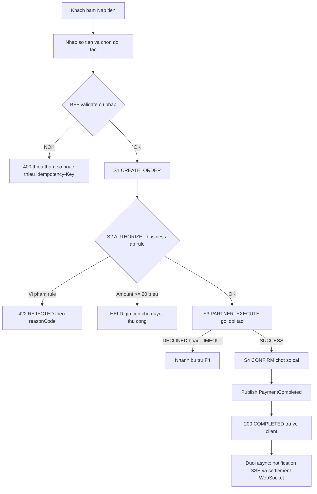
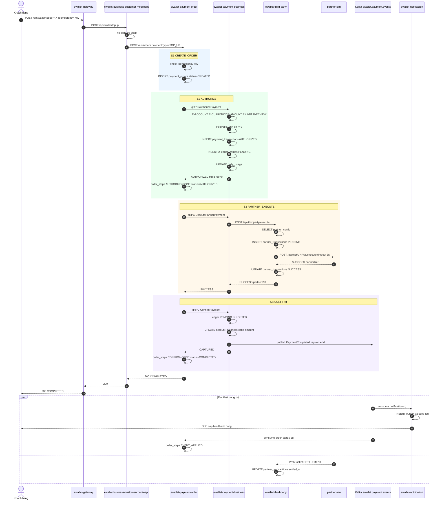

# [F1] Nap tien vi qua doi tac

> Trang Confluence. Nguồn gốc: `ewallet-demo/docs/specs/F1-topup-partner.md`.
> Giá trị trong trang này là giá trị **ĐÚNG theo nghiệp vụ**. Code có thể lệch — phần lệch là drift
> mà v-quality phải phát hiện.

## Page Properties

| Khoá | Giá trị |
|---|---|
| Flow ID | F1 |
| Flow Slug | topup-partner |
| Flow Name | Nạp tiền ví qua đối tác |
| Actor | Khách hàng |
| Trigger | Khách bấm Nạp tiền trên app, chọn đối tác và số tiền |
| Loại | ghi |
| Services | ewallet-gateway, ewallet-business-customer-mobileapp, ewallet-payment-order, ewallet-payment-business, ewallet-third-party, partner-sim, ewallet-notification |
| Protocols | HTTP, gRPC, Kafka, WebSocket, SSE, JDBC |
| Entry Endpoint | POST /api/wallet/topup |
| Kafka Topics | ewallet.payment.events |
| Jira Epic | EWL-1 |
| Spec Source | docs/specs/F1-topup-partner.md |
| Doc Version | 1.0 |
| Status | APPROVED |

---

# 1. Mô tả chung

| Hạng mục | Nội dung |
|---|---|
| Mục đích | Cho phép khách hàng chuyển tiền từ tài khoản ở đối tác (ngân hàng / cổng thanh toán) vào ví điện tử |
| Loại chức năng | Mobile app + API |
| Đối tượng sử dụng | Khách hàng cá nhân |
| Đối tượng ảnh hưởng | Khách hàng, đối tác thanh toán |
| Kênh áp dụng | E-Wallet Mobile App |
| Ngôn ngữ | Tiếng Việt |
| Đường dẫn chức năng | Đăng nhập App → Trang chủ → Nạp tiền |

## 1.1 Mục đích

Khách hàng nạp tiền từ tài khoản mở tại đối tác (VNPAY) vào ví. Sau khi flow kết thúc, số dư ví tăng
đúng bằng số tiền nạp, sổ cái cân bằng, và khách nhận được thông báo. Tiền đi **vào** ví — đây là điểm
khác cơ bản với F2 và F3, nơi tiền đi ra.

## 1.2 Phạm vi

**Trong phạm vi**: tạo đơn, áp business rule, giữ tiền, gọi đối tác, chốt sổ, phát event, gửi thông báo.

**Ngoài phạm vi**: xác thực người dùng, 3-D Secure, đối soát cuối ngày, khách chủ động huỷ đơn
(nhánh lỗi do [F4] xử lý).

## 1.3 Tiền điều kiện

1. Khách có ví ở trạng thái `ACTIVE`.
2. `partnerCode` tồn tại trong `partner_config` và `enabled = true`.
3. Dịch vụ đối tác đang hoạt động.
4. Client sinh được `X-Idempotency-Key` (UUID).

## 1.4 Hậu điều kiện

Khi thành công:

1. `payment_orders.status = COMPLETED`, có `txn_id` và `partner_ref`.
2. `payment_transactions.status = CAPTURED`.
3. Có **đúng 2** `ledger_entries` trạng thái `POSTED` cùng `txn_id`: DEBIT `SYSTEM_SUSPENSE`, CREDIT ví khách.
4. `account_balances` của ví khách tăng đúng `amount`.
5. `daily_usage` của khách trong ngày tăng `amount_vnd`.
6. `partner_transactions.status = SUCCESS`, `settled_at` được điền qua WebSocket (trễ khoảng 300ms).
7. Kafka có đúng 1 event `PaymentCompleted`; hai consumer group đều xử lý.
8. `notification_outbox` có ít nhất 1 dòng, `notification_sent_log` ghi `SENT`.

---

# 2. Luồng nghiệp vụ

## 2.1 Biểu đồ luồng



## 2.2 Sequence diagram



## 2.3 Mô tả chi tiết nghiệp vụ

| Bước | Mô tả | Thực hiện bởi | Rule áp dụng |
|---|---|---|---|
| 1 | Khách gửi `POST /api/wallet/topup` kèm header `X-Idempotency-Key` | ewallet-gateway | R-IDEM-01 |
| 2 | Gateway route sang BFF, thêm header `X-Gateway` | ewallet-gateway | |
| 3 | BFF validate cú pháp: số tiền dương, `partnerCode` không rỗng | ewallet-business-customer-mobileapp | R-IDEM-01 |
| 4 | BFF gọi `POST /api/orders` với `paymentType = TOP_UP` | ewallet-business-customer-mobileapp | |
| 5 | S1 CREATE_ORDER — kiểm tra idempotency, ghi `payment_orders` trạng thái `CREATED` | ewallet-payment-order | R-IDEM-02, R-IDEM-03 |
| 6 | S2 AUTHORIZE — gọi gRPC `AuthorizePayment`, đặt order `AUTHORIZING` | ewallet-payment-order | |
| 7 | Business áp rule tài khoản, tiền tệ, số tiền, hạn mức, ngưỡng rà soát; tính phí; ghi transaction `AUTHORIZED` + 2 ledger `PENDING`; cộng `daily_usage` | ewallet-payment-business | R-ACCOUNT-01, R-ACCOUNT-02, R-CURRENCY-01, R-AMOUNT-01, R-AMOUNT-02, R-LIMIT-01, R-REVIEW-01, R-FEE-01, R-LEDGER-01, R-USAGE-01 |
| 8 | Business trả `AUTHORIZED` kèm `ledgerTxnId` và `fee`. Order ghi step `AUTHORIZE=DONE` | ewallet-payment-business | |
| 9 | S3 PARTNER_EXECUTE — gọi gRPC `ExecutePartnerPayment`, order sang `EXECUTING` | ewallet-payment-order | R-TOPUP-06 |
| 10 | Business gọi `POST /api/thirdparty/execute` | ewallet-payment-business | R-TOPUP-02 |
| 11 | Third-party đọc `partner_config`, ghi `partner_transactions` `PENDING`, chọn adapter theo `service_type` | ewallet-third-party | R-TOPUP-03 |
| 12 | Third-party gọi `POST /partner/VNPAY/execute` với timeout 3000ms | ewallet-third-party | NFR-TIMEOUT-01 |
| 13 | Partner-sim trả `SUCCESS` kèm `partnerRef` | partner-sim | R-TOPUP-05 |
| 14 | Third-party cập nhật `partner_transactions = SUCCESS`, gửi frame WATCH qua WebSocket | ewallet-third-party | |
| 15 | Business nhận `SUCCESS`, lưu `partner_ref` vào transaction | ewallet-payment-business | |
| 16 | S4 CONFIRM — gọi gRPC `ConfirmPayment`, order sang `CONFIRMING` | ewallet-payment-order | |
| 17 | Business chuyển ledger `PENDING` sang `POSTED`, cập nhật `account_balances`, transaction sang `CAPTURED` | ewallet-payment-business | R-LEDGER-01 |
| 18 | Business publish `PaymentCompleted` lên `ewallet.payment.events` với key là `orderId` | ewallet-payment-business | R-EVENT-01, R-EVENT-02 |
| 19 | Order ghi step `CONFIRM=DONE`, đặt `COMPLETED`, trả kết quả lên BFF | ewallet-payment-order | |
| 20 | BFF map sang DTO client, trả `200 OK` | ewallet-business-customer-mobileapp | |
| 21 | Đuôi async — `notification-cg` nhận event, ghi outbox, đẩy SSE | ewallet-notification | R-NOTIF-01 |
| 22 | Đuôi async — `order-status-cg` nhận event, ghi `order_steps EVENT_APPLIED` | ewallet-payment-order | R-ORDST-03 |
| 23 | Đuôi async — partner-sim đẩy frame SETTLEMENT qua WebSocket, third-party điền `settled_at` | ewallet-third-party | |

Bước 19–20 **không chờ** bước 21–23. Client nhận phản hồi ngay sau bước 19.

## 2.4 Luồng phụ và ngoại lệ

| Mã | Điều kiện | Xử lý | Kết quả cho client |
|---|---|---|---|
| A1 | Thiếu `X-Idempotency-Key` | BFF từ chối ngay, không tạo đơn | `400` |
| A2 | Trùng idempotency key, payload giống hệt | Order trả lại đơn cũ theo R-IDEM-02 | `200` với đơn cũ |
| A3 | Trùng idempotency key, payload khác | R-IDEM-03 | `409 DUPLICATE_REQUEST` |
| A4 | Ví không tồn tại hoặc bị khoá | Business `REJECTED`, publish `PaymentFailed`, order `REJECTED` | `422 ACCOUNT_NOT_FOUND` hoặc `ACCOUNT_INACTIVE` |
| A5 | `amount` ngoài khoảng cho phép | R-AMOUNT-01 / R-AMOUNT-02 | `422 AMOUNT_TOO_SMALL` hoặc `AMOUNT_TOO_LARGE` |
| A6 | Vượt hạn mức ngày | R-LIMIT-01, không ghi ledger | `422 LIMIT_EXCEEDED` |
| A7 | `amount` ≥ 20.000.000đ | R-REVIEW-01: transaction `HELD`, giữ tiền, publish `PaymentHeld`, order `HELD`, dừng saga tại S2 | `202` với `status=HELD` |
| A8 | Đối tác từ chối hoặc timeout ở S3 | Nhánh bù trừ, xem [F4] | `502` hoặc `504`, order `REFUNDED` |
| A9 | `ConfirmPayment` lỗi hạ tầng ở S4 | Order retry 2 lần, vẫn lỗi thì bù trừ (F4) | `502`, order `REFUNDED` |
| A10 | Kafka down khi publish | Business ghi log lỗi, vẫn trả `CAPTURED` cho order; event bù bằng job đối soát | `200` nhưng không có thông báo |

---

# 3. Business rule

## 3.1 Rule riêng của F1

| Mã | Điều kiện | Hành động | Severity |
|---|---|---|---|
| `R-TOPUP-01` | `paymentType = TOP_UP` | Ví nguồn là tài khoản hệ thống `SYSTEM_SUSPENSE`, ví đích là ví khách. Không áp `R-BALANCE-01` vì tiền đến từ đối tác | must |
| `R-TOPUP-02` | `partnerCode` rỗng hoặc không có trong `partner_config` | Từ chối `PARTNER_DECLINED`, không ghi ledger | must |
| `R-TOPUP-03` | `partner_config.service_type` khác `TOPUP` | Từ chối `PARTNER_DECLINED` | must |
| `R-TOPUP-04` | Nạp tiền thành công | Phí bằng 0 theo `R-FEE-01`, đối tác chịu phí | must |
| `R-TOPUP-05` | Đối tác trả `SUCCESS` nhưng `partnerRef` rỗng | Coi như thất bại, vào nhánh bù trừ | should |
| `R-TOPUP-06` | Giao dịch đã `CAPTURED` | Không cho phép execute lại cùng `orderId` ở đối tác | must |

## 3.2 Rule dùng chung mà F1 áp dụng

`R-IDEM-01` · `R-IDEM-02` · `R-IDEM-03` · `R-ACCOUNT-01` · `R-ACCOUNT-02` · `R-AMOUNT-01` · `R-AMOUNT-02` ·
`R-LIMIT-01` · `R-REVIEW-01` · `R-CURRENCY-01` · `R-LEDGER-01` · `R-USAGE-01` · `R-EVENT-01` · `R-EVENT-02` · `R-FEE-01`

Chi tiết xem trang `[COMMON] Mien nghiep vu va quy uoc`.

---

# 4. NFR

| Mã | metric | operator | threshold | unit |
|---|---|---|---|---|
| `NFR-LAT-01` | latency_p95 | `<` | 500 | ms |
| `NFR-LAT-02` | latency_p95 | `<` | 2000 | ms |
| `NFR-TIMEOUT-01` | timeout | `<=` | 3000 | ms |
| `NFR-ERR-01` | error_rate | `<` | 1 | percent |

Điểm đo: `NFR-LAT-01` đo tại span gRPC `AuthorizePayment`; `NFR-LAT-02` đo end-to-end tại gateway
cho route `POST /api/wallet/topup`; `NFR-TIMEOUT-01` đo tại lời gọi HTTP từ `ewallet-third-party`
sang `partner-sim`.

---

# 5. Acceptance criteria

```gherkin
Scenario: Nap tien thanh cong qua VNPAY
  Given khach CUST-001 co vi ACTIVE so du 5.000.000d
  When khach goi POST /api/wallet/topup voi amount=500000 partnerCode=VNPAY
  Then response 200 va status=COMPLETED
  And so du vi CUST-001 la 5.500.000d
  And co dung 2 ledger_entries POSTED cung txn_id
  And co 1 event PaymentCompleted tren ewallet.payment.events
  And notification_outbox co ban ghi cho CUST-001

Scenario: Nap tien vuot nguong ra soat thi bi treo
  Given khach CUST-003 co vi ACTIVE
  When khach goi POST /api/wallet/topup voi amount=25000000
  Then response 202 va status=HELD
  And payment_transactions.status=HELD va tien van bi giu
  And co 1 event PaymentHeld tren ewallet.payment.events

Scenario: Nap tien vuot han muc ngay thi bi tu choi
  Given khach CUST-003 da giao dich 40.000.000d trong ngay
  When khach goi POST /api/wallet/topup voi amount=15000000
  Then response 422 va reasonCode=LIMIT_EXCEEDED
  And khong co ledger_entries moi

Scenario: Thieu Idempotency-Key thi bi tu choi
  When khach goi POST /api/wallet/topup khong co header X-Idempotency-Key
  Then response 400
  And khong co payment_orders nao duoc tao

Scenario: Goi lai cung Idempotency-Key voi cung payload
  Given mot don topup da COMPLETED voi key K
  When goi lai cung key K va cung payload
  Then response 200 va tra ve dung don cu
  And khong co transaction moi duoc tao
```

---

# 6. Bảng/Thực thể liên quan

| Database | Bảng | Thao tác | Ghi chú |
|---|---|---|---|
| `orderdb` | `payment_orders` | INSERT, UPDATE | vòng đời saga `CREATED` → `COMPLETED` |
| `orderdb` | `order_steps` | INSERT | `CREATE_ORDER`, `AUTHORIZE`, `PARTNER_EXECUTE`, `CONFIRM`, `EVENT_APPLIED` |
| `paymentdb` | `payment_transactions` | INSERT, UPDATE | `AUTHORIZED` → `CAPTURED` |
| `paymentdb` | `ledger_entries` | INSERT, UPDATE | 2 dòng, `PENDING` → `POSTED` |
| `paymentdb` | `account_balances` | UPDATE | ví khách tăng `amount` |
| `paymentdb` | `daily_usage` | UPSERT | cộng `amount_vnd` |
| `paymentdb` | `limit_config` | SELECT | nguồn hạn mức đúng theo spec |
| `thirdpartydb` | `partner_config` | SELECT | |
| `thirdpartydb` | `partner_transactions` | INSERT, UPDATE | `PENDING` → `SUCCESS`, `settled_at` |
| `notifdb` | `notification_outbox` | INSERT, UPDATE | |
| `notifdb` | `notification_sent_log` | INSERT | |

---

# 7. Danh sách mã lỗi

| Mã lỗi | HTTP status | Message | Sinh ra ở |
|---|---|---|---|
| `DUPLICATE_REQUEST` | 409 | Yêu cầu trùng với giao dịch trước đó | ewallet-payment-order |
| `ACCOUNT_NOT_FOUND` | 422 | Không tìm thấy ví | ewallet-payment-business |
| `ACCOUNT_INACTIVE` | 422 | Ví đang bị khoá | ewallet-payment-business |
| `AMOUNT_TOO_SMALL` | 422 | Số tiền nhỏ hơn mức tối thiểu 10.000đ | ewallet-payment-business |
| `AMOUNT_TOO_LARGE` | 422 | Số tiền vượt hạn mức mỗi giao dịch | ewallet-payment-business |
| `LIMIT_EXCEEDED` | 422 | Vượt hạn mức giao dịch trong ngày | ewallet-payment-business |
| `MANUAL_REVIEW` | 202 | Giao dịch đang chờ duyệt | ewallet-payment-business |
| `PARTNER_DECLINED` | 502 | Đối tác từ chối giao dịch | ewallet-third-party |
| `PARTNER_TIMEOUT` | 504 | Đối tác không phản hồi | ewallet-third-party |

---

# 8. Chức năng ảnh hưởng

| Flow bị ảnh hưởng | Vì sao | Mức |
|---|---|---|
| [F2] Thanh toán hoá đơn | Dùng chung `payment-order` saga + `payment-business` rule + `third-party` | cao |
| [F3] Chuyển tiền P2P | Dùng chung `payment-business` rule engine và ledger | cao |
| [F4] Giao dịch lỗi | F1 là nguồn sinh nhánh bù trừ F4a, F4c | cao |
| [F5] Thông báo | Event `PaymentCompleted` của F1 là đầu vào F5 | trung bình |
| [F6] Lịch sử | Đơn F1 xuất hiện trong danh sách lịch sử | thấp |

> Chèn macro Jira Issues: `project = EWL AND "Flow Slug" ~ "topup-partner" ORDER BY issuetype`

---

# 9. Bảng ghi nhận thay đổi tài liệu

A – Tạo mới, M – Sửa đổi, D – Xoá bỏ

| Ngày thay đổi | Vị trí thay đổi | A/M/D | Nguồn gốc | Link CR | Mô tả thay đổi | Phiên bản confluence | Phiên bản mới |
|---|---|---|---|---|---|---|---|
| 16 Sep 2026 | Toàn bộ | A | Stage D specs | | Tạo mới tài liệu từ `docs/specs/F1-topup-partner.md` | 1 | 1.0 |
