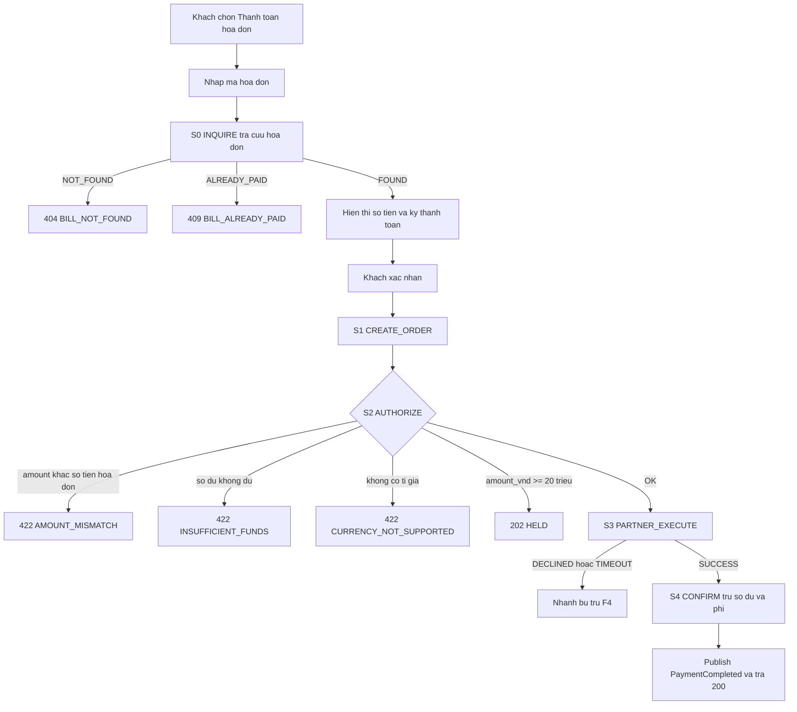
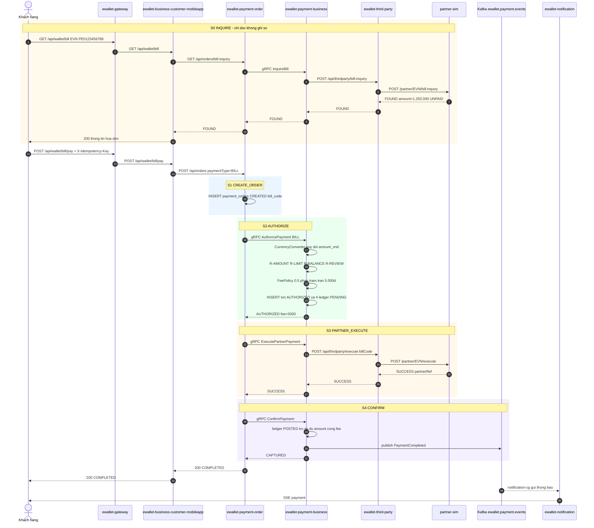

# [F2] Thanh toan hoa don va nap telco

> Nguồn gốc: `ewallet-demo/docs/specs/F2-bill-telco.md`.

## Page Properties

| Khoá | Giá trị |
|---|---|
| Flow ID | F2 |
| Flow Slug | bill-telco-payment |
| Flow Name | Thanh toán hoá đơn và nạp tiền điện thoại |
| Actor | Khách hàng |
| Trigger | Khách chọn Thanh toán hoá đơn (EVN) hoặc Nạp điện thoại (VTELCO) |
| Loại | ghi |
| Services | ewallet-gateway, ewallet-business-customer-mobileapp, ewallet-payment-order, ewallet-payment-business, ewallet-third-party, partner-sim, ewallet-notification |
| Protocols | HTTP, gRPC, Kafka, WebSocket, SSE, JDBC |
| Entry Endpoint | POST /api/wallet/bill/pay |
| Kafka Topics | ewallet.payment.events |
| Jira Epic | EWL-2 |
| Spec Source | docs/specs/F2-bill-telco.md |
| Doc Version | 1.0 |
| Status | APPROVED |

> Flow này có **hai endpoint vào**: `GET /api/wallet/bill` (tra cứu, sinh trace riêng) và
> `POST /api/wallet/bill/pay` (thanh toán). Biến thể telco dùng `POST /api/wallet/telco/topup`.
> `Entry Endpoint` khai báo endpoint chính; hai endpoint còn lại khai ở mục 2.3.

---

# 1. Mô tả chung

| Hạng mục | Nội dung |
|---|---|
| Mục đích | Cho khách dùng số dư ví thanh toán hoá đơn dịch vụ hoặc nạp tiền điện thoại qua đối tác |
| Loại chức năng | Mobile app + API |
| Đối tượng sử dụng | Khách hàng cá nhân |
| Đối tượng ảnh hưởng | Khách hàng, nhà cung cấp dịch vụ (EVN, VTELCO) |
| Kênh áp dụng | E-Wallet Mobile App |
| Ngôn ngữ | Tiếng Việt |
| Đường dẫn chức năng | Đăng nhập App → Thanh toán hoá đơn / Nạp điện thoại |

## 1.1 Mục đích

Khác F1 ở chiều tiền: F1 tiền vào ví, F2 tiền **ra khỏi** ví. Vì tiền ra nên phải kiểm tra số dư,
có thu phí, và hỗ trợ giao dịch khác loại tiền tệ.

## 1.2 Phạm vi

**Trong phạm vi**: tra cứu hoá đơn, kiểm tra số dư, tính phí, thanh toán qua đối tác, ghi sổ, thông báo.

**Ngoài phạm vi**: thanh toán trả góp, đặt lịch thanh toán tự động, hoá đơn nhiều kỳ.

## 1.3 Hai biến thể

| Biến thể | paymentType | Đối tác | Tra cứu trước | Phí |
|---|---|---|---|---|
| Thanh toán hoá đơn điện | `BILL` | `EVN` | Bắt buộc (bước S0) | `R-FEE-02`: 0,5%, sàn 1.000đ trần 5.000đ |
| Nạp tiền điện thoại | `TELCO` | `VTELCO` | Không | `R-FEE-03`: bằng 0 |

## 1.4 Tiền điều kiện

1. Ví khách `ACTIVE`, số dư ≥ `amount + fee`.
2. Với `BILL`: `billCode` tồn tại ở đối tác và ở trạng thái `UNPAID`.
3. Với `TELCO`: `phoneNumber` gồm 10 chữ số.
4. `partner_config.service_type` khớp `BILL` hoặc `TELCO`.

## 1.5 Hậu điều kiện

1. Số dư ví giảm đúng `amount + fee`.
2. Có **4** `ledger_entries` `POSTED` (2 cho tiền gốc, 2 cho phí nếu phí lớn hơn 0), tổng bằng 0.
3. `daily_usage` tăng `amount_vnd`.
4. `partner_transactions.status = SUCCESS`, có `bill_code`.
5. Event `PaymentCompleted` được publish, thông báo gửi thành công.

---

# 2. Luồng nghiệp vụ

## 2.1 Biểu đồ luồng



## 2.2 Sequence diagram



## 2.3 Mô tả chi tiết nghiệp vụ

Endpoint của flow: `GET /api/wallet/bill` (tra cứu) · `POST /api/wallet/bill/pay` (thanh toán hoá đơn) ·
`POST /api/wallet/telco/topup` (nạp điện thoại).

| Bước | Mô tả | Thực hiện bởi | Rule áp dụng |
|---|---|---|---|
| 1 | Khách gửi `GET /api/wallet/bill?partnerCode=EVN&billCode=...` | ewallet-gateway | |
| 2 | S0 INQUIRE — BFF gọi `GET /api/orders/bill-inquiry` | ewallet-business-customer-mobileapp | R-BILL-01 |
| 3 | Order gọi gRPC `InquireBill` | ewallet-payment-order | |
| 4 | Business gọi `POST /api/thirdparty/bill-inquiry` | ewallet-payment-business | |
| 5 | Third-party gọi `POST /partner/EVN/bill-inquiry` | ewallet-third-party | R-BILL-03 |
| 6 | Kết quả tra cứu trả ngược về client, **không ghi DB nghiệp vụ** | ewallet-business-customer-mobileapp | |
| 7 | Khách xác nhận, gửi `POST /api/wallet/bill/pay` kèm `X-Idempotency-Key` | ewallet-gateway | R-IDEM-01 |
| 8 | S1 CREATE_ORDER — ghi `payment_orders` `CREATED` với `bill_code` | ewallet-payment-order | R-IDEM-02, R-IDEM-03 |
| 9 | S2 AUTHORIZE — gọi gRPC `AuthorizePayment` với `paymentType=BILL` | ewallet-payment-order | R-BILL-02 |
| 10 | Business quy đổi tiền tệ, áp rule số tiền, hạn mức, số dư, ngưỡng rà soát; tính phí; ghi transaction + 4 ledger `PENDING`; cộng `daily_usage` | ewallet-payment-business | R-CURRENCY-01, R-FX-01, R-FX-02, R-AMOUNT-01, R-AMOUNT-02, R-LIMIT-01, R-BALANCE-01, R-REVIEW-01, R-FEE-02, R-BILL-04, R-USAGE-01 |
| 11 | S3 PARTNER_EXECUTE — gọi đối tác kèm `billCode` | ewallet-third-party | NFR-TIMEOUT-01 |
| 12 | S4 CONFIRM — ledger `POSTED`, trừ số dư, transaction `CAPTURED`, publish `PaymentCompleted` | ewallet-payment-business | R-LEDGER-01, R-EVENT-01, R-EVENT-02 |
| 13 | Order `COMPLETED`, trả `200` lên client | ewallet-payment-order | |
| 14 | Đuôi async: notification, order-status, settlement WebSocket | ewallet-notification | R-NOTIF-01 |

Biến thể `TELCO`: bỏ bước 1–6, `paymentType=TELCO`, `accountRef = phoneNumber`, phí bằng 0.

## 2.4 Luồng phụ và ngoại lệ

| Mã | Điều kiện | Xử lý | Kết quả cho client |
|---|---|---|---|
| B1 | `billCode` không tồn tại | S0 trả `NOT_FOUND` | `404 BILL_NOT_FOUND`, không tạo đơn |
| B2 | Hoá đơn đã thanh toán | S0 trả `ALREADY_PAID` | `409 BILL_ALREADY_PAID` |
| B3 | `amount` client gửi khác số tiền hoá đơn | Order từ chối trước khi authorize | `422 AMOUNT_MISMATCH` |
| B4 | Số dư nhỏ hơn `amount + fee` | R-BALANCE-01, transaction `REJECTED` | `422 INSUFFICIENT_FUNDS` |
| B5 | `currency` không có trong `fx_rates` | R-CURRENCY-01, transaction `REJECTED` | `422 CURRENCY_NOT_SUPPORTED` |
| B6 | `amount` quy đổi ≥ 20.000.000đ | R-REVIEW-01, transaction `HELD` | `202 HELD` |
| B7 | Đối tác từ chối hoặc timeout ở S3 | Nhánh bù trừ, xem [F4] | `502` / `504`, order `REFUNDED` |
| B8 | Đối tác trả `SUCCESS` sau khi third-party đã timeout | Ghi `partner_transactions` với `fail_reason=LATE_SUCCESS`, đối soát thủ công | order vẫn `REFUNDED` |

---

# 3. Business rule

## 3.1 Rule riêng của F2

| Mã | Điều kiện | Hành động | Severity |
|---|---|---|---|
| `R-BILL-01` | `paymentType = BILL` | Bắt buộc có `billCode` và phải tra cứu S0 trước khi thanh toán | must |
| `R-BILL-02` | `amount` khác số tiền hoá đơn trả về ở S0 | Từ chối `AMOUNT_MISMATCH`, không authorize | must |
| `R-BILL-03` | Hoá đơn ở trạng thái `PAID` | Từ chối `BILL_ALREADY_PAID` | must |
| `R-BILL-04` | `paymentType = BILL` | Phí theo `R-FEE-02`, trừ vào ví nguồn, ghi bút toán `entry_type=FEE` về `SYSTEM_FEE` | must |
| `R-TELCO-01` | `paymentType = TELCO` | `accountRef` phải là số thuê bao 10 chữ số | must |
| `R-TELCO-02` | `paymentType = TELCO` | Mệnh giá hợp lệ: 10.000 · 20.000 · 50.000 · 100.000 · 200.000 · 500.000 | must |
| `R-TELCO-03` | `paymentType = TELCO` | Phí bằng 0 theo `R-FEE-03` | must |
| `R-FX-01` | `currency = USD` | Quy đổi `amount_vnd = amount × fx_rates.rate_to_vnd` **trước** mọi so sánh hạn mức; lưu cả `amount` gốc và `amount_vnd` | must |
| `R-FX-02` | Giao dịch khác loại tiền tệ | `ledger_entries` ghi bằng VND theo `amount_vnd`; `payment_transactions` giữ cả hai giá trị | must |

## 3.2 Rule dùng chung mà F2 áp dụng

`R-IDEM-01` · `R-IDEM-02` · `R-IDEM-03` · `R-ACCOUNT-01` · `R-ACCOUNT-02` · `R-AMOUNT-01` · `R-AMOUNT-02` ·
`R-LIMIT-01` · `R-BALANCE-01` · `R-REVIEW-01` · `R-CURRENCY-01` · `R-LEDGER-01` · `R-USAGE-01` ·
`R-EVENT-01` · `R-EVENT-02` · `R-FEE-02` · `R-FEE-03`

---

# 4. NFR

| Mã | metric | operator | threshold | unit |
|---|---|---|---|---|
| `NFR-LAT-01` | latency_p95 | `<` | 500 | ms |
| `NFR-LAT-02` | latency_p95 | `<` | 2000 | ms |
| `NFR-LAT-06` | latency_p95 | `<` | 1500 | ms |
| `NFR-TIMEOUT-01` | timeout | `<=` | 3000 | ms |

Điểm đo: `NFR-LAT-01` tại span gRPC `AuthorizePayment`; `NFR-LAT-02` end-to-end tại gateway cho
`POST /api/wallet/bill/pay`; `NFR-LAT-06` end-to-end cho `GET /api/wallet/bill`.

---

# 5. Acceptance criteria

```gherkin
Scenario: Thanh toan hoa don dien thanh cong
  Given khach CUST-001 co so du 5.000.000d
  And hoa don EVN PE0123456789 la 1.250.000d trang thai UNPAID
  When khach tra cuu roi goi POST /api/wallet/bill/pay voi amount=1250000
  Then response 200 va status=COMPLETED
  And phi la 5000 do bi tran o muc 5.000d
  And so du con lai la 3.745.000d
  And co 4 ledger_entries POSTED

Scenario: Hoa don khong ton tai
  When khach goi GET /api/wallet/bill voi billCode=PE0000000000
  Then response 404 va reasonCode=BILL_NOT_FOUND
  And khong co payment_orders nao duoc tao

Scenario: Hoa don da thanh toan
  When khach tra cuu billCode=PE0999999999
  Then response 409 va reasonCode=BILL_ALREADY_PAID

Scenario: So tien gui khac so tien hoa don
  Given hoa don PE0123456789 la 1.250.000d
  When khach goi thanh toan voi amount=1000000
  Then response 422 va reasonCode=AMOUNT_MISMATCH

Scenario: Nap dien thoai menh gia khong hop le
  When khach goi POST /api/wallet/telco/topup voi amount=35000
  Then response 422 va reasonCode=AMOUNT_TOO_SMALL hoac INVALID_DENOMINATION

Scenario: Thanh toan cross-currency phai quy doi truoc khi ap han muc
  Given ti gia USD = 25.000 VND
  When khach CUST-003 goi thanh toan amount=1000 currency=USD
  Then he thong phai coi giao dich la 25.000.000d
  And vi 25.000.000 lon hon nguong ra soat nen ket qua phai la HELD

Scenario: Giao dich ngoai te lon phai bi tu choi
  Given ti gia USD = 25.000 VND
  When khach CUST-003 goi thanh toan amount=15000 currency=USD
  Then he thong phai coi giao dich la 375.000.000d
  And vi vuot MAX_TXN_BILL 50.000.000d nen phai la 422 AMOUNT_TOO_LARGE
```

---

# 6. Bảng/Thực thể liên quan

| Database | Bảng | Thao tác | Ghi chú |
|---|---|---|---|
| `orderdb` | `payment_orders` | INSERT, UPDATE | có thêm cột `bill_code` |
| `orderdb` | `order_steps` | INSERT | thêm bước `INQUIRE` so với F1 |
| `paymentdb` | `payment_transactions` | INSERT, UPDATE | lưu cả `amount` và `amount_vnd` |
| `paymentdb` | `ledger_entries` | INSERT, UPDATE | **4 dòng**: 2 `PAYMENT` + 2 `FEE` |
| `paymentdb` | `account_balances` | UPDATE | ví khách giảm `amount + fee`, `SYSTEM_FEE` tăng `fee` |
| `paymentdb` | `fx_rates` | SELECT | chỉ khi `currency` khác VND |
| `paymentdb` | `daily_usage` | UPSERT | cộng `amount_vnd` |
| `thirdpartydb` | `partner_transactions` | INSERT, UPDATE | có `bill_code`, `service_type` |
| `notifdb` | `notification_outbox` | INSERT, UPDATE | |

Bút toán kép của một giao dịch `BILL` phí 5.000đ:

| # | Tài khoản | Chiều | Số tiền | entry_type |
|---|---|---|---|---|
| 1 | ví khách | DEBIT | 1.250.000 | PAYMENT |
| 2 | PARTNER_SETTLE EVN | CREDIT | 1.250.000 | PAYMENT |
| 3 | ví khách | DEBIT | 5.000 | FEE |
| 4 | SYSTEM_FEE | CREDIT | 5.000 | FEE |

---

# 7. Danh sách mã lỗi

| Mã lỗi | HTTP status | Message | Sinh ra ở |
|---|---|---|---|
| `BILL_NOT_FOUND` | 404 | Không tra được hoá đơn | ewallet-third-party |
| `BILL_ALREADY_PAID` | 409 | Hoá đơn đã được thanh toán | ewallet-third-party |
| `AMOUNT_MISMATCH` | 422 | Số tiền không khớp hoá đơn | ewallet-payment-order |
| `INSUFFICIENT_FUNDS` | 422 | Số dư không đủ để thanh toán và trả phí | ewallet-payment-business |
| `CURRENCY_NOT_SUPPORTED` | 422 | Loại tiền tệ không được hỗ trợ | ewallet-payment-business |
| `LIMIT_EXCEEDED` | 422 | Vượt hạn mức giao dịch trong ngày | ewallet-payment-business |
| `MANUAL_REVIEW` | 202 | Giao dịch đang chờ duyệt | ewallet-payment-business |
| `PARTNER_DECLINED` | 502 | Đối tác từ chối giao dịch | ewallet-third-party |
| `PARTNER_TIMEOUT` | 504 | Đối tác không phản hồi | ewallet-third-party |

---

# 8. Chức năng ảnh hưởng

| Flow bị ảnh hưởng | Vì sao | Mức |
|---|---|---|
| [F1] Nạp tiền | Dùng chung saga, rule engine, third-party | cao |
| [F3] Chuyển tiền P2P | Dùng chung rule engine và ledger, nhưng không dùng third-party | trung bình |
| [F4] Giao dịch lỗi | F2 sinh nhánh bù trừ khi đối tác từ chối | cao |
| [F5] Thông báo | Event của F2 là đầu vào F5 | trung bình |

> Lưu ý quan trọng cho impact analysis: F2 và F1 đi qua **gần như cùng một chuỗi span**.
> Chỉ phân biệt được bằng `http.route` ở gateway và attribute `paymentType`.

> Chèn macro Jira Issues: `project = EWL AND "Flow Slug" ~ "bill-telco-payment" ORDER BY issuetype`

---

# 9. Bảng ghi nhận thay đổi tài liệu

| Ngày thay đổi | Vị trí thay đổi | A/M/D | Nguồn gốc | Link CR | Mô tả thay đổi | Phiên bản confluence | Phiên bản mới |
|---|---|---|---|---|---|---|---|
| 16 Sep 2026 | Toàn bộ | A | Stage D specs | | Tạo mới tài liệu từ `docs/specs/F2-bill-telco.md` | 1 | 1.0 |
