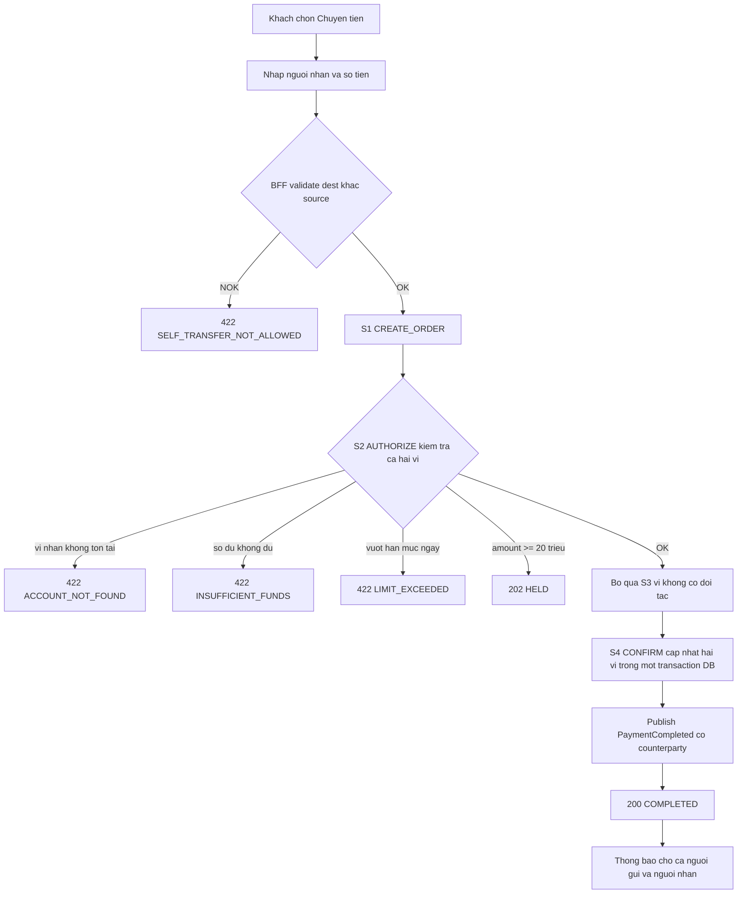
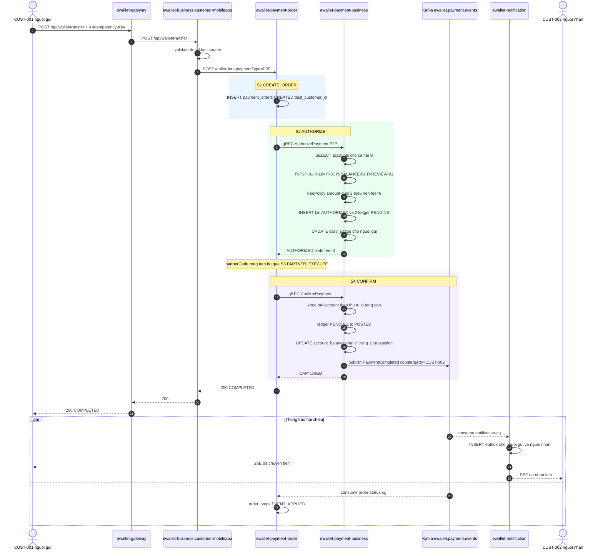

# [F3] Chuyen tien P2P

> Nguồn gốc: `ewallet-demo/docs/specs/F3-p2p-transfer.md`.

## Page Properties

| Khoá | Giá trị |
|---|---|
| Flow ID | F3 |
| Flow Slug | p2p-transfer |
| Flow Name | Chuyển tiền P2P giữa hai ví |
| Actor | Khách hàng (người gửi) |
| Trigger | Khách chọn Chuyển tiền tới một khách hàng khác trong hệ |
| Loại | ghi |
| Services | ewallet-gateway, ewallet-business-customer-mobileapp, ewallet-payment-order, ewallet-payment-business, ewallet-notification |
| Protocols | HTTP, gRPC, Kafka, SSE, JDBC |
| Entry Endpoint | POST /api/wallet/transfer |
| Kafka Topics | ewallet.payment.events |
| Jira Epic | EWL-3 |
| Spec Source | docs/specs/F3-p2p-transfer.md |
| Doc Version | 1.0 |
| Status | APPROVED |

---

# 1. Mô tả chung

| Hạng mục | Nội dung |
|---|---|
| Mục đích | Chuyển tiền từ ví khách A sang ví khách B trong cùng hệ thống, tức thời, không qua đối tác |
| Loại chức năng | Mobile app + API |
| Đối tượng sử dụng | Khách hàng cá nhân |
| Đối tượng ảnh hưởng | Người gửi và người nhận |
| Kênh áp dụng | E-Wallet Mobile App |
| Ngôn ngữ | Tiếng Việt |
| Đường dẫn chức năng | Đăng nhập App → Chuyển tiền |

## 1.1 Mục đích

Đây là flow **đối chứng** với F1/F2: cùng xương sống `order → business → Kafka` nhưng **không có nhánh
third-party**. Dùng để kiểm chứng impact analysis — sửa `ewallet-third-party` **không** được ảnh hưởng F3.

## 1.2 Phạm vi

**Trong phạm vi**: kiểm tra hai ví, hạn mức, số dư, phí, ghi sổ kép, thông báo cho cả hai bên.

**Ngoài phạm vi**: chuyển tiền liên ngân hàng, chuyển tiền theo lịch, nhắc nợ.

## 1.3 Tiền điều kiện

1. Ví người gửi `ACTIVE`, số dư ≥ `amount + fee`.
2. Ví người nhận tồn tại và `ACTIVE`.
3. Người gửi khác người nhận.

## 1.4 Hậu điều kiện

1. Ví người gửi giảm `amount + fee`, ví người nhận tăng đúng `amount`.
2. Có 2 hoặc 4 `ledger_entries` `POSTED` (4 khi có phí), tổng bằng 0.
3. `daily_usage` của **người gửi** tăng `amount_vnd`. Người nhận không bị tính hạn mức.
4. Một event `PaymentCompleted` với `counterpartyCustomerId` là người nhận.
5. Notification tạo **2** bản ghi outbox: báo trừ tiền cho người gửi, báo nhận tiền cho người nhận.

---

# 2. Luồng nghiệp vụ

## 2.1 Biểu đồ luồng



## 2.2 Sequence diagram



## 2.3 Mô tả chi tiết nghiệp vụ

| Bước | Mô tả | Thực hiện bởi | Rule áp dụng |
|---|---|---|---|
| 1 | Khách gửi `POST /api/wallet/transfer` kèm `X-Idempotency-Key` | ewallet-gateway | R-IDEM-01 |
| 2 | BFF validate: `destCustomerId` khác `customerId`, `amount` dương | ewallet-business-customer-mobileapp | R-P2P-01 |
| 3 | BFF gọi `POST /api/orders` với `paymentType = P2P` | ewallet-business-customer-mobileapp | |
| 4 | S1 CREATE_ORDER — ghi `payment_orders` `CREATED`, lưu `dest_customer_id` | ewallet-payment-order | R-IDEM-02, R-IDEM-03 |
| 5 | S2 AUTHORIZE — gọi gRPC `AuthorizePayment` | ewallet-payment-order | |
| 6 | Business kiểm tra tự chuyển cho mình, trạng thái **cả hai** ví, tiền tệ, số tiền, hạn mức, số dư, ngưỡng rà soát; tính phí; ghi transaction + ledger `PENDING`; cộng `daily_usage` người gửi | ewallet-payment-business | R-P2P-01, R-P2P-05, R-ACCOUNT-01, R-ACCOUNT-02, R-CURRENCY-01, R-AMOUNT-01, R-AMOUNT-02, R-LIMIT-01, R-BALANCE-01, R-REVIEW-01, R-FEE-04, R-USAGE-01 |
| 7 | Bỏ qua S3 PARTNER_EXECUTE vì `partnerCode` rỗng | ewallet-payment-order | R-P2P-02 |
| 8 | S4 CONFIRM — ledger `POSTED`, cập nhật số dư hai ví, transaction `CAPTURED` | ewallet-payment-business | R-P2P-06, R-P2P-07, R-LEDGER-01 |
| 9 | Business publish `PaymentCompleted` có `counterpartyCustomerId` | ewallet-payment-business | R-EVENT-01, R-EVENT-02 |
| 10 | Order `COMPLETED`, trả `200` | ewallet-payment-order | |
| 11 | Đuôi async: notification tạo 2 thông báo, order-status ghi `EVENT_APPLIED` | ewallet-notification | R-P2P-04, R-NOTIF-02 |

## 2.4 Luồng phụ và ngoại lệ

| Mã | Điều kiện | Xử lý | Kết quả cho client |
|---|---|---|---|
| C1 | `destCustomerId` bằng `customerId` | R-P2P-01 | `422 SELF_TRANSFER_NOT_ALLOWED` |
| C2 | Ví người nhận không tồn tại | R-ACCOUNT-01 | `422 ACCOUNT_NOT_FOUND` |
| C3 | Ví người nhận bị khoá | R-ACCOUNT-02 | `422 ACCOUNT_INACTIVE` |
| C4 | Số dư không đủ, tính cả phí | R-BALANCE-01 | `422 INSUFFICIENT_FUNDS` |
| C5 | `amount` lớn hơn 30.000.000đ | R-AMOUNT-02 | `422 AMOUNT_TOO_LARGE` |
| C6 | Tổng giao dịch trong ngày vượt 50.000.000đ | R-LIMIT-01 | `422 LIMIT_EXCEEDED` |
| C7 | `amount` ≥ 20.000.000đ | R-REVIEW-01: `HELD`, giữ tiền, publish `PaymentHeld` | `202 HELD` |
| C8 | Hai request cùng lúc từ cùng ví | Khoá bi quan trên `account_balances` theo `account_id` tăng dần để tránh deadlock | request sau chờ, số dư không âm |
| C9 | `ConfirmPayment` lỗi | Retry 2 lần rồi bù trừ theo [F4] | `502`, order `REFUNDED` |

---

# 3. Business rule

## 3.1 Rule riêng của F3

| Mã | Điều kiện | Hành động | Severity |
|---|---|---|---|
| `R-P2P-01` | `sourceAccountId` bằng `destAccountId` | Từ chối `SELF_TRANSFER_NOT_ALLOWED` | must |
| `R-P2P-02` | `paymentType = P2P` | Không gọi `ewallet-third-party`, saga bỏ bước S3 | must |
| `R-P2P-03` | `amount` ≤ 2.000.000đ | Phí bằng 0; ngược lại phí 2.200đ theo `R-FEE-04` | must |
| `R-P2P-04` | Giao dịch thành công | Thông báo cho **cả** người gửi và người nhận | must |
| `R-P2P-05` | Hai ví khác `currency` | Từ chối `CURRENCY_MISMATCH` — chỉ hỗ trợ chuyển cùng loại tiền | must |
| `R-P2P-06` | Ghi sổ | Cập nhật số dư hai ví trong **cùng một transaction DB** | must |
| `R-P2P-07` | Khoá số dư | Lấy khoá theo thứ tự `account_id` tăng dần để tránh deadlock chéo | should |

## 3.2 Rule dùng chung mà F3 áp dụng

`R-IDEM-01` · `R-IDEM-02` · `R-IDEM-03` · `R-ACCOUNT-01` · `R-ACCOUNT-02` · `R-AMOUNT-01` · `R-AMOUNT-02` ·
`R-LIMIT-01` · `R-BALANCE-01` · `R-REVIEW-01` · `R-CURRENCY-01` · `R-LEDGER-01` · `R-USAGE-01` ·
`R-EVENT-01` · `R-EVENT-02` · `R-FEE-04`

---

# 4. NFR

| Mã | metric | operator | threshold | unit |
|---|---|---|---|---|
| `NFR-LAT-01` | latency_p95 | `<` | 500 | ms |
| `NFR-LAT-03` | latency_p95 | `<` | 800 | ms |
| `NFR-ERR-01` | error_rate | `<` | 1 | percent |

F3 có ngưỡng end-to-end chặt hơn F1/F2 (800ms so với 2000ms) vì không có hop ra ngoài hệ thống.

---

# 5. Acceptance criteria

```gherkin
Scenario: Chuyen tien thanh cong khong phi
  Given CUST-001 co 5.000.000d va CUST-002 co 1.000.000d
  When CUST-001 chuyen 300.000d cho CUST-002
  Then response 200 status=COMPLETED va fee=0
  And CUST-001 con 4.700.000d
  And CUST-002 co 1.300.000d
  And co dung 2 ledger_entries POSTED cung txn_id
  And notification_outbox co 2 ban ghi

Scenario: Chuyen tien tren 2 trieu thi co phi
  When CUST-003 chuyen 3.000.000d cho CUST-002
  Then fee=2200 va CUST-003 bi tru 3.002.200d

Scenario: Tu chuyen cho chinh minh bi tu choi
  When CUST-001 chuyen tien cho CUST-001
  Then response 422 va reasonCode=SELF_TRANSFER_NOT_ALLOWED

Scenario: Vuot han muc ngay bi tu choi
  Given CUST-003 da chuyen 36.000.000d trong ngay
  When CUST-003 chuyen tiep 18.000.000d
  Then tong ngay se la 54.000.000d vuot 50.000.000d
  And response phai la 422 LIMIT_EXCEEDED

Scenario: Chuyen tien lon bi treo cho duyet
  When CUST-003 chuyen 25.000.000d cho CUST-002
  Then response 202 status=HELD
  And tien bi giu chua vao vi nguoi nhan
  And co event PaymentHeld

Scenario: Sua third-party khong duoc anh huong F3
  Given co thay doi trong ewallet-third-party
  When chay lai kich ban chuyen tien
  Then trace cua F3 khong chua span nao cua ewallet-third-party
```

---

# 6. Bảng/Thực thể liên quan

| Database | Bảng | Thao tác | Ghi chú |
|---|---|---|---|
| `orderdb` | `payment_orders` | INSERT, UPDATE | có `dest_customer_id`, không có `partner_ref` |
| `orderdb` | `order_steps` | INSERT | chỉ 3 bước: `CREATE_ORDER`, `AUTHORIZE`, `CONFIRM` |
| `paymentdb` | `payment_transactions` | INSERT, UPDATE | có `counterparty_customer_id` |
| `paymentdb` | `ledger_entries` | INSERT, UPDATE | 2 dòng (4 khi có phí) |
| `paymentdb` | `account_balances` | UPDATE | **hai** ví trong cùng một transaction DB |
| `paymentdb` | `daily_usage` | UPSERT | chỉ cộng cho người gửi |
| `notifdb` | `notification_outbox` | INSERT | **2** bản ghi cho 2 khách |

---

# 7. Danh sách mã lỗi

| Mã lỗi | HTTP status | Message | Sinh ra ở |
|---|---|---|---|
| `SELF_TRANSFER_NOT_ALLOWED` | 422 | Không thể chuyển tiền cho chính mình | ewallet-payment-business |
| `ACCOUNT_NOT_FOUND` | 422 | Không tìm thấy ví người nhận | ewallet-payment-business |
| `ACCOUNT_INACTIVE` | 422 | Ví người nhận đang bị khoá | ewallet-payment-business |
| `INSUFFICIENT_FUNDS` | 422 | Số dư không đủ | ewallet-payment-business |
| `AMOUNT_TOO_LARGE` | 422 | Số tiền vượt hạn mức 30.000.000đ mỗi giao dịch | ewallet-payment-business |
| `LIMIT_EXCEEDED` | 422 | Vượt hạn mức giao dịch trong ngày | ewallet-payment-business |
| `CURRENCY_MISMATCH` | 422 | Hai ví khác loại tiền tệ | ewallet-payment-business |
| `MANUAL_REVIEW` | 202 | Giao dịch đang chờ duyệt | ewallet-payment-business |

---

# 8. Chức năng ảnh hưởng

| Flow bị ảnh hưởng | Vì sao | Mức |
|---|---|---|
| [F1] Nạp tiền | Dùng chung `payment-business` rule engine và ledger | cao |
| [F2] Thanh toán hoá đơn | Dùng chung rule engine, ledger, saga | cao |
| [F4] Giao dịch lỗi | F3 sinh nhánh bù trừ khi confirm lỗi | trung bình |
| [F5] Thông báo | F3 là flow duy nhất sinh **2** thông báo cho 1 event | cao |
| [F6] Lịch sử | Đơn F3 xuất hiện trong lịch sử | thấp |

> Chèn macro Jira Issues: `project = EWL AND "Flow Slug" ~ "p2p-transfer" ORDER BY issuetype`

---

# 9. Bảng ghi nhận thay đổi tài liệu

| Ngày thay đổi | Vị trí thay đổi | A/M/D | Nguồn gốc | Link CR | Mô tả thay đổi | Phiên bản confluence | Phiên bản mới |
|---|---|---|---|---|---|---|---|
| 16 Sep 2026 | Toàn bộ | A | Stage D specs | | Tạo mới tài liệu từ `docs/specs/F3-p2p-transfer.md` | 1 | 1.0 |
