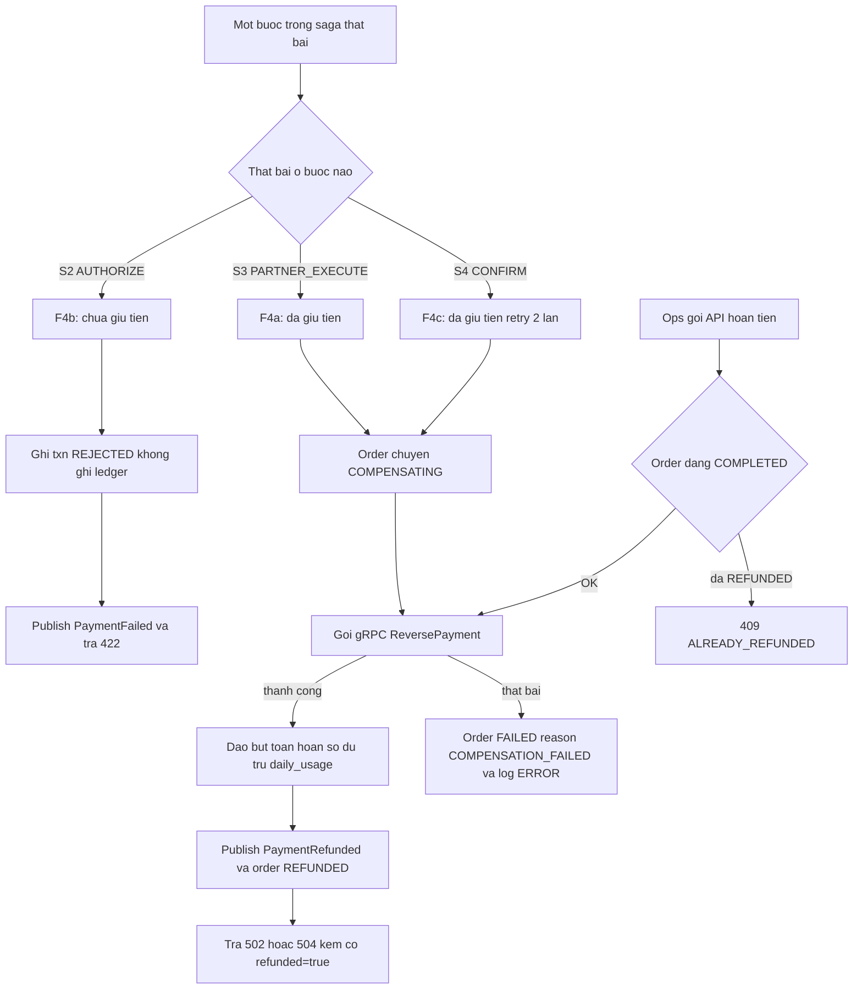
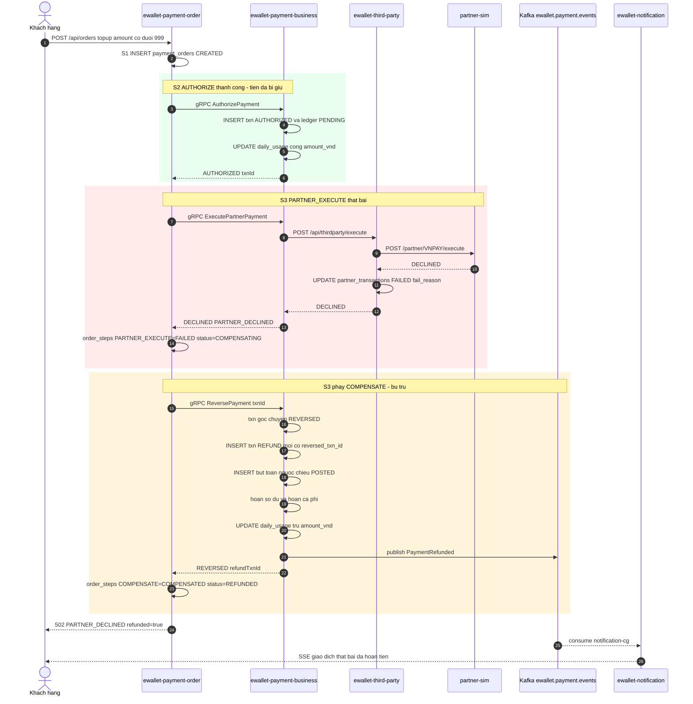
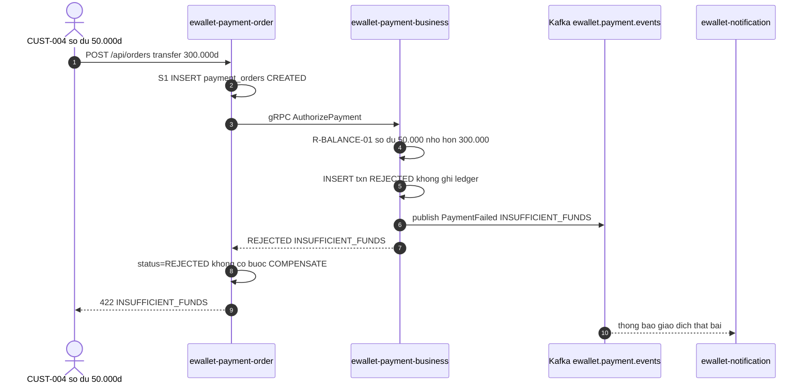

# [F4] Giao dich loi va hoan tien

> Nguồn gốc: `ewallet-demo/docs/specs/F4-failure-refund.md`.

## Page Properties

| Khoá | Giá trị |
|---|---|
| Flow ID | F4 |
| Flow Slug | failure-refund |
| Flow Name | Giao dịch lỗi và hoàn tiền (compensation) |
| Actor | Hệ thống (tự động) hoặc Ops (hoàn tiền thủ công) |
| Trigger | Một bước sau AUTHORIZE thất bại, hoặc Ops gọi API hoàn tiền |
| Loại | ghi |
| Services | ewallet-payment-order, ewallet-payment-business, ewallet-third-party, partner-sim, ewallet-notification |
| Protocols | HTTP, gRPC, Kafka, SSE, JDBC |
| Entry Endpoint | POST /api/orders/{orderId}/refund |
| Kafka Topics | ewallet.payment.events |
| Jira Epic | EWL-4 |
| Spec Source | docs/specs/F4-failure-refund.md |
| Doc Version | 1.0 |
| Status | APPROVED |

> F4 có hai lối vào: **tự động** (nhánh bù trừ bên trong saga của F1/F2/F3, không có endpoint riêng)
> và **thủ công** (`POST /api/orders/{orderId}/refund` do Ops gọi). `Entry Endpoint` khai lối vào thủ công;
> lối tự động nhận biết qua `order_steps.step_name = COMPENSATE`.

---

# 1. Mô tả chung

| Hạng mục | Nội dung |
|---|---|
| Mục đích | Đảm bảo không có tiền bị treo sai: khi giao dịch đã giữ tiền nhưng không hoàn tất, hệ thống tự trả tiền về ví khách |
| Loại chức năng | Tiến trình + API nội bộ |
| Đối tượng sử dụng | Hệ thống, Ops |
| Đối tượng ảnh hưởng | Khách hàng |
| Kênh áp dụng | Nội bộ |
| Ngôn ngữ | Tiếng Việt |
| Đường dẫn chức năng | Tự động trong saga, hoặc Ops Portal → Đơn hàng → Hoàn tiền |

## 1.1 Mục đích

Sổ cái phải luôn cân và số dư khách phải trở về đúng giá trị trước giao dịch. Đây là đường **hay bị bỏ sót
khi test** — mục tiêu của flow này với v-quality là chứng minh test gap và nhánh compensation.

## 1.2 Bốn kịch bản

| Mã | Tên | Đã giữ tiền chưa | Cần bù trừ | Event cuối |
|---|---|---|---|---|
| F4a | Đối tác từ chối ở bước S3 | Rồi | Có | `PaymentRefunded` |
| F4b | Business từ chối ở bước S2 | Chưa | Không | `PaymentFailed` |
| F4c | `ConfirmPayment` lỗi ở bước S4 | Rồi | Có | `PaymentRefunded` |
| F4d | Ops hoàn tiền chủ động sau khi đã `COMPLETED` | Rồi, đã chốt | Có (reverse txn đã capture) | `PaymentRefunded` |

## 1.3 Tiền điều kiện

- F4a/F4c: đã có `payment_transactions.status = AUTHORIZED` và ledger `PENDING`.
- F4d: `payment_orders.status = COMPLETED` và `payment_transactions.status = CAPTURED`.

## 1.4 Hậu điều kiện (F4a — bù trừ tự động)

1. `payment_orders.status = REFUNDED`, `reason_code = PARTNER_DECLINED` hoặc `PARTNER_TIMEOUT`.
2. `order_steps` có `PARTNER_EXECUTE = FAILED` **và** `COMPENSATE = COMPENSATED`.
3. `payment_transactions` gốc chuyển `REVERSED`. Sinh transaction mới `paymentType = REFUND`,
   `reversed_txn_id` trỏ về transaction gốc.
4. `ledger_entries` gốc chuyển `REVERSED`; thêm 2 hoặc 4 bút toán ngược chiều với `txn_id` mới,
   `entry_type = REFUND`.
5. Số dư ví trở lại đúng giá trị trước giao dịch, kể cả phí.
6. `daily_usage` bị trừ lại `amount_vnd`.
7. Event `PaymentRefunded` được publish.
8. Client nhận `502` (declined) hoặc `504` (timeout) — **sau khi** bù trừ xong.

---

# 2. Luồng nghiệp vụ

## 2.1 Biểu đồ luồng



## 2.2 Sequence diagram — F4a đối tác từ chối



## 2.3 Sequence diagram — F4b business từ chối, không bù trừ



## 2.4 Mô tả chi tiết nghiệp vụ

Luồng F4a — đối tác từ chối:

| Bước | Mô tả | Thực hiện bởi | Rule áp dụng |
|---|---|---|---|
| 1 | Bước 1–8 giống F1: tạo đơn, authorize thành công, tiền đã giữ | ewallet-payment-order | |
| 2 | S3 PARTNER_EXECUTE — order gọi `ExecutePartnerPayment` | ewallet-payment-order | |
| 3 | Business gọi third-party, third-party gọi partner-sim | ewallet-payment-business | |
| 4 | Partner-sim trả `DECLINED` | partner-sim | |
| 5 | Third-party ghi `partner_transactions = FAILED`, `fail_reason = PARTNER_DECLINED` | ewallet-third-party | |
| 6 | Business trả `DECLINED` cho order, **không** tự bù trừ | ewallet-payment-business | R-COMP-01 |
| 7 | Order ghi `order_steps PARTNER_EXECUTE = FAILED`, đặt order `COMPENSATING` | ewallet-payment-order | R-COMP-01 |
| 8 | S3' COMPENSATE — order gọi gRPC `ReversePayment` | ewallet-payment-order | R-COMP-05 |
| 9 | Business: transaction gốc `REVERSED`; tạo transaction `REFUND` mới; ghi bút toán ngược; hoàn số dư; trừ `daily_usage` | ewallet-payment-business | R-COMP-02, R-COMP-03, R-LEDGER-02, R-USAGE-02, R-FEE-05 |
| 10 | Business publish `PaymentRefunded` | ewallet-payment-business | R-EVENT-01 |
| 11 | Order ghi `order_steps COMPENSATE = COMPENSATED`, đặt order `REFUNDED` | ewallet-payment-order | |
| 12 | Order trả lỗi `502 PARTNER_DECLINED` kèm `refunded: true` | ewallet-payment-order | R-COMP-08 |
| 13 | Đuôi async: thông báo giao dịch thất bại, đã hoàn tiền | ewallet-notification | R-NOTIF-01 |

Luồng F4c — confirm lỗi: S4 ném lỗi hạ tầng → order retry **2 lần**, backoff 200ms/500ms, ghi
`order_steps CONFIRM` với `attempt` tăng dần → vẫn lỗi thì `COMPENSATING` → `ReversePayment` → `REFUNDED`.
Nếu `ReversePayment` cũng lỗi thì order `FAILED` với `reason_code = COMPENSATION_FAILED` và log mức `ERROR`.

Luồng F4d — hoàn tiền chủ động: Ops gọi `POST /api/orders/{orderId}/refund` với `{"reason":"CUSTOMER_REQUEST"}`
→ order kiểm tra đang `COMPLETED` và chưa từng hoàn → gọi `ReversePayment` với `txn_id` đã `CAPTURED`
→ business đảo bút toán đã `POSTED` (không sửa dòng gốc) → publish `PaymentRefunded` → order `REFUNDED`, trả `200`.

## 2.5 Luồng phụ và ngoại lệ

| Mã | Điều kiện | Xử lý | Kết quả cho client |
|---|---|---|---|
| D4-1 | `ReversePayment` thất bại | Order `FAILED`, `reason_code = COMPENSATION_FAILED`, log `ERROR` | `502` kèm `refunded=false` |
| D4-2 | Gọi `ReversePayment` nhiều lần cùng `txn_id` | Idempotent, trả kết quả cũ | không sinh bút toán mới |
| D4-3 | Order đã `REFUNDED` mà Ops hoàn lại | R-COMP-06 | `409 ALREADY_REFUNDED` |
| D4-4 | Order đang `HELD` | R-COMP-07: không tự bù trừ, tiền tiếp tục bị giữ | chờ quyết định thủ công |

---

# 3. Business rule

| Mã | Điều kiện | Hành động | Severity |
|---|---|---|---|
| `R-COMP-01` | Bất kỳ bước nào **sau** `AUTHORIZE` thất bại | Order bắt buộc gọi `ReversePayment` trước khi trả lỗi cho client | must |
| `R-COMP-02` | Bù trừ | Không sửa hoặc xoá bút toán gốc; chỉ thêm bút toán ngược với `txn_id` mới | must |
| `R-COMP-03` | Bù trừ | Hoàn cả phí theo `R-FEE-05` và trừ lại `daily_usage` theo `R-USAGE-02` | must |
| `R-COMP-04` | `ReversePayment` thất bại | Order `FAILED`, `reason_code = COMPENSATION_FAILED`, log `ERROR`, không im lặng | must |
| `R-COMP-05` | Gọi `ReversePayment` nhiều lần cho cùng `txn_id` | Idempotent — lần 2 trở đi trả kết quả cũ, không sinh bút toán mới | must |
| `R-COMP-06` | Order đã `REFUNDED` | Từ chối hoàn tiền lần nữa `409 ALREADY_REFUNDED` | must |
| `R-COMP-07` | Order đang `HELD` | Không tự bù trừ; tiền tiếp tục bị giữ tới khi có quyết định duyệt hoặc từ chối thủ công | must |
| `R-COMP-08` | Bù trừ xong | Trả cho client mã lỗi gốc `502` hoặc `504` kèm cờ `refunded = true`, không trả `200` | must |

Rule dùng chung mà F4 áp dụng: `R-LEDGER-02` · `R-USAGE-02` · `R-FEE-05` · `R-EVENT-01` · `R-EVENT-02`

---

# 4. NFR

| Mã | metric | operator | threshold | unit |
|---|---|---|---|---|
| `NFR-COMP-01` | latency_p95 | `<` | 1000 | ms |
| `NFR-COMP-02` | error_rate | `<` | 0.1 | percent |
| `NFR-TIMEOUT-01` | timeout | `<=` | 3000 | ms |

Điểm đo: `NFR-COMP-01` tính từ lúc partner trả lỗi tới khi order chuyển `REFUNDED`;
`NFR-COMP-02` là tỉ lệ bù trừ thất bại (`COMPENSATION_FAILED`) trên tổng lần bù trừ.

---

# 5. Acceptance criteria

```gherkin
Scenario: Doi tac tu choi thi tien phai duoc hoan
  Given CUST-001 co so du 5.000.000d
  When khach nap tien 500.999d qua VNPAY va doi tac tra DECLINED
  Then response 502 va body co refunded=true
  And so du CUST-001 van la 5.000.000d
  And payment_orders.status=REFUNDED
  And co 4 ledger_entries cho don nay 2 goc REVERSED va 2 nguoc chieu POSTED
  And co event PaymentRefunded tren ewallet.payment.events
  And daily_usage cua CUST-001 khong tang

Scenario: Doi tac timeout thi cung phai hoan tien
  When khach nap tien 500.888d va doi tac khong phan hoi trong 3 giay
  Then third-party timeout
  And response 504 va order o trang thai REFUNDED

Scenario: So du khong du thi khong can bu tru
  Given CUST-004 co so du 50.000d
  When CUST-004 chuyen 300.000d cho CUST-002
  Then response 422 INSUFFICIENT_FUNDS
  And khong co ledger_entries nao duoc tao
  And co event PaymentFailed

Scenario: Hoan tien hai lan phai bi tu choi
  Given mot don da REFUNDED
  When Ops goi lai POST /api/orders/{id}/refund
  Then response 409 ALREADY_REFUNDED
  And khong co but toan moi

Scenario: Don dang HELD thi khong tu bu tru
  Given mot don o trang thai HELD
  When he thong chay chu ky doi soat
  Then don van HELD va tien van bi giu
  And khong co but toan REFUND nao duoc tao
```

---

# 6. Bảng/Thực thể liên quan

| Database | Bảng | Thao tác | Ghi chú |
|---|---|---|---|
| `orderdb` | `payment_orders` | UPDATE | `COMPENSATING` → `REFUNDED` hoặc `FAILED` |
| `orderdb` | `order_steps` | INSERT | bước `COMPENSATE` với kết quả `COMPENSATED` |
| `paymentdb` | `payment_transactions` | INSERT, UPDATE | transaction gốc `REVERSED` + transaction `REFUND` mới |
| `paymentdb` | `ledger_entries` | INSERT, UPDATE | gốc `REVERSED`, thêm bút toán ngược `entry_type=REFUND` |
| `paymentdb` | `account_balances` | UPDATE | hoàn số dư gồm cả phí |
| `paymentdb` | `daily_usage` | UPDATE | trừ lại `amount_vnd` của **ngày gốc** |
| `thirdpartydb` | `partner_transactions` | UPDATE | `FAILED` + `fail_reason` |

---

# 7. Danh sách mã lỗi

| Mã lỗi | HTTP status | Message | Sinh ra ở |
|---|---|---|---|
| `PARTNER_DECLINED` | 502 | Đối tác từ chối giao dịch, đã hoàn tiền | ewallet-payment-order |
| `PARTNER_TIMEOUT` | 504 | Đối tác không phản hồi, đã hoàn tiền | ewallet-payment-order |
| `COMPENSATION_FAILED` | 502 | Bù trừ thất bại, cần can thiệp thủ công | ewallet-payment-order |
| `ALREADY_REFUNDED` | 409 | Đơn đã được hoàn tiền trước đó | ewallet-payment-order |
| `INSUFFICIENT_FUNDS` | 422 | Số dư không đủ, không cần bù trừ | ewallet-payment-business |

---

# 8. Chức năng ảnh hưởng

| Flow bị ảnh hưởng | Vì sao | Mức |
|---|---|---|
| [F1] Nạp tiền | F4 là nhánh lỗi của F1 | cao |
| [F2] Thanh toán hoá đơn | F4 là nhánh lỗi của F2 | cao |
| [F3] Chuyển tiền P2P | F4 là nhánh lỗi của F3 khi confirm hỏng | trung bình |
| [F5] Thông báo | Event `PaymentRefunded` và `PaymentFailed` là đầu vào F5 | trung bình |

> Chèn macro Jira Issues: `project = EWL AND "Flow Slug" ~ "failure-refund" ORDER BY issuetype`

---

# 9. Bảng ghi nhận thay đổi tài liệu

| Ngày thay đổi | Vị trí thay đổi | A/M/D | Nguồn gốc | Link CR | Mô tả thay đổi | Phiên bản confluence | Phiên bản mới |
|---|---|---|---|---|---|---|---|
| 16 Sep 2026 | Toàn bộ | A | Stage D specs | | Tạo mới tài liệu từ `docs/specs/F4-failure-refund.md` | 1 | 1.0 |
