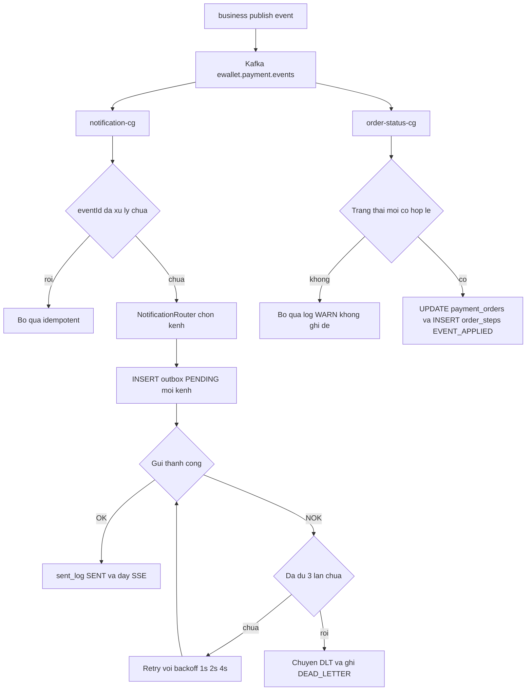
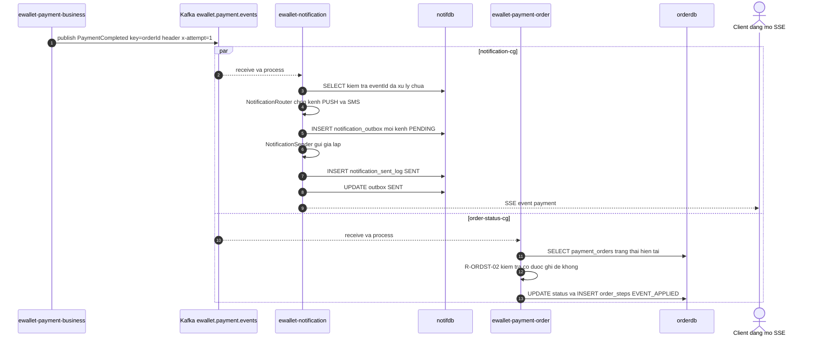
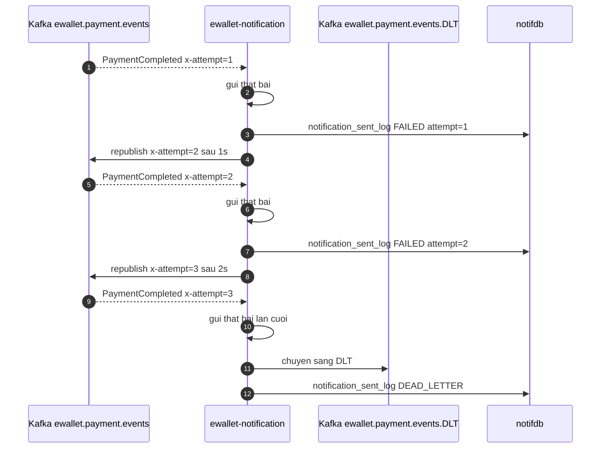

# [F5] Thong bao bat dong bo

> Nguồn gốc: `ewallet-demo/docs/specs/F5-async-notification.md`.

## Page Properties

| Khoá | Giá trị |
|---|---|
| Flow ID | F5 |
| Flow Slug | async-notification |
| Flow Name | Thông báo bất đồng bộ (đuôi chung của mọi flow) |
| Actor | Hệ thống |
| Trigger | payment-business publish event lên ewallet.payment.events |
| Loại | bất đồng bộ |
| Services | ewallet-payment-business, ewallet-notification, ewallet-payment-order |
| Protocols | Kafka, SSE, JDBC |
| Entry Endpoint | GET /api/notifications/stream |
| Kafka Topics | ewallet.payment.events, ewallet.payment.events.DLT |
| Jira Epic | EWL-5 |
| Spec Source | docs/specs/F5-async-notification.md |
| Doc Version | 1.0 |
| Status | APPROVED |

> F5 **không có HTTP entry** theo nghĩa thông thường — nó bắt đầu từ một Kafka record.
> `Entry Endpoint` khai endpoint SSE mà client mở để nhận thông báo; điểm bắt đầu thật của trace là
> span `publish` trên topic `ewallet.payment.events`.

---

# 1. Mô tả chung

| Hạng mục | Nội dung |
|---|---|
| Mục đích | Tách việc thông báo cho khách và chốt trạng thái đơn ra khỏi đường đồng bộ |
| Loại chức năng | Tiến trình |
| Đối tượng sử dụng | Hệ thống (không có người bấm) |
| Đối tượng ảnh hưởng | Khách hàng nhận thông báo |
| Kênh áp dụng | PUSH, SMS, EMAIL (giả lập) + SSE |
| Ngôn ngữ | Tiếng Việt |
| Đường dẫn chức năng | Tự động sau mỗi giao dịch |

## 1.1 Mục đích

Để client nhận phản hồi nhanh, không phải chờ gửi SMS/push; và để khi notification chết thì giao dịch
**vẫn đúng**, chỉ thông báo bị chậm.

## 1.2 Phạm vi

**Trong phạm vi**: tiêu thụ event, định tuyến kênh, ghi outbox, gửi (giả lập), đẩy SSE, retry, DLT,
và consumer thứ hai cập nhật trạng thái đơn.

**Ngoài phạm vi**: tích hợp nhà cung cấp SMS/push thật, template đa ngôn ngữ, opt-out.

## 1.3 Hai consumer group trên cùng một topic

| Consumer group | Service | Mục đích | Hệ quả khi lỗi |
|---|---|---|---|
| `notification-cg` | ewallet-notification | Sinh thông báo cho khách | Khách không nhận được báo, tiền vẫn đúng |
| `order-status-cg` | ewallet-payment-order | Chốt trạng thái đơn bất đồng bộ, ghi `order_steps EVENT_APPLIED` | Đơn thiếu dấu vết async, trạng thái đồng bộ vẫn đúng |

Hai group độc lập offset. Một group lỗi không chặn group kia.

## 1.4 Tiền điều kiện

1. Kafka đang chạy, topic `ewallet.payment.events` và `ewallet.payment.events.DLT` đã tồn tại.
2. Có ít nhất một event được `ewallet-payment-business` publish.

## 1.5 Hậu điều kiện

1. `notification_outbox` có một dòng cho mỗi kênh, trạng thái `SENT`.
2. `notification_sent_log` ghi kết quả `SENT` hoặc `DEAD_LETTER`.
3. `payment_orders.status` được chốt theo `eventType` (nếu hợp lệ).
4. `order_steps` có đúng một dòng `EVENT_APPLIED` cho mỗi `eventId`.

---

# 2. Luồng nghiệp vụ

## 2.1 Biểu đồ luồng



## 2.2 Sequence diagram — fan-out hai consumer group



## 2.3 Sequence diagram — retry và dead letter



Ba lần thử này là **cùng một** `messaging.message.id`. Baseline latency và rps chỉ tính lần
`x-attempt = 1`; `retry` và `dead_letter` đếm riêng.

## 2.4 Mô tả chi tiết nghiệp vụ

| Bước | Mô tả | Thực hiện bởi | Rule áp dụng |
|---|---|---|---|
| 1 | Publish event với key `orderId`, header `eventType` và `x-attempt=1` | ewallet-payment-business | R-EVENT-01, R-EVENT-02 |
| 2 | `notification-cg` nhận, deserialize, kiểm tra `eventId` đã xử lý chưa | ewallet-notification | R-NOTIF-05 |
| 3 | `NotificationRouter` chọn kênh theo `eventType` và `amountVnd` | ewallet-notification | R-NOTIF-01 |
| 4 | Ghi `notification_outbox` một dòng cho **mỗi kênh**, trạng thái `PENDING` | ewallet-notification | R-NOTIF-05 |
| 5 | `NotificationSender` gửi (giả lập), ghi `notification_sent_log` `SENT` | ewallet-notification | R-NOTIF-03 |
| 6 | Cập nhật outbox `SENT` | ewallet-notification | |
| 7 | Đẩy SSE tới mọi kết nối đang mở của `customerId` và của `counterpartyCustomerId` nếu có | ewallet-notification | R-NOTIF-02, R-NOTIF-06 |
| 8 | Song song: `order-status-cg` nhận cùng event, ánh xạ `eventType` sang trạng thái đơn | ewallet-payment-order | R-ORDST-01 |
| 9 | Order cập nhật `payment_orders.status` **chỉ khi** trạng thái mới hợp lệ, ghi `order_steps EVENT_APPLIED` | ewallet-payment-order | R-ORDST-02, R-ORDST-03 |

## 2.5 Luồng phụ và ngoại lệ

| Mã | Điều kiện | Xử lý | Kết quả cho client |
|---|---|---|---|
| D1 | Không có client nào đang mở SSE | Vẫn ghi outbox và sent_log, bỏ qua bước đẩy | Thông báo còn trong outbox để app đọc sau |
| D2 | Gửi thất bại lần 1 | Retry sau 1s với `x-attempt=2` | |
| D3 | Thất bại đủ 3 lần | Đẩy sang `ewallet.payment.events.DLT`, ghi `result = DEAD_LETTER` | Không mất event |
| D4 | Event trùng (`eventId` đã có) | Bỏ qua, không tạo outbox mới | Idempotent |
| D5 | Event `PaymentHeld` không bao giờ tới | Khách không biết đơn bị treo | Khách mất thông tin về đơn đang treo |
| D6 | JSON sai định dạng | Không retry (lỗi vĩnh viễn), đẩy thẳng DLT | |
| D7 | `order-status-cg` nhận event của đơn đã ở trạng thái kết thúc khác | Bỏ qua, ghi log `WARN`, không ghi đè | Không có race giữa đồng bộ và bất đồng bộ |

---

# 3. Business rule

| Mã | Điều kiện | Hành động | Severity |
|---|---|---|---|
| `R-NOTIF-01` | Định tuyến kênh | `PaymentCompleted` gửi PUSH, thêm SMS nếu `amountVnd` ≥ 10.000.000đ; `PaymentFailed` gửi PUSH; `PaymentHeld` gửi PUSH và EMAIL; `PaymentRefunded` gửi PUSH và SMS | must |
| `R-NOTIF-02` | Event có `counterpartyCustomerId` (P2P) | Tạo thông báo cho **cả hai** khách, nội dung khác nhau | must |
| `R-NOTIF-03` | Gửi thất bại | Retry tối đa **3 lần**, backoff 1s/2s/4s, tăng header `x-attempt` | must |
| `R-NOTIF-04` | Hết lượt retry | Chuyển `ewallet.payment.events.DLT`, ghi `result = DEAD_LETTER`, không nuốt lỗi | must |
| `R-NOTIF-05` | Cùng `eventId` + `channel` + `customerId` đã có trong outbox | Bỏ qua theo unique index; phải có `customerId` vì P2P báo cho cả hai bên qua cùng kênh PUSH | must |
| `R-NOTIF-06` | Client mở SSE | Chỉ nhận thông báo của đúng `customerId` của mình | must |
| `R-NOTIF-07` | Nội dung thông báo | Không chứa số tài khoản đầy đủ, chỉ 4 số cuối | should |
| `R-ORDST-01` | `order-status-cg` nhận event | Ánh xạ `PaymentCompleted` sang `COMPLETED`, `PaymentFailed` sang `FAILED`, `PaymentHeld` sang `HELD`, `PaymentRefunded` sang `REFUNDED` | must |
| `R-ORDST-02` | Trạng thái hiện tại đã là terminal khác | Không ghi đè, chỉ ghi `order_steps` và log `WARN` | must |
| `R-ORDST-03` | Mỗi event | Ghi đúng 1 `order_steps` `EVENT_APPLIED`, idempotent theo `eventId` | must |

Rule dùng chung mà F5 áp dụng: `R-EVENT-01` · `R-EVENT-02`

---

# 4. NFR

| Mã | metric | operator | threshold | unit |
|---|---|---|---|---|
| `NFR-LAT-05` | latency_p95 | `<` | 5000 | ms |
| `NFR-NOTIF-01` | error_rate | `<` | 1 | percent |
| `NFR-NOTIF-02` | consumer_lag | `<` | 100 | messages |

Điểm đo: `NFR-LAT-05` tính từ span `publish` tới lúc ghi `notification_sent_log`;
`NFR-NOTIF-01` là tỉ lệ event rơi vào DLT; `NFR-NOTIF-02` là consumer lag của `notification-cg`.

---

# 5. Acceptance criteria

```gherkin
Scenario: Mot event den ca hai consumer group
  When business publish PaymentCompleted cho don X
  Then notification tao ban ghi notification_outbox cho don X
  And order ghi order_steps EVENT_APPLIED cho don X
  And hai consumer group co offset doc lap

Scenario: Chuyen tien P2P sinh hai thong bao
  When co event PaymentCompleted voi counterpartyCustomerId
  Then notification_outbox co 2 ban ghi cho 2 customerId khac nhau

Scenario: Giao dich lon gui them SMS
  When co event PaymentCompleted voi amountVnd = 15.000.000
  Then notification_outbox co 2 ban ghi channel PUSH va SMS

Scenario: Gui that bai 3 lan thi vao DLT
  Given notification duoc cau hinh loi cho CUST-DLQ
  When co event PaymentCompleted cho CUST-DLQ
  Then co 3 lan thu voi x-attempt 1 2 3
  And message cuoi cung nam o ewallet.payment.events.DLT
  And notification_sent_log ghi DEAD_LETTER

Scenario: Event trung khong tao thong bao moi
  When cung mot eventId duoc gui hai lan
  Then notification_outbox chi co mot ban ghi cho moi kenh

Scenario: Don bi treo thi khach phai duoc bao
  When mot don vao trang thai HELD
  Then phai co event PaymentHeld va thong bao PUSH cong EMAIL

Scenario: Khong ghi de trang thai terminal
  Given don da o trang thai REFUNDED
  When order-status-cg nhan event PaymentCompleted cho don do
  Then trang thai don van la REFUNDED
  And co log WARN va co order_steps EVENT_APPLIED
```

---

# 6. Bảng/Thực thể liên quan

| Database | Bảng | Thao tác | Ghi chú |
|---|---|---|---|
| `notifdb` | `notification_outbox` | INSERT, UPDATE | unique index `(event_id, channel, customer_id)` |
| `notifdb` | `notification_sent_log` | INSERT | `SENT` / `FAILED` / `DEAD_LETTER` |
| `orderdb` | `payment_orders` | SELECT, UPDATE | chỉ cập nhật khi trạng thái mới hợp lệ |
| `orderdb` | `order_steps` | INSERT | `EVENT_APPLIED`, idempotent theo `eventId` |

Schema event trên topic `ewallet.payment.events`:

| Trường | Kiểu | Ghi chú |
|---|---|---|
| `eventId` | UUID | khoá idempotency |
| `eventType` | string | `PaymentCompleted` / `PaymentFailed` / `PaymentHeld` / `PaymentRefunded` |
| `orderId` | UUID | dùng làm Kafka key |
| `txnId` | UUID | |
| `customerId` | string | |
| `counterpartyCustomerId` | string | chỉ P2P |
| `amountVnd` | long | dùng để quyết định kênh SMS |
| `status`, `reasonCode`, `partnerCode`, `partnerRef` | string | |
| `schemaVersion` | int | |

---

# 7. Danh sách mã lỗi

| Mã lỗi | HTTP status | Message | Sinh ra ở |
|---|---|---|---|
| `DEAD_LETTER` | — | Event không gửi được sau 3 lần thử | ewallet-notification |
| `DESERIALIZE_ERROR` | — | JSON sai định dạng, đẩy thẳng DLT | ewallet-notification |
| `STATE_CONFLICT` | — | Không ghi đè trạng thái terminal (log WARN) | ewallet-payment-order |

F5 không có mã lỗi HTTP vì không có client đồng bộ chờ kết quả.

---

# 8. Chức năng ảnh hưởng

| Flow bị ảnh hưởng | Vì sao | Mức |
|---|---|---|
| [F1] Nạp tiền | F5 là đuôi async của F1 | cao |
| [F2] Thanh toán hoá đơn | F5 là đuôi async của F2 | cao |
| [F3] Chuyển tiền P2P | F5 phải sinh **2** thông báo cho 1 event | cao |
| [F4] Giao dịch lỗi | Event `PaymentRefunded` và `PaymentFailed` đi qua F5 | cao |

> Chèn macro Jira Issues: `project = EWL AND "Flow Slug" ~ "async-notification" ORDER BY issuetype`

---

# 9. Bảng ghi nhận thay đổi tài liệu

| Ngày thay đổi | Vị trí thay đổi | A/M/D | Nguồn gốc | Link CR | Mô tả thay đổi | Phiên bản confluence | Phiên bản mới |
|---|---|---|---|---|---|---|---|
| 16 Sep 2026 | Toàn bộ | A | Stage D specs | | Tạo mới tài liệu từ `docs/specs/F5-async-notification.md` | 1 | 1.0 |
