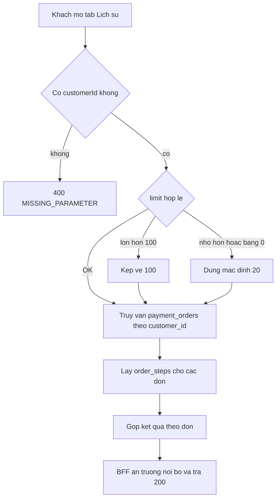
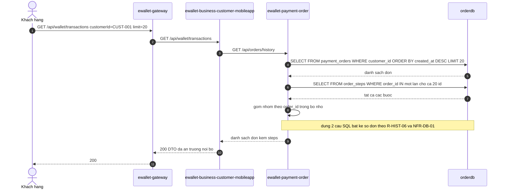

# [F6] Tra cuu lich su giao dich

> Nguồn gốc: `ewallet-demo/docs/specs/F6-transaction-history.md`.

## Page Properties

| Khoá | Giá trị |
|---|---|
| Flow ID | F6 |
| Flow Slug | transaction-history |
| Flow Name | Tra cứu lịch sử giao dịch |
| Actor | Khách hàng (app) hoặc Ops |
| Trigger | Khách mở tab Lịch sử trong app |
| Loại | đọc |
| Services | ewallet-gateway, ewallet-business-customer-mobileapp, ewallet-payment-order |
| Protocols | HTTP, JDBC |
| Entry Endpoint | GET /api/wallet/transactions |
| Kafka Topics | |
| Jira Epic | EWL-6 |
| Spec Source | docs/specs/F6-transaction-history.md |
| Doc Version | 1.0 |
| Status | APPROVED |

---

# 1. Mô tả chung

| Hạng mục | Nội dung |
|---|---|
| Mục đích | Hiển thị danh sách giao dịch gần nhất của khách kèm tiến trình xử lý từng đơn |
| Loại chức năng | Mobile app + API |
| Đối tượng sử dụng | Khách hàng, Ops |
| Đối tượng ảnh hưởng | Khách hàng |
| Kênh áp dụng | E-Wallet Mobile App, Ops Portal |
| Ngôn ngữ | Tiếng Việt |
| Đường dẫn chức năng | Đăng nhập App → Lịch sử |

## 1.1 Mục đích

Để khách tự đối chiếu giao dịch và để Ops điều tra khi có khiếu nại. Flow ngắn nhất trong hệ: không gọi
business, không gọi third-party, không có Kafka. Đây là nơi chứa vấn đề hiệu năng truy vấn DB.

## 1.2 Phạm vi

**Trong phạm vi**: liệt kê đơn theo khách, sắp xếp mới nhất trước, kèm các bước xử lý của mỗi đơn, phân trang.

**Ngoài phạm vi**: lọc theo khoảng ngày hoặc loại giao dịch, xuất file, thống kê tổng hợp.

## 1.3 Tiền điều kiện

Khách đã có ít nhất một đơn trong `payment_orders`.

## 1.4 Hậu điều kiện

1. Trả về danh sách đơn, mới nhất trước, tối đa `limit` bản ghi.
2. Mỗi đơn kèm danh sách `order_steps` sắp xếp tăng dần theo thời gian.
3. Không thay đổi dữ liệu — flow chỉ đọc.

---

# 2. Luồng nghiệp vụ

## 2.1 Biểu đồ luồng



## 2.2 Sequence diagram



## 2.3 Mô tả chi tiết nghiệp vụ

| Bước | Mô tả | Thực hiện bởi | Rule áp dụng |
|---|---|---|---|
| 1 | Khách gửi `GET /api/wallet/transactions?customerId=CUST-001&limit=20` | ewallet-gateway | |
| 2 | Gateway route sang BFF | ewallet-gateway | |
| 3 | BFF gọi `GET /api/orders/history?customerId=...&limit=...` | ewallet-business-customer-mobileapp | R-HIST-03 |
| 4 | Order truy vấn `payment_orders` theo `customer_id`, sắp xếp `created_at DESC`, giới hạn `limit` | ewallet-payment-order | R-HIST-01, R-HIST-02, R-HIST-07 |
| 5 | Order lấy `order_steps` của **tất cả** đơn bằng **một** truy vấn `IN` hoặc `JOIN` | ewallet-payment-order | R-HIST-05, R-HIST-06, R-HIST-07 |
| 6 | Order gộp kết quả theo `order_id` trong bộ nhớ, trả danh sách | ewallet-payment-order | |
| 7 | BFF map sang DTO client, ẩn trường nội bộ, trả `200` | ewallet-business-customer-mobileapp | R-HIST-04 |

## 2.4 Luồng phụ và ngoại lệ

| Mã | Điều kiện | Xử lý | Kết quả cho client |
|---|---|---|---|
| E1 | Khách chưa có giao dịch | Trả danh sách rỗng | `200` với `items: []`, `count: 0` |
| E2 | Thiếu `customerId` | BFF từ chối | `400 MISSING_PARAMETER` |
| E3 | `limit` lớn hơn 100 | Kẹp về 100 theo R-HIST-03 | `200` với tối đa 100 đơn |
| E4 | `limit` nhỏ hơn hoặc bằng 0, hoặc không phải số | Dùng mặc định 20 | `200` |
| E5 | Ops gọi qua route nội bộ `/orders/history` | Trả đầy đủ trường nội bộ, không ẩn | `200` |

---

# 3. Business rule

| Mã | Điều kiện | Hành động | Severity |
|---|---|---|---|
| `R-HIST-01` | Mọi truy vấn lịch sử | Chỉ trả đơn của đúng `customerId` được yêu cầu | must |
| `R-HIST-02` | Sắp xếp | `created_at DESC`, mới nhất trước | must |
| `R-HIST-03` | `limit` | Mặc định 20, tối đa 100 | must |
| `R-HIST-04` | Trường trả về cho client | Ẩn `source_account_id`, `dest_account_id`, `idempotency_key` | must |
| `R-HIST-05` | Mỗi đơn | Kèm danh sách `order_steps` sắp xếp theo `created_at` tăng dần | should |
| `R-HIST-06` | Truy vấn dữ liệu | Lấy các bước của **nhiều đơn bằng một truy vấn** (`IN` hoặc `JOIN`), không lặp truy vấn theo từng đơn | must |
| `R-HIST-07` | Cột dùng để lọc hoặc nối | Phải có index: `payment_orders(customer_id, created_at)` và `order_steps(order_id)` | must |

---

# 4. NFR

| Mã | metric | operator | threshold | unit |
|---|---|---|---|---|
| `NFR-LAT-04` | latency_p95 | `<` | 300 | ms |
| `NFR-DB-01` | query_count | `<=` | 2 | queries |
| `NFR-DB-02` | latency_p95 | `<` | 50 | ms |

`NFR-DB-01` là NFR đặc thù cho `database-quality-library`: nó biến khái niệm mơ hồ "N+1" thành một
ngưỡng đo được. `NFR-DB-02` đo trên từng câu SQL riêng lẻ.

---

# 5. Acceptance criteria

```gherkin
Scenario: Tra cuu lich su tra ve don moi nhat truoc
  Given CUST-001 co 5 don
  When goi GET /api/wallet/transactions customerId=CUST-001 limit=20
  Then response 200 va count=5
  And don dau tien la don co created_at lon nhat
  And moi don co danh sach steps

Scenario: Gioi han limit toi da
  When goi voi limit=500
  Then he thong chi tra toi da 100 don

Scenario: Thieu customerId
  When goi GET /api/orders/history khong co customerId
  Then response 400 va reasonCode=MISSING_PARAMETER

Scenario: Khach chua co giao dich
  When goi voi customerId=CUST-NEW
  Then response 200 va items rong

Scenario: An truong noi bo voi client
  When khach goi qua /api/wallet/transactions
  Then response khong chua source_account_id dest_account_id idempotency_key

Scenario: So cau SQL phai khong phu thuoc so don
  Given CUST-001 co 50 don
  When goi GET /api/orders/history limit=50
  Then tong so cau SQL phai nho hon hoac bang 2
```

---

# 6. Bảng/Thực thể liên quan

| Database | Bảng | Thao tác | Ghi chú |
|---|---|---|---|
| `orderdb` | `payment_orders` | SELECT | lọc `customer_id`, sắp xếp `created_at DESC` — cần index `(customer_id, created_at)` |
| `orderdb` | `order_steps` | SELECT | lấy theo `order_id IN (...)` — cần index `order_id` |

Index bắt buộc theo `R-HIST-07`:

| Bảng | Index | Vì sao |
|---|---|---|
| `payment_orders` | `(customer_id, created_at)` | lọc + sắp xếp trong một lần quét |
| `order_steps` | `(order_id)` | tránh seq scan khi nối |

---

# 7. Danh sách mã lỗi

| Mã lỗi | HTTP status | Message | Sinh ra ở |
|---|---|---|---|
| `MISSING_PARAMETER` | 400 | Thiếu tham số `customerId` | ewallet-business-customer-mobileapp |

---

# 8. Chức năng ảnh hưởng

| Flow bị ảnh hưởng | Vì sao | Mức |
|---|---|---|
| [F1] [F2] [F3] [F4] | Mọi đơn của các flow ghi đều hiện trong lịch sử | thấp — F6 chỉ đọc, không ghi |
| Ops Portal | Dùng chung route nội bộ `/orders/history` | trung bình |

F6 không ảnh hưởng ngược lên flow nào vì nó thuần đọc. Ngược lại, **mọi thay đổi schema `payment_orders`
hoặc `order_steps` đều ảnh hưởng F6** — đây là chiều phụ thuộc mà impact analysis phải bắt được.

> Chèn macro Jira Issues: `project = EWL AND "Flow Slug" ~ "transaction-history" ORDER BY issuetype`

---

# 9. Bảng ghi nhận thay đổi tài liệu

| Ngày thay đổi | Vị trí thay đổi | A/M/D | Nguồn gốc | Link CR | Mô tả thay đổi | Phiên bản confluence | Phiên bản mới |
|---|---|---|---|---|---|---|---|
| 16 Sep 2026 | Toàn bộ | A | Stage D specs | | Tạo mới tài liệu từ `docs/specs/F6-transaction-history.md` | 1 | 1.0 |
