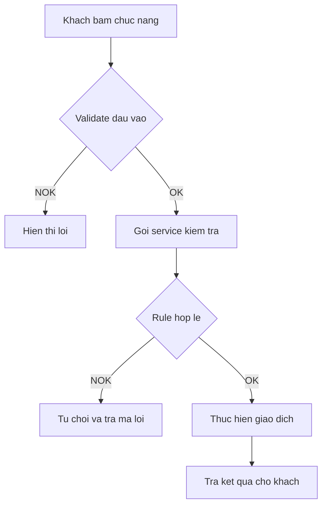
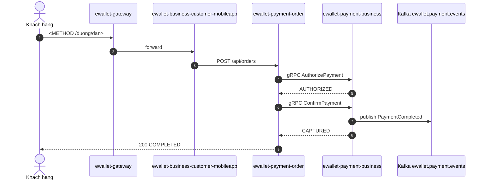

# TEMPLATE — Flow Spec (`VQ - Flow Spec`)

> Khuôn chuẩn cho **một feature / một luồng nghiệp vụ**. Giữ đúng khuôn tài liệu nghiệp vụ hiện dùng
> (Mô tả chung → Màn hình → Luồng nghiệp vụ → Bảng liên quan → Mã lỗi → Chức năng ảnh hưởng →
> Bảng ghi nhận thay đổi), bổ sung 3 thứ mà v-quality cần: **Page Properties**, **mermaid**,
> **bảng rule/NFR có mã**.
>
> Chỗ nào ghi `<…>` là chỗ điền. Xoá toàn bộ dòng trích dẫn hướng dẫn trước khi lưu trang thật.

---

## Page Properties (macro `Page Properties` — đặt ở đầu trang)

| Khoá | Giá trị |
|---|---|
| Flow ID | `<F7>` |
| Flow Slug | `<kebab-case-slug>` |
| Flow Name | `<Tên nghiệp vụ tiếng Việt>` |
| Actor | `<Khách hàng / Agent / Hệ thống / Ops>` |
| Trigger | `<Hành động khởi phát>` |
| Loại | `<ghi / đọc / bất đồng bộ>` |
| Services | `<danh sách OTEL_SERVICE_NAME, cách nhau dấu phẩy>` |
| Protocols | `<HTTP, gRPC, Kafka, WebSocket, SSE, JDBC>` |
| Entry Endpoint | `<METHOD /duong/dan>` |
| Kafka Topics | `<tên topic hoặc để trống>` |
| Jira Epic | `<EWL-n>` |
| Spec Source | `<docs/specs/F7-....md>` |
| Doc Version | `1.0` |
| Status | `DRAFT` |

---

# 1. Mô tả chung

| Hạng mục | Nội dung |
|---|---|
| Mục đích | `<một câu, nói cái flow này cho phép ai làm gì>` |
| Loại chức năng | `<Web app / Mobile app / API / Tiến trình>` |
| Đối tượng sử dụng | `<...>` |
| Đối tượng ảnh hưởng | `<...>` |
| Kênh áp dụng | `<...>` |
| Ngôn ngữ | `<...>` |
| Đường dẫn chức năng | `<Đăng nhập app → ...>` |

## 1.1 Mục đích

`<2–4 câu. Nói rõ tiền đi hướng nào, ai được lợi, kết thúc ở đâu.>`

## 1.2 Phạm vi

**Trong phạm vi**: `<...>`

**Ngoài phạm vi**: `<...>`

## 1.3 Tiền điều kiện

1. `<...>`
2. `<...>`

## 1.4 Hậu điều kiện

Khi thành công:

1. `<trạng thái bản ghi>`
2. `<số dư / sổ cái>`
3. `<event phát ra>`
4. `<thông báo>`

## 1.5 Màn hình (tuỳ chọn)

> Bỏ hẳn mục này nếu flow không có UI. Nếu có, giữ đúng bảng 5 cột dưới đây theo mẫu công ty.

| Tên control | Loại control | Require | Maxlength | Giá trị mặc định | Mô tả |
|---|---|---|---|---|---|
| `<...>` | `<Button / Textbox / Label>` | `<có/không>` | `<...>` | `<...>` | `<...>` |

---

# 2. Luồng nghiệp vụ

## 2.1 Biểu đồ luồng

> Activity diagram. Dùng mermaid `flowchart`, không dùng ảnh export từ draw.io — ảnh không parse được.



## 2.2 Sequence diagram

> **Bắt buộc.** Participant phải ghi đủ `as <OTEL_SERVICE_NAME>` — đây là nguồn để nối span với flow.



## 2.3 Mô tả chi tiết nghiệp vụ

> Bảng 4 cột, tiêu đề cột không được đổi.

| Bước | Mô tả | Thực hiện bởi | Rule áp dụng |
|---|---|---|---|
| 1 | `<...>` | `<service>` | `<R-...>` |
| 2 | `<...>` | `<service>` | |

## 2.4 Luồng phụ và ngoại lệ

| Mã | Điều kiện | Xử lý | Kết quả cho client |
|---|---|---|---|
| `<X1>` | `<...>` | `<...>` | `<HTTP status + reasonCode>` |

---

# 3. Business rule

> 4 cột, đúng tên. `Severity` chỉ nhận `must` hoặc `should`. Điều kiện phải có **số cụ thể**.

| Mã | Điều kiện | Hành động | Severity |
|---|---|---|---|
| `R-<NHOM>-01` | `<...>` | `<...>` | `must` |

---

# 4. NFR

> 5 cột, `threshold` chỉ ghi số.

| Mã | metric | operator | threshold | unit |
|---|---|---|---|---|
| `NFR-<NHOM>-01` | `latency_p95` | `<` | `500` | `ms` |

---

# 5. Acceptance criteria

```gherkin
Scenario: <ten kich ban khong dau>
  Given <tien de>
  When <hanh dong>
  Then <ket qua kiem chung duoc>
  And <rang buoc du lieu>
```

---

# 6. Bảng/Thực thể liên quan

| Database | Bảng | Thao tác | Ghi chú |
|---|---|---|---|
| `<orderdb>` | `<payment_orders>` | `<INSERT / UPDATE / SELECT>` | `<...>` |

---

# 7. Danh sách mã lỗi

| Mã lỗi | HTTP status | Message | Sinh ra ở |
|---|---|---|---|
| `<REASON_CODE>` | `<422>` | `<...>` | `<service>` |

---

# 8. Chức năng ảnh hưởng

| Flow bị ảnh hưởng | Vì sao | Mức |
|---|---|---|
| `<F...>` | `<dùng chung service / rule / bảng nào>` | `<cao / trung bình / thấp>` |

> Chèn macro **Jira Issues** ở đây với JQL:
> `project = EWL AND "Flow Slug" ~ "<slug>" ORDER BY issuetype`

---

# 9. Bảng ghi nhận thay đổi tài liệu

A – Tạo mới, M – Sửa đổi, D – Xoá bỏ

| Ngày thay đổi | Vị trí thay đổi | A/M/D | Nguồn gốc | Link CR | Mô tả thay đổi | Phiên bản confluence | Phiên bản mới |
|---|---|---|---|---|---|---|---|
| `<dd MMM yyyy>` | Toàn bộ | A | `<người tạo>` | | Tạo mới tài liệu | 1 | 1.0 |
