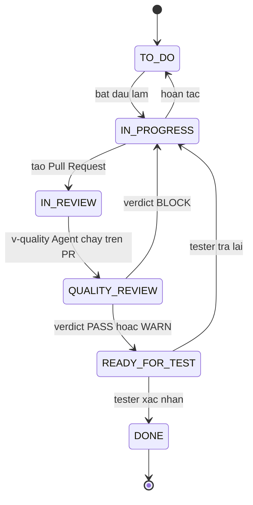

# Jira — Workflow và screen

> Mục tiêu: verdict của AI Agent có **một chỗ đậu chính thức** trong quy trình, chứ không chỉ là một
> comment trôi đi. Nếu verdict không gắn với trạng thái, không ai bị buộc phải xử lý nó.

---

## 1. Workflow đề xuất



| Trạng thái | Ai chuyển | Ý nghĩa |
|---|---|---|
| `TO DO` | người | Chưa làm |
| `IN PROGRESS` | người | Đang code |
| `IN REVIEW` | người | Đã tạo PR, chờ người review |
| `QUALITY REVIEW` | **hệ thống** | Agent v-quality đang phân tích PR |
| `READY FOR TEST` | hệ thống hoặc người | Agent cho qua, chờ tester |
| `DONE` | người | Đã kiểm thử xong |

---

## 2. Tạo trạng thái và workflow

1. Settings → **Issues** → **Statuses** → **Add status**:
   - Name: `QUALITY REVIEW`, Category: **In Progress** (màu vàng)
   - Name: `READY FOR TEST`, Category: **In Progress**
2. Settings → **Issues** → **Workflows** → copy workflow mặc định thành `EWL Quality Workflow`.
3. Thêm 2 trạng thái trên vào workflow, nối transition theo sơ đồ mục 1.
4. Settings → **Workflow schemes** → tạo `EWL Workflow Scheme`, gán `EWL Quality Workflow` cho
   `Story`, `Task`, `Bug`.
5. Project settings → **Workflows** → gán scheme mới cho project `EWL`.

> Epic giữ workflow mặc định. Epic là đơn vị quá lớn để chạy verdict — một epic tương ứng cả một flow,
> luôn có phần đang làm và phần đã xong.

---

## 3. Transition mà Agent sử dụng

Agent chỉ được phép dùng đúng 3 transition sau. Ghi rõ ở đây để khi cấp quyền không cấp thừa:

| Transition | Từ → Đến | Khi nào | Agent ghi thêm gì |
|---|---|---|---|
| `Start quality review` | `IN REVIEW` → `QUALITY REVIEW` | nhận webhook PR mới | comment "đang phân tích" |
| `Quality passed` | `QUALITY REVIEW` → `READY FOR TEST` | verdict `PASS` hoặc `WARN` | `Quality Verdict`, comment chi tiết |
| `Quality blocked` | `QUALITY REVIEW` → `IN PROGRESS` | verdict `BLOCK` | `Quality Verdict`, comment nêu rule bị vi phạm |

Agent **không** được chuyển sang `DONE`. Việc đóng issue là quyết định của người — nền tảng đưa bằng
chứng, người ra quyết định. Ranh giới này nên giữ ngay cả khi nền tảng đã chạy ổn định.

---

## 4. Post-function gợi ý

Trên transition `Quality blocked`, thêm post-function:

- Set field `Quality Verdict` = `BLOCK` (Agent cũng ghi, nhưng đặt ở đây để phòng trường hợp
  transition được kích hoạt bằng tay)
- Add comment nhắc người làm mở trang `[CATALOG] Traceability` để xem rule bị vi phạm

---

## 5. Screen

| Screen | Field |
|---|---|
| `EWL: Create Issue Screen` | Summary, Description, Issue Type, Component, Fix Version, Priority, Labels, `Flow Slug`, `Rule Codes`, `NFR Codes`, `Service` |
| `EWL: Edit Issue Screen` | như trên + `Confluence Page`, `Defect ID`, `Quality Verdict` |
| `EWL: View Issue Screen` | tất cả |

Settings → **Issues** → **Screen schemes** → tạo `EWL Screen Scheme` trỏ tới 3 screen trên, rồi
gán qua **Issue type screen scheme** cho project.

---

## 6. Board

Cột board ánh xạ 1-1 với trạng thái:

| Cột | Trạng thái |
|---|---|
| To Do | `TO DO` |
| In Progress | `IN PROGRESS` |
| Review | `IN REVIEW`, `QUALITY REVIEW` |
| Testing | `READY FOR TEST` |
| Done | `DONE` |

Đặt `QUALITY REVIEW` chung cột với `IN REVIEW` để board không phình ngang; hai trạng thái vẫn phân biệt
được bằng màu thẻ và bằng JQL.

Thêm một **quick filter** trên board:

```
"Quality Verdict" in (WARN, BLOCK)
```

Đây là filter mà Lead mở hằng ngày — nó trả lời đúng một câu hỏi: hôm nay nền tảng tìm ra gì đáng ngại.
