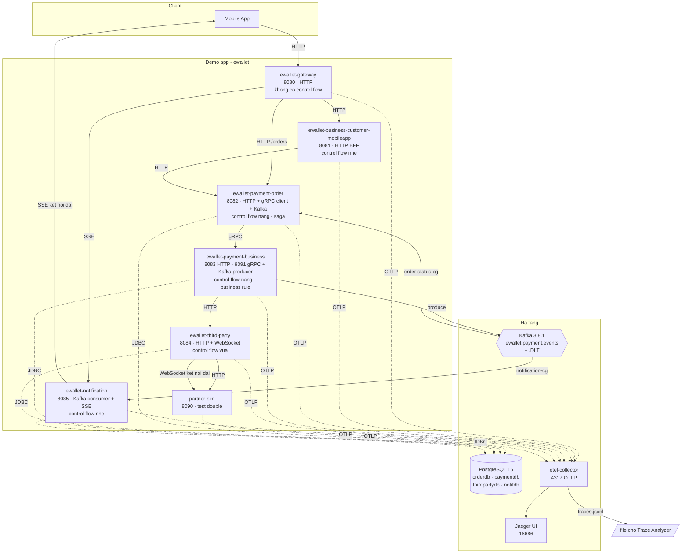
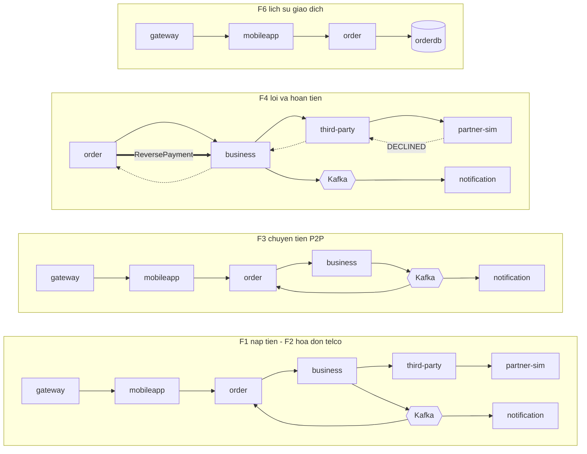
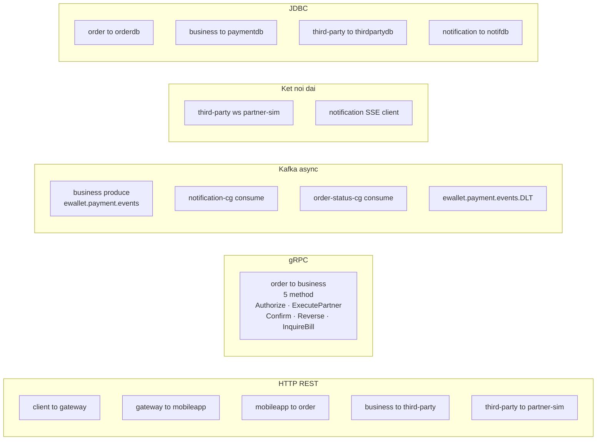
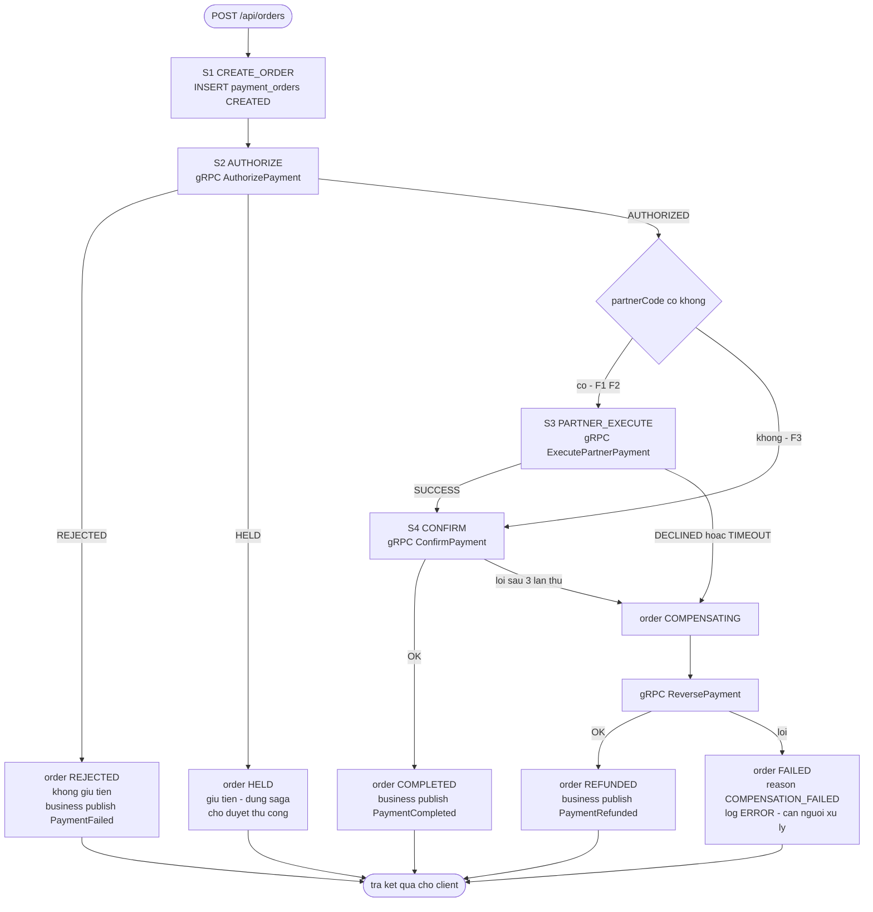
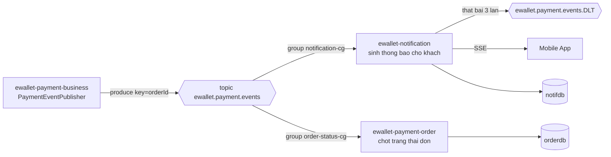
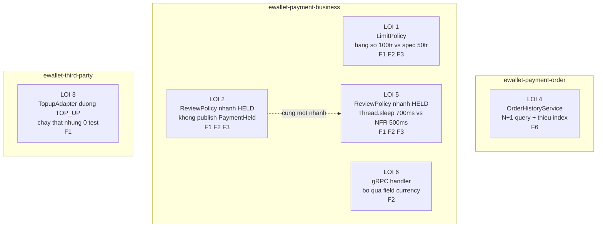

# Sơ đồ tổng thể — container, giao thức, bản đồ flow

> Mermaid. Xem trực tiếp trên GitLab/GitHub, VS Code (extension Markdown Preview Mermaid) hoặc <https://mermaid.live>.
> Chi tiết nghiệp vụ: [`../specs/README.md`](../specs/README.md).

---

## 1. Container diagram

---

## 2. Bản đồ flow trên cùng một topology

Mỗi flow là một tập con của sơ đồ trên. Đặt cạnh nhau để thấy phần dùng chung và phần riêng.

**Đọc ra được gì:**
- `order → business` xuất hiện ở F1, F2, F3, F4 → là **xương sống**. Sửa `business` chạm 5/6 flow.
- `third-party → partner-sim` chỉ ở F1, F2, F4 → sửa `third-party` **không** chạm F3, F6.
- F6 không chạm service nào ngoài `order` → lỗi ở F6 (N+1) không ảnh hưởng giao dịch, chỉ ảnh hưởng trải nghiệm đọc.

---

## 3. Phủ giao thức

Mục đích: chứng minh collector thu được context **ngoài HTTP** — `rpc.*`, `messaging.*`, `db.*`,
và span của kết nối dài.

---

## 4. Saga của `payment-order` — bốn bước và nhánh bù trừ

---

## 5. Fan-out Kafka — một topic, hai consumer group

Đổi schema event → **cả hai** group bị ảnh hưởng nhưng theo cách khác nhau:
`notification` hỏng phần nội dung thông báo, `order` hỏng phần ánh xạ trạng thái.
Đây là ca kiểm chứng impact analysis qua message queue.

---

## 6. Sáu lỗi có chủ đích nằm ở đâu

| Lỗi | Loại | Chỉ lộ ra khi đối chiếu |
|---|---|---|
| #1 | Spec drift | spec ↔ code ↔ DB |
| #2 | Nhánh quên event | spec ↔ trace |
| #3 | Test gap | coverage ↔ trace |
| #4 | DB anti-pattern | db-quality ↔ spec/NFR |
| #5 | Vi phạm NFR | trace ↔ NFR |
| #6 | Drift qua gRPC | attribute span gRPC ↔ spec |

Không lỗi nào phát hiện được chỉ bằng **một** nguồn dữ liệu — đó là luận điểm của đề tài.
