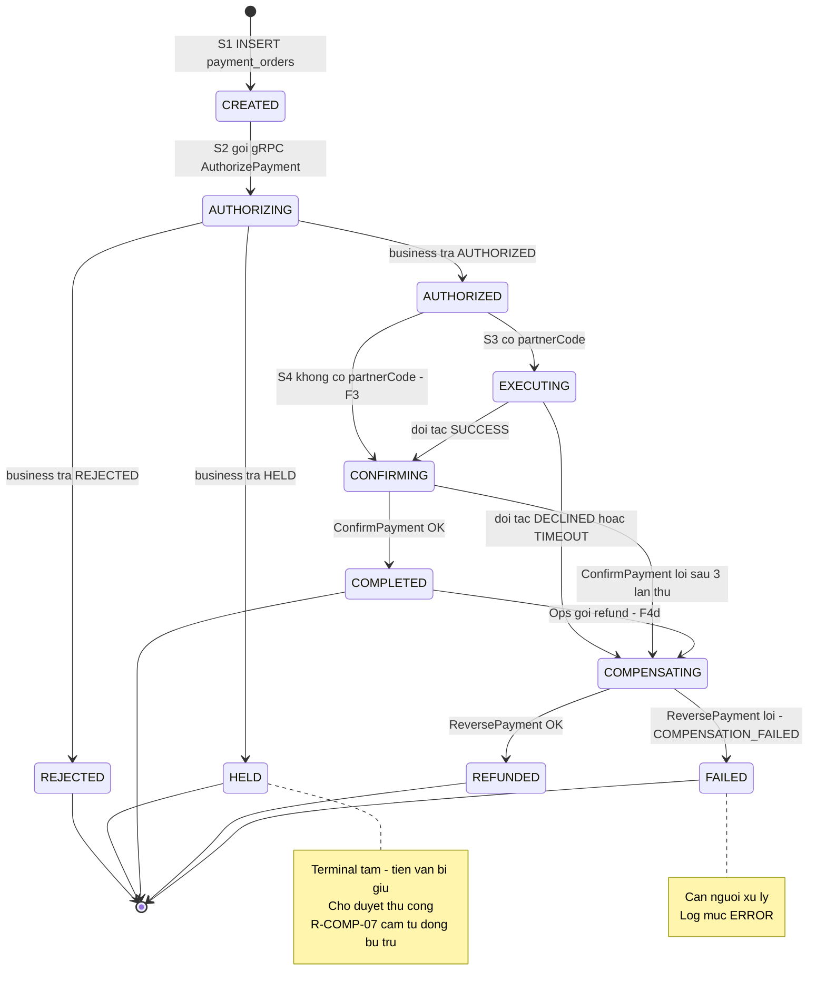
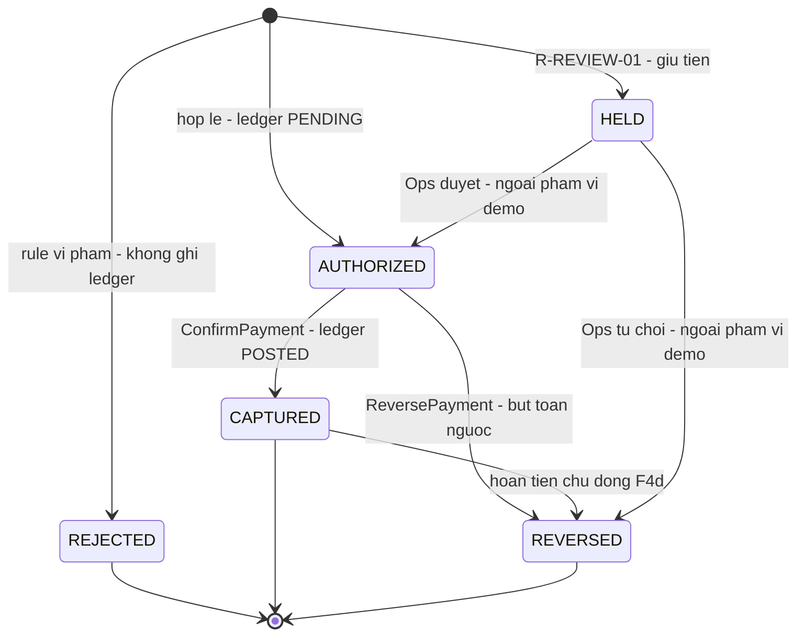
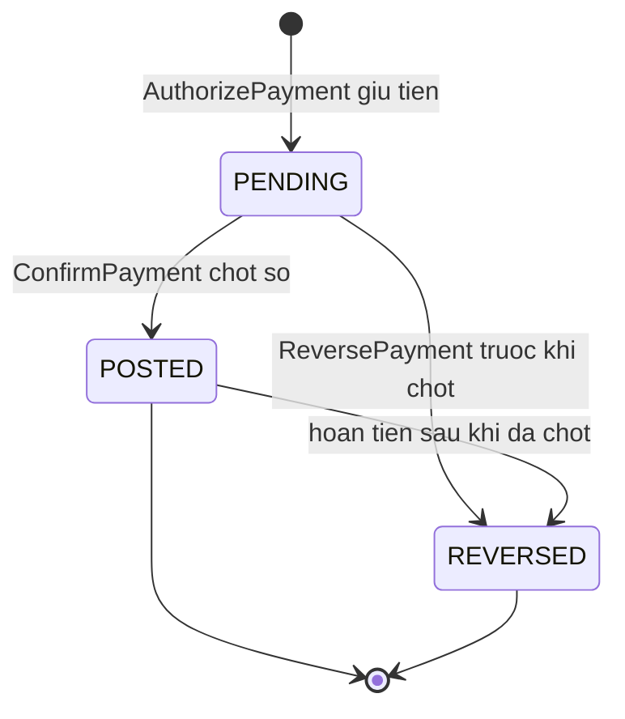
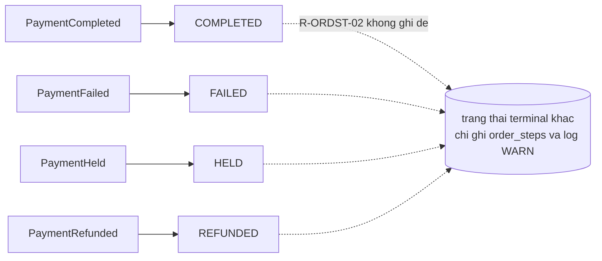
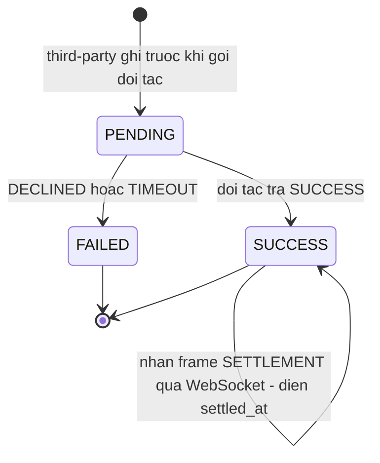
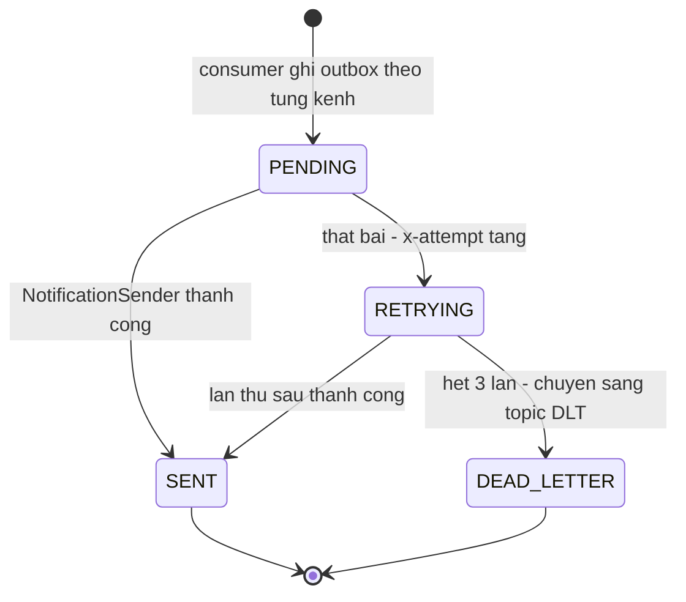
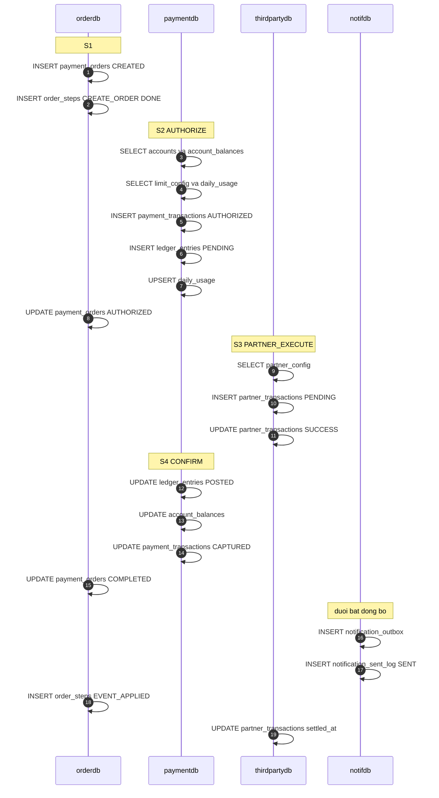

# Máy trạng thái & vòng đời dữ liệu

> Bổ sung cho [`../specs/00-domain-and-conventions.md`](../specs/00-domain-and-conventions.md) §7.

---

## 1. Trạng thái Order — `payment_orders.status` (sở hữu bởi `payment-order`)

---

## 2. Trạng thái Transaction — `payment_transactions.status` (sở hữu bởi `payment-business`)

Mỗi lần `REVERSED` sinh **một transaction mới** `payment_type = REFUND` với `reversed_txn_id`
trỏ về transaction gốc. Transaction gốc không bị xoá.

---

## 3. Trạng thái Ledger entry — `ledger_entries.status`

Sổ cái **append-only**: bù trừ không sửa dòng cũ mà thêm dòng ngược chiều với `txn_id` mới.

---

## 4. Ánh xạ event → trạng thái (consumer `order-status-cg`)

---

## 5. Trạng thái Partner transaction — `partner_transactions.status`

`settled_at` được điền **sau** khi HTTP đã trả — bằng chứng cho kết nối dài WebSocket có ích thật,
không phải gắn vào cho có.

---

## 6. Trạng thái Notification — `notification_outbox.status`

---

## 7. Vòng đời một giao dịch qua bốn DB

Mười chín thao tác DB trên bốn database cho một giao dịch F1 — đây là lượng `db.statement`
mà `database-quality-library` và OTel agent phải thu được.
