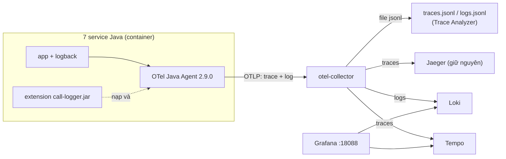

# Log tập trung theo traceId — call-logger + Grafana / Loki / Tempo

> Mỗi lần các service gọi nhau đều tự bắn một dòng log `SERVICE_CALL` mang `trace_id`, và mọi log
> (nghiệp vụ + lời gọi) được tìm kiếm trên Grafana giống Kibana.
> Không phải sửa code nghiệp vụ của service nào.

---

## 1. Kiến trúc



| Thành phần | Vai trò |
|---|---|
| **OTel Java Agent** (có sẵn từ Stage B) | Tự tạo span cho HTTP / gRPC / Kafka / JDBC, tự truyền `traceparent` sang service kế tiếp, tự gửi log logback qua OTLP kèm `trace_id` |
| **call-logger** (`otel-extensions/call-logger`) | Extension của agent. Mỗi span loại CLIENT / SERVER / PRODUCER / CONSUMER kết thúc → bắn một log record `SERVICE_CALL` |
| **Loki** | Kho log. Resource (`service.name`...) thành label, thuộc tính log + `trace_id` thành structured metadata |
| **Tempo** | Kho trace, thay chỗ Jaeger trong Grafana. Jaeger vẫn chạy song song vì spec và script đang dẫn link tới nó |
| **Grafana** | UI: dashboard dựng sẵn + Explore. Log ↔ trace bấm qua lại được |

---

## 2. Dòng log `SERVICE_CALL`

Ví dụ thật, **một giao dịch nạp tiền điện thoại (F2) trong một trace**, lọc theo `trace_id`:

```
ewallet-gateway          SERVICE_CALL inbound  http      <- 172.21.0.1   POST wallet 200 498ms
ewallet-gateway          SERVICE_CALL outbound http      -> ewallet-business-customer-mobileapp:8081 POST /api/wallet/telco/topup 200 493ms
ewallet-payment-order    SERVICE_CALL outbound grpc      -> ewallet-payment-business:9091 ewallet.payment.v2.PaymentBusinessService/AuthorizePayment grpc_0 48ms
ewallet-payment-business SERVICE_CALL outbound http      -> ewallet-third-party:8084 POST /api/thirdparty/execute 200 217ms
ewallet-third-party      SERVICE_CALL outbound http      -> partner-sim:8090 POST /partner/VTELCO/execute 200 184ms
ewallet-third-party      SERVICE_CALL outbound websocket -> partner-sim send WATCH OK 0ms
ewallet-payment-business SERVICE_CALL outbound kafka     -> ewallet.payment.events publish ewallet.payment.events OK 17ms
ewallet-notification     SERVICE_CALL inbound  kafka     <- ewallet.payment.events@notification-cg process ewallet.payment.events OK 62ms
partner-sim              SERVICE_CALL outbound websocket -> ewallet-third-party send SETTLEMENT OK 0ms
ewallet-third-party      SERVICE_CALL inbound  websocket <- partner-sim receive SETTLEMENT OK 21ms
```

Xen giữa các dòng trên là log nghiệp vụ của chính service (`authorize thanh cong ...`,
`da ghi nhan quyet toan ...`) — cùng `trace_id`.

### Trường có cấu trúc (structured metadata trong Loki)

| Trường | Ví dụ | Ghi chú |
|---|---|---|
| `event_name` | `service.call` | lọc riêng log lời gọi |
| `call_direction` | `outbound` / `inbound` | CLIENT, PRODUCER = outbound · SERVER, CONSUMER = inbound |
| `call_protocol` | `http` `grpc` `kafka` `websocket` | |
| `call_peer` | `ewallet-payment-business:9091`, `ewallet.payment.events@order-status-cg` | Kafka: topic@consumer group |
| `call_operation` | `POST /api/orders`, `PaymentBusinessService/AuthorizePayment` | HTTP client **bỏ query string** để không lộ tham số |
| `call_status` | `200`, `grpc_0`, `OK`, `ERROR` | |
| `call_duration_ms` | `48` | dùng `unwrap` để tính p95 |
| `call_error` | `java.net.SocketTimeoutException` | chỉ có khi lỗi; log đó mức `WARN` |
| `trace_id`, `span_id` | | trùng span trong Tempo |

### Cấu hình extension

Đặt bằng `-D...` trong `JAVA_TOOL_OPTIONS` hoặc biến môi trường `OTEL_CALL_LOGGER_...`:

| Thuộc tính | Mặc định | |
|---|---|---|
| `otel.call-logger.enabled` | `true` | tắt hẳn |
| `otel.call-logger.include-db` | `false` | ghi cả span JDBC (một request N+1 sinh hàng chục dòng — mặc định tắt) |
| `otel.call-logger.exclude-paths` | `/actuator` | bỏ HTTP path có tiền tố này, phân tách bằng dấu phẩy |

---

## 3. Chỗ agent **không** tự nối trace — đã xử lý tay

| Kênh | Vì sao agent không làm | Cách xử lý |
|---|---|---|
| **WebSocket** third-party ↔ partner-sim | Kênh mở một lần lúc khởi động, sống hàng giờ; agent không gắn context cho từng frame | Frame nghiệp vụ `WATCH` / `SETTLEMENT` mang thêm trường `"traceparent"` (W3C). Mỗi bên mở span PRODUCER khi gửi, CONSUMER khi nhận (`ws/WsTracing.java` ở cả hai service). Quyết toán đến sau 300ms vẫn nằm chung trace với giao dịch. `PING` / `SUBSCRIBE` cố ý không gắn |
| **SSE** notification → trình duyệt | Chặng cuối, không có service phía sau | Mỗi sự kiện `payment` kèm dòng comment `:trace_id=...` (EventSource bỏ qua, payload JSON giữ nguyên) để client tra ngược log |

Không có agent (unit test, chạy thường không `-javaagent`) thì phần trên là no-op: frame không có
trường mới, SSE không có dòng comment.

---

## 4. Dùng dashboard

Mở <http://localhost:18088> (không cần đăng nhập) — trang chủ là dashboard
**ewallet — Service calls & logs**:

| Panel | Dùng để |
|---|---|
| Log — lọc theo service / trace_id / từ khoá | Ô `trace_id` dán id vào là thấy toàn bộ log của giao dịch qua mọi service. Ô từ khoá nhận regex, ví dụ `orderId=05117abc` |
| SERVICE_CALL | Chỉ các lời gọi giữa service |
| Số lời gọi đi theo service → peer | Ai gọi ai, nhiều cỡ nào |
| Lời gọi lỗi (WARN) | Timeout đối tác, gRPC lỗi... |
| p95 thời gian lời gọi đi | Đỏ khi > 500ms — nhánh HELD của `AuthorizePayment` (lỗi #5) nổi lên ở đây |

**Log → trace**: bung một dòng log, ở trường `trace_id` bấm **Mở trace trong Tempo**.
**Trace → log**: trong Explore / Tempo, mỗi span có icon tài liệu → log của đúng trace đó.

### Truy vấn LogQL hay dùng (Explore → Loki)

```logql
# mọi log của một giao dịch
{service_name=~".+"} | trace_id="3bbbf9d689fc42053268b3455368e6f7"

# tìm theo orderId trong log nghiệp vụ
{service_name=~".+"} |= "05117abc-897a-492a-94c0-86d1a6b68cb9"

# lời gọi gRPC chậm hơn 500ms
{service_name="ewallet-payment-order"} | event_name="service.call" | call_protocol="grpc" | call_duration_ms > 500

# lời gọi lỗi
{service_name=~".+"} | event_name="service.call" | severity_text="WARN"
```

Tra bằng API (không cần UI) — Loki mở cổng host **13100**:

```bash
curl -G http://localhost:13100/loki/api/v1/query_range \
  --data-urlencode 'query={service_name=~".+"} | trace_id="<id>"' --data-urlencode since=30m
```

---

## 5. Build & chạy

Trong Docker không phải làm gì thêm: `docker compose --profile all up -d --build`.
Service `otel-ext-build` build jar rồi chép vào volume `otel-ext`; 7 service Java chờ nó xong,
mount volume tại `/otel/ext` và nạp qua `-Dotel.javaagent.extensions=/otel/ext/call-logger.jar`.

Sửa code extension xong thì:

```bash
docker compose --profile all up -d --build otel-ext-build
docker compose restart ewallet-gateway ewallet-business-customer-mobileapp ewallet-payment-order ewallet-payment-business ewallet-third-party ewallet-notification partner-sim
```

Chạy service trên host (cách 2 trong `local-run.md`): build jar một lần
`cd otel-extensions/call-logger && mvn package`, rồi thêm vào `jvmArguments`:
`-Dotel.javaagent.extensions=../otel-extensions/call-logger/target/call-logger.jar -Dotel.logs.exporter=otlp`.

Unit test của extension: `mvn test` trong `otel-extensions/call-logger` (7 test, dùng SDK in-memory).

RAM thêm: Loki, Tempo, Grafana mỗi cái cap 256–384 MB.

---

## 6. Lưu ý khi đưa lên VDS thật

- Grafana đang bật **anonymous Admin** cho tiện demo — phải tắt, nối SSO/LDAP.
- Loki / Tempo đang lưu filesystem trong volume (`lokidata`, `tempodata`) — sống qua lần xoá container, mất khi `docker compose down -v`. Tempo giữ 72h. Production dùng object storage (S3/MinIO) và chế độ microservices hoặc simple-scalable.
- Tempo cũng là nguồn trace của Trace Analyzer từ Stage F (API `http://localhost:13200`, `/api/search` + `/api/traces/<id>`); giai đoạn demo Trace Analyzer đọc file `traces*.jsonl`. Xem `collector-data-contract.md` §3.
- Nếu VDS đã có ELK/OpenSearch: giữ nguyên call-logger, chỉ đổi exporter trong `infra/otel-collector/config.yaml` sang `elasticsearch` / `opensearch`.
- Log `SERVICE_CALL` không chứa body hay query string, nhưng log nghiệp vụ có `customerId`, `orderId` — cần chính sách retention và phân quyền xem log.
