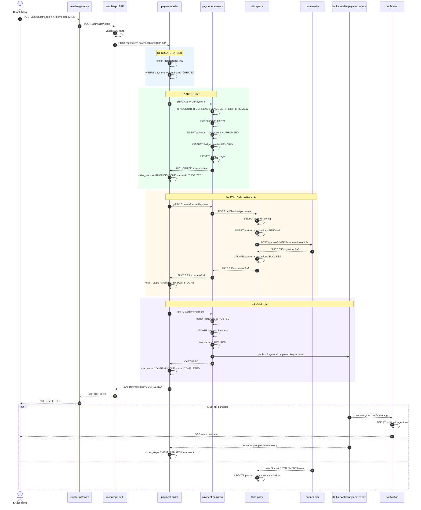
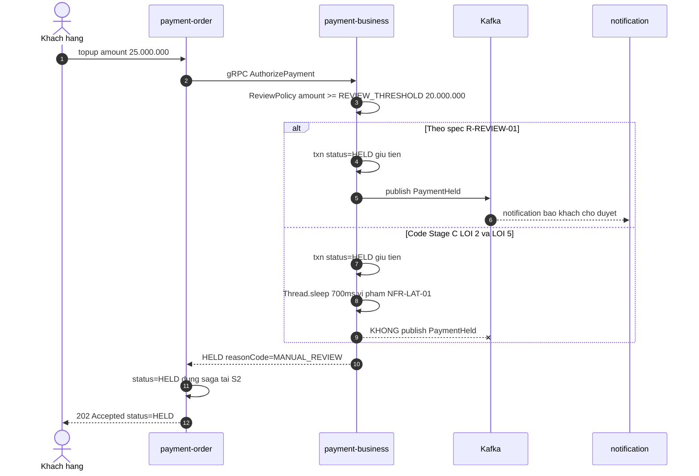

# F1 — Nạp tiền vào ví qua đối tác

| | |
|---|---|
| **Slug** | `topup-partner` |
| **Loại** | Giao dịch ghi, đồng bộ + đuôi bất đồng bộ |
| **Actor** | Khách hàng |
| **Trigger** | Khách bấm "Nạp tiền" trên app, chọn đối tác và số tiền |
| **Service đi qua** | gateway → mobileapp → order → business → third-party → partner-sim → Kafka → notification + order |
| **Giao thức chạm** | HTTP · gRPC · HTTP ra ngoài · WebSocket · Kafka · JDBC · SSE |
| **Lỗi có chủ đích chạm vào** | #1 (hạn mức) · #2 (HELD không publish) · #3 (không có test) · #5 (NFR 500ms) |

---

# PHẦN 1 — REQUIREMENT

## 1.1 Mục tiêu

Cho phép khách hàng chuyển tiền **từ tài khoản ở đối tác** (ngân hàng / cổng thanh toán) **vào ví**.
Sau khi flow kết thúc, số dư ví tăng đúng bằng số tiền nạp, sổ cái cân, và khách nhận được thông báo.

## 1.2 Phạm vi

**Trong phạm vi**: tạo đơn, áp business rule, giữ tiền, gọi đối tác, chốt sổ, phát event, thông báo.
**Ngoài phạm vi**: xác thực người dùng (demo không có auth), 3-D Secure, đối soát cuối ngày,
huỷ đơn do khách chủ động (F4 xử lý nhánh lỗi).

## 1.3 Tiền điều kiện

1. Khách có ví ở trạng thái `ACTIVE` (seed §11.1 của `00-domain-and-conventions.md`).
2. `partnerCode` tồn tại trong `partner_config` và `enabled = true`.
3. Đối tác (partner-sim) đang chạy.
4. Client sinh được `X-Idempotency-Key`.

## 1.4 Hậu điều kiện (khi thành công)

1. `payment_orders.status = COMPLETED`, có `txn_id` và `partner_ref`.
2. `payment_transactions.status = CAPTURED`.
3. Có **đúng 2** `ledger_entries` `POSTED` cùng `txn_id`: DEBIT `SYSTEM_SUSPENSE`, CREDIT ví khách.
4. `account_balances` của ví khách **tăng** đúng `amount`.
5. `daily_usage` của khách trong ngày tăng `amount_vnd`.
6. `partner_transactions.status = SUCCESS`, `settled_at` được điền (qua WebSocket, trễ ~300ms).
7. Kafka có đúng 1 event `PaymentCompleted`, hai consumer group đều xử lý.
8. `notification_outbox` có ít nhất 1 dòng, `notification_sent_log` ghi `SENT`.

## 1.5 Luồng chính (happy path)

| # | Bước | Thực hiện bởi |
|---|---|---|
| 1 | Khách gửi `POST /api/wallet/topup` kèm `X-Idempotency-Key` | Client → gateway |
| 2 | Gateway route sang BFF, thêm header `X-Gateway` | gateway |
| 3 | BFF validate cú pháp (số tiền dương, `partnerCode` không rỗng), map sang lệnh tạo đơn | mobileapp |
| 4 | BFF gọi `POST /api/orders` với `paymentType = TOP_UP` | mobileapp → order |
| 5 | **S1 CREATE_ORDER** — order kiểm tra idempotency, ghi `payment_orders` trạng thái `CREATED` | order |
| 6 | **S2 AUTHORIZE** — order gọi gRPC `AuthorizePayment`, đặt order `AUTHORIZING` | order → business |
| 7 | Business áp `R-ACCOUNT-01/02`, `R-CURRENCY-01`, `R-AMOUNT-01/02`, `R-LIMIT-01`, `R-REVIEW-01`; tính phí `R-FEE-01`; ghi `payment_transactions` `AUTHORIZED` + 2 `ledger_entries` `PENDING`; cộng `daily_usage` | business |
| 8 | Business trả `AUTHORIZED` kèm `ledgerTxnId`, `fee`. Order ghi step `AUTHORIZE=DONE`, order → `AUTHORIZED` | business → order |
| 9 | **S3 PARTNER_EXECUTE** — order gọi gRPC `ExecutePartnerPayment`, order → `EXECUTING` | order → business |
| 10 | Business gọi `POST /api/thirdparty/execute` | business → third-party |
| 11 | Third-party đọc `partner_config`, ghi `partner_transactions` `PENDING`, chọn adapter theo `service_type` | third-party |
| 12 | Third-party gọi `POST /partner/VNPAY/execute` (timeout 3000ms) | third-party → partner-sim |
| 13 | Partner-sim trả `SUCCESS` + `partnerRef` | partner-sim |
| 14 | Third-party cập nhật `partner_transactions = SUCCESS`, gửi frame `WATCH` qua WebSocket đang mở | third-party |
| 15 | Business nhận `SUCCESS`, lưu `partner_ref` vào transaction, trả về order | third-party → business → order |
| 16 | **S4 CONFIRM** — order gọi gRPC `ConfirmPayment`, order → `CONFIRMING` | order → business |
| 17 | Business chuyển ledger `PENDING → POSTED`, cập nhật `account_balances`, txn → `CAPTURED` | business |
| 18 | Business publish `PaymentCompleted` lên `ewallet.payment.events` (key = `orderId`) | business → Kafka |
| 19 | Order ghi step `CONFIRM=DONE`, đặt `COMPLETED`, trả kết quả lên BFF | order |
| 20 | BFF map sang DTO client, trả `200 OK` | mobileapp → gateway → client |
| 21 | **Đuôi async** — `notification-cg` nhận event, ghi outbox, đẩy SSE (chi tiết F5) | notification |
| 22 | **Đuôi async** — `order-status-cg` nhận event, ghi `order_steps EVENT_APPLIED` (idempotent) | order |
| 23 | **Đuôi async** — partner-sim đẩy frame `SETTLEMENT` qua WebSocket, third-party điền `settled_at` | partner-sim → third-party |

Bước 19–20 **không chờ** bước 21–23. Client nhận phản hồi ngay sau bước 19.

## 1.6 Luồng phụ & ngoại lệ

| Mã | Điều kiện | Xử lý | Kết quả cho client |
|---|---|---|---|
| **A1** | Thiếu `X-Idempotency-Key` | BFF từ chối ngay, không tạo đơn | `400` |
| **A2** | Trùng idempotency key, payload giống | Order trả lại đơn cũ (`R-IDEM-02`) | `200` với đơn cũ |
| **A3** | Trùng idempotency key, payload khác | `R-IDEM-03` | `409 DUPLICATE_REQUEST` |
| **A4** | Ví không tồn tại / bị khoá | Business `REJECTED`, publish `PaymentFailed`, order → `REJECTED` | `422 ACCOUNT_NOT_FOUND` / `ACCOUNT_INACTIVE` |
| **A5** | `amount` ngoài khoảng cho phép | `R-AMOUNT-01/02` → `REJECTED` | `422 AMOUNT_TOO_SMALL` / `AMOUNT_TOO_LARGE` |
| **A6** | Vượt hạn mức ngày | `R-LIMIT-01` → `REJECTED`, không ghi ledger | `422 LIMIT_EXCEEDED` |
| **A7** | `amount ≥ 20.000.000` | `R-REVIEW-01` → txn `HELD`, **giữ tiền**, publish `PaymentHeld`, order → `HELD`, **dừng saga tại S2** | `202` với `status=HELD` |
| **A8** | Đối tác từ chối / timeout ở S3 | Nhánh bù trừ → xem [F4](F4-failure-refund.md) | `502` / `504`, order `REFUNDED` |
| **A9** | `ConfirmPayment` lỗi hạ tầng ở S4 | Order retry 2 lần, vẫn lỗi → nhánh bù trừ (F4) | `502`, order `REFUNDED` |
| **A10** | Kafka down khi publish | Business ghi log lỗi, **vẫn trả `CAPTURED`** cho order (tiền đã đúng); event bù bằng job đối soát | `200` — nhưng không có thông báo |

## 1.7 Business rule của flow

Kế thừa toàn bộ rule dùng chung (`00-domain-and-conventions.md` §8). Riêng F1:

| Mã | Điều kiện | Hành động | Severity |
|---|---|---|---|
| `R-TOPUP-01` | `paymentType = TOP_UP` | Ví nguồn là tài khoản hệ thống `SYSTEM_SUSPENSE`, ví đích là ví khách. Không áp `R-BALANCE-01` (tiền đến từ đối tác) | must |
| `R-TOPUP-02` | `partnerCode` rỗng hoặc không có trong `partner_config` | Từ chối `PARTNER_DECLINED`, không ghi ledger | must |
| `R-TOPUP-03` | `partner_config.service_type != TOPUP` | Từ chối `PARTNER_DECLINED` | must |
| `R-TOPUP-04` | Nạp tiền thành công | Phí = 0 (`R-FEE-01`) — đối tác chịu phí | must |
| `R-TOPUP-05` | Đối tác trả `SUCCESS` nhưng `partnerRef` rỗng | Coi như thất bại, vào nhánh bù trừ | should |
| `R-TOPUP-06` | Giao dịch đã `CAPTURED` | Không cho phép execute lại cùng `orderId` ở đối tác | must |

## 1.8 NFR

| Mã | metric | operator | threshold | unit |
|---|---|---|---|---|
| `NFR-LAT-01` | `latency_p95` gRPC `AuthorizePayment` | `<` | 500 | ms |
| `NFR-LAT-02` | `latency_p95` end-to-end `POST /api/wallet/topup` | `<` | 2000 | ms |
| `NFR-TIMEOUT-01` | timeout gọi partner | `<=` | 3000 | ms |
| `NFR-ERR-01` | `error_rate` | `<` | 1 | percent |

## 1.9 Acceptance criteria

```gherkin
Scenario: Nap tien thanh cong qua VNPAY
  Given khach CUST-001 co vi ACTIVE so du 5.000.000d
  When khach goi POST /api/wallet/topup voi amount=500000 partnerCode=VNPAY
  Then response 200 va status=COMPLETED
  And so du vi CUST-001 la 5.500.000d
  And co dung 2 ledger_entries POSTED cung txn_id
  And co 1 event PaymentCompleted tren ewallet.payment.events
  And notification_outbox co ban ghi cho CUST-001

Scenario: Nap tien vuot nguong ra soat thi bi treo
  Given khach CUST-003 co vi ACTIVE
  When khach goi POST /api/wallet/topup voi amount=25000000
  Then response 202 va status=HELD
  And payment_transactions.status=HELD va tien van bi giu
  And co 1 event PaymentHeld tren ewallet.payment.events   # LOI #2 lam buoc nay that bai

Scenario: Nap tien vuot han muc ngay thi bi tu choi
  Given khach CUST-003 da giao dich 40.000.000d trong ngay
  When khach goi POST /api/wallet/topup voi amount=15000000
  Then response 422 va reasonCode=LIMIT_EXCEEDED   # LOI #1 lam buoc nay that bai
  And khong co ledger_entries moi
```

---

# PHẦN 2 — DESIGN

## 2.1 Service tham gia

| Service | Vai trò trong F1 | Class chính (Stage C) |
|---|---|---|
| `ewallet-gateway` | Route, không logic | — |
| `ewallet-business-customer-mobileapp` | Validate cú pháp, shape DTO | `web.WalletController`, `client.OrderClient` |
| `ewallet-payment-order` | Orchestrator saga 4 bước, ghi `order_steps` | `web.OrderController`, `saga.PaymentSagaOrchestrator`, `grpc.PaymentBusinessClient` |
| `ewallet-payment-business` | Business rule, sổ cái, gọi đối tác, publish event | `grpc.PaymentBusinessGrpcService`, `domain.*Policy`, `ledger.LedgerService`, `client.ThirdPartyClient`, `kafka.PaymentEventPublisher` |
| `ewallet-third-party` | Adapter đối tác, giữ WebSocket | `web.ThirdPartyController`, `partner.TopupAdapter`, `ws.PartnerWsClient` |
| `partner-sim` | Giả lập đối tác | `web.PartnerController`, `ws.PartnerWebSocketHandler` |
| `ewallet-notification` | Đuôi async (F5) | `kafka.PaymentEventListener` |

## 2.2 Sequence diagram — happy path



## 2.3 Sequence diagram — nhánh HELD (chạm lỗi #2 và #5)



Hai điều platform phải bắt được từ nhánh này:
- Trace của flow HELD **không có** span `publish` tới `ewallet.payment.events` → vi phạm `R-EVENT-01` + `R-REVIEW-01` (lỗi #2).
- `latency_p95` của span gRPC `AuthorizePayment` nhánh HELD > 700ms → vi phạm `NFR-LAT-01` (lỗi #5).

## 2.4 Hợp đồng dùng trong flow

| Bước | Hợp đồng | Chi tiết |
|---|---|---|
| 1–2 | `POST /api/wallet/topup` | [01-api-contracts §3.1](01-api-contracts.md#31-post-apiwallettopup--f1) |
| 4 | `POST /api/orders` | [§4.1](01-api-contracts.md) |
| 6 | gRPC `AuthorizePayment` | [§5](01-api-contracts.md) |
| 9 | gRPC `ExecutePartnerPayment` | [§5](01-api-contracts.md) |
| 10 | `POST /api/thirdparty/execute` | [§7.1](01-api-contracts.md) |
| 12 | `POST /partner/{code}/execute` | [§8.1](01-api-contracts.md) |
| 16 | gRPC `ConfirmPayment` | [§5](01-api-contracts.md) |
| 18 | Kafka `PaymentCompleted` | [00 §12](00-domain-and-conventions.md) |
| 23 | WS frame `SETTLEMENT` | [§8.3](01-api-contracts.md) |

## 2.5 Dữ liệu thay đổi

| DB | Bảng | Thao tác | Bước |
|---|---|---|---|
| `orderdb` | `payment_orders` | INSERT + 4 lần UPDATE status | 5, 6, 9, 16, 19 |
| `orderdb` | `order_steps` | 4–5 INSERT | 5, 8, 15, 19, 22 |
| `paymentdb` | `payment_transactions` | INSERT (AUTHORIZED) → UPDATE (CAPTURED) | 7, 17 |
| `paymentdb` | `ledger_entries` | 2 INSERT (PENDING) → 2 UPDATE (POSTED) | 7, 17 |
| `paymentdb` | `account_balances` | UPDATE ví khách | 17 |
| `paymentdb` | `daily_usage` | UPSERT | 7 |
| `thirdpartydb` | `partner_config` | SELECT | 11 |
| `thirdpartydb` | `partner_transactions` | INSERT → UPDATE status → UPDATE settled_at | 11, 14, 23 |
| `notifdb` | `notification_outbox`, `notification_sent_log` | INSERT | 21 |

### Bút toán kép của F1

| # | account | direction | amount | entry_type | status |
|---|---|---|---|---|---|
| 1 | `SYSTEM_SUSPENSE` `...00f1` | `DEBIT` | `amount` | `PAYMENT` | `PENDING` → `POSTED` |
| 2 | ví khách | `CREDIT` | `amount` | `PAYMENT` | `PENDING` → `POSTED` |

Không có bút toán phí (`R-FEE-01` cho phí = 0).

## 2.6 Xử lý lỗi & bù trừ

Saga dạng **orchestration**, orchestrator là `payment-order`. Bù trừ **luôn do order khởi xướng**:

| Bước lỗi | Đã giữ tiền chưa | Hành động |
|---|---|---|
| S1 | chưa | Trả lỗi ngay, order `FAILED` |
| S2 (REJECTED) | chưa | Order `REJECTED`, business đã publish `PaymentFailed` |
| S2 (HELD) | rồi | Order `HELD`, dừng saga, chờ duyệt thủ công |
| S3 (partner lỗi) | rồi | Order → `COMPENSATING`, gọi `ReversePayment`, order → `REFUNDED` — xem [F4](F4-failure-refund.md) |
| S4 (confirm lỗi) | rồi | Order retry 2 lần → vẫn lỗi → như S3 |

Mọi bước ghi `order_steps` với `step_status` và `duration_ms` để dựng lại timeline khi điều tra.

## 2.7 Quan sát kỳ vọng (cho Trace Analyzer)

**Span path kỳ vọng của 1 trace F1:**

```
ewallet-gateway        POST /api/wallet/topup                  (SERVER, root)
└─ mobileapp           POST /api/wallet/topup                  (SERVER)
   └─ order            POST /api/orders                        (SERVER)
      ├─ order         INSERT payment_orders                   (CLIENT, db)
      ├─ business      ewallet.payment.v2.PaymentBusinessService/AuthorizePayment   (SERVER, rpc)
      │  ├─ business   SELECT accounts / limit_config          (CLIENT, db)
      │  └─ business   INSERT payment_transactions, ledger_entries (CLIENT, db)
      ├─ business      .../ExecutePartnerPayment               (SERVER, rpc)
      │  └─ third-party POST /api/thirdparty/execute           (SERVER)
      │     └─ partner-sim POST /partner/{code}/execute        (SERVER)
      ├─ business      .../ConfirmPayment                      (SERVER, rpc)
      │  └─ business   publish ewallet.payment.events          (PRODUCER, messaging)
      └─ order         INSERT order_steps                      (CLIENT, db)

(trace liên kết) notification  ewallet.payment.events process  (CONSUMER, group=notification-cg)
(trace liên kết) order         ewallet.payment.events process  (CONSUMER, group=order-status-cg)
```

| Thuộc tính | Giá trị kỳ vọng |
|---|---|
| `service.name` | 6 giá trị khác nhau trong 1 trace |
| `rpc.service` | `ewallet.payment.v2.PaymentBusinessService` |
| `rpc.method` | `AuthorizePayment` · `ExecutePartnerPayment` · `ConfirmPayment` |
| `messaging.destination.name` | `ewallet.payment.events` |
| `messaging.kafka.consumer.group` | `notification-cg`, `order-status-cg` |
| `db.statement` | có INSERT/UPDATE trên `payment_orders`, `ledger_entries`, `partner_transactions` |
| số span | 18–24 span cho happy path |

**Baseline gợi ý** (máy dev, partner-sim latency mặc định): `p95` end-to-end 400–900ms, `p95` `AuthorizePayment` 40–120ms.

## 2.8 Lỗi có chủ đích chạm vào F1

| # | Ở đâu | Biểu hiện trong F1 | Platform bắt bằng |
|---|---|---|---|
| **#1** | `LimitPolicy` hằng số 100.000.000 | Giao dịch 50–100tr/ngày lẽ ra bị chặn nhưng vẫn qua | Doc Indexer (`R-LIMIT-01` = 50tr) vs Code Indexer (hằng số) |
| **#2** | Nhánh HELD không publish | Trace nhánh HELD thiếu span producer | Trace Analyzer + `R-EVENT-01` |
| **#3** | Đường TOP_UP không có test | Có `FlowObservation` cho `topup-partner` nhưng JaCoCo coverage = 0 trên `TopupAdapter` / nhánh `TOP_UP` | Coverage vs trace |
| **#5** | `Thread.sleep(700)` nhánh HELD | `AuthorizePayment` p95 > 500ms | `SpanStat.p95` vs `NFR-LAT-01` |

---

# PHẦN 3 — TEST & DEMO

## 3.1 Kịch bản demo

```bash
# 1. Happy path - nap 500.000d
curl -s -X POST http://localhost:18080/api/wallet/topup \
  -H "Content-Type: application/json" \
  -H "X-Idempotency-Key: $(uuidgen)" \
  -d '{"customerId":"CUST-001","amount":500000,"currency":"VND","partnerCode":"VNPAY","partnerAccountRef":"9704000000001234"}'

# 2. Kiem tra so du tang dung
curl -s http://localhost:18083/admin/accounts/CUST-001/balance

# 3. Nhanh HELD - cham loi #2 va #5
curl -s -X POST http://localhost:18080/api/wallet/topup \
  -H "Content-Type: application/json" \
  -H "X-Idempotency-Key: $(uuidgen)" \
  -d '{"customerId":"CUST-003","amount":25000000,"currency":"VND","partnerCode":"VNPAY","partnerAccountRef":"9704000000009999"}'

# 4. Idempotency - goi lai voi cung key phai tra ve don cu
KEY=$(uuidgen)
curl -s -X POST http://localhost:18080/api/wallet/topup -H "X-Idempotency-Key: $KEY" -H "Content-Type: application/json" \
  -d '{"customerId":"CUST-001","amount":100000,"currency":"VND","partnerCode":"VNPAY","partnerAccountRef":"9704000000001234"}'
curl -s -X POST http://localhost:18080/api/wallet/topup -H "X-Idempotency-Key: $KEY" -H "Content-Type: application/json" \
  -d '{"customerId":"CUST-001","amount":100000,"currency":"VND","partnerCode":"VNPAY","partnerAccountRef":"9704000000001234"}'
```

Script sẵn có: `scripts/demo-flows.ps1 -Flow F1` (Windows) hoặc `scripts/demo-flows.sh F1`.

## 3.2 Kiểm chứng trong Jaeger

1. Mở <http://localhost:16686>, chọn service `ewallet-gateway`, operation `POST /api/wallet/topup`.
2. Trace phải có **6 service** và chứa 3 span `rpc` + 1 span `publish`.
3. So sánh trace happy path và trace HELD: trace HELD **thiếu** span publish và có span `AuthorizePayment` > 700ms.

## 3.3 Test suite (Stage E)

> ⚠️ **Lỗi có chủ đích #3**: F1 (đường `TOP_UP`) **cố ý không có test** ở Stage E.
> Các flow khác có test. Đây là hợp đồng nghiệm thu — không viết test cho F1.
