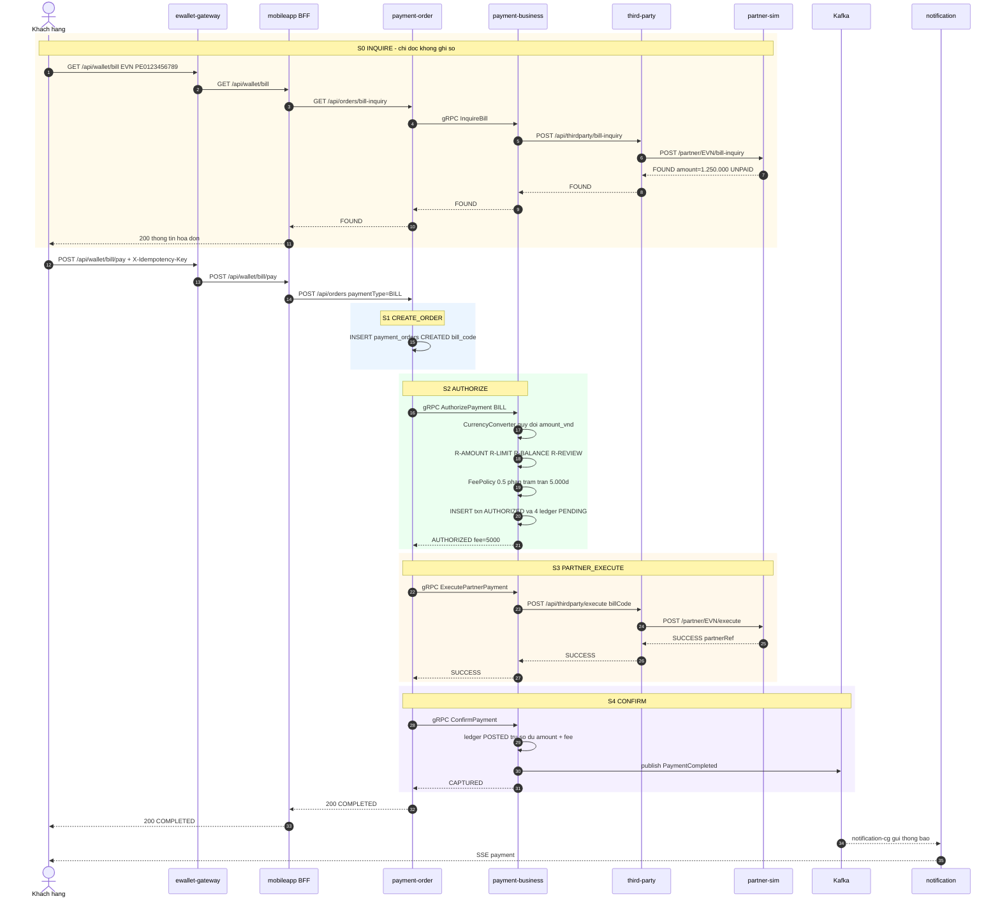
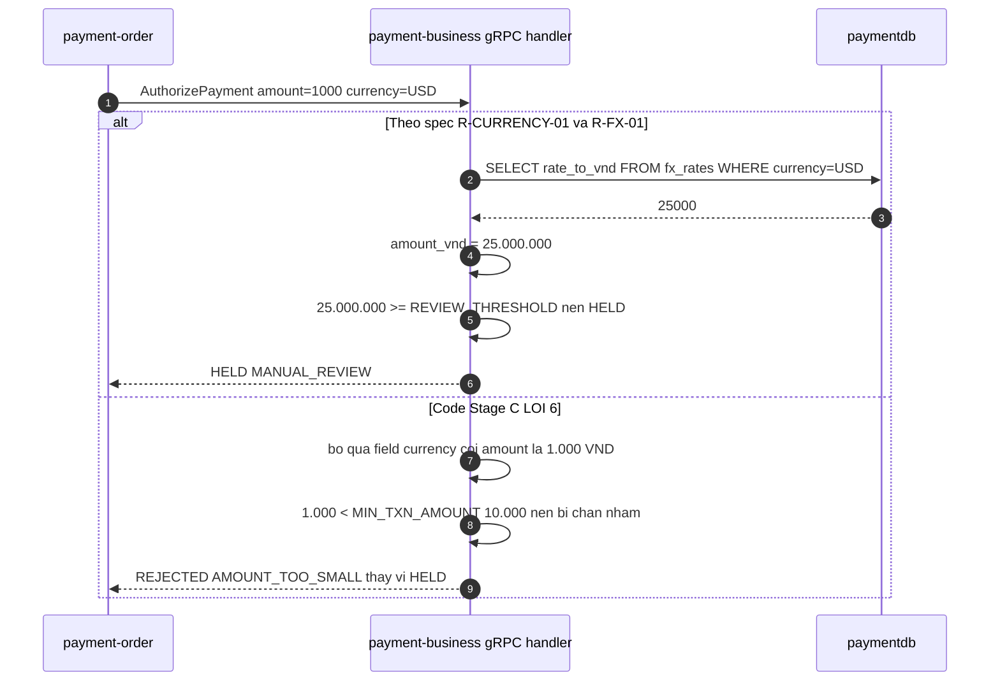

# F2 — Thanh toán hoá đơn & nạp tiền điện thoại

| | |
|---|---|
| **Slug** | `bill-telco-payment` |
| **Loại** | Giao dịch ghi, có bước tra cứu trước |
| **Actor** | Khách hàng |
| **Trigger** | Khách chọn "Thanh toán hoá đơn" (EVN) hoặc "Nạp điện thoại" (VTELCO) |
| **Service đi qua** | gateway → mobileapp → order → business → third-party → partner-sim → Kafka → notification + order |
| **Khác F1 ở đâu** | Có bước **tra cứu hoá đơn** (S0) trước khi trả tiền · tiền **ra khỏi ví** nên phải kiểm tra số dư · có **phí** · hỗ trợ **cross-currency** |
| **Lỗi có chủ đích chạm vào** | #1 (hạn mức) · #2 + #5 (nhánh HELD) · **#6 (gRPC bỏ qua `currency`)** |

---

# PHẦN 1 — REQUIREMENT

## 1.1 Mục tiêu

Cho phép khách dùng **số dư ví** để thanh toán hoá đơn dịch vụ (điện, nước) hoặc nạp tiền điện thoại,
thông qua đối tác. Khác F1 ở chiều tiền: F1 tiền **vào** ví, F2 tiền **ra** khỏi ví.

## 1.2 Phạm vi

**Trong phạm vi**: tra cứu hoá đơn, kiểm tra số dư, tính phí, thanh toán qua đối tác, ghi sổ, thông báo.
**Ngoài phạm vi**: thanh toán trả góp, đặt lịch thanh toán tự động, hoá đơn nhiều kỳ.

## 1.3 Hai biến thể

| Biến thể | `paymentType` | Đối tác | Tra cứu trước | Phí |
|---|---|---|---|---|
| Thanh toán hoá đơn điện | `BILL` | `EVN` | **Bắt buộc** (S0) | `R-FEE-02` (0,5%, 1.000–5.000đ) |
| Nạp tiền điện thoại | `TELCO` | `VTELCO` | Không | `R-FEE-03` (= 0) |

## 1.4 Tiền điều kiện

1. Ví khách `ACTIVE`, số dư ≥ `amount + fee`.
2. Với `BILL`: `billCode` tồn tại ở đối tác và ở trạng thái `UNPAID`.
3. Với `TELCO`: `phoneNumber` 10 chữ số.
4. `partner_config.service_type` khớp `BILL`/`TELCO`.

## 1.5 Hậu điều kiện (khi thành công)

1. Số dư ví **giảm** đúng `amount + fee`.
2. Có **4** `ledger_entries` `POSTED` (2 cho tiền gốc, 2 cho phí — nếu phí > 0), tổng bằng 0.
3. `daily_usage` tăng `amount_vnd`.
4. `partner_transactions.status = SUCCESS`, có `bill_code`.
5. Event `PaymentCompleted` được publish, notification gửi thành công.

## 1.6 Luồng chính (biến thể `BILL`)

| # | Bước | Thực hiện bởi |
|---|---|---|
| 1 | Khách gửi `GET /api/wallet/bill?partnerCode=EVN&billCode=PE0123456789` | Client → gateway → BFF |
| 2 | **S0 INQUIRE** — BFF gọi `GET /api/orders/bill-inquiry` | mobileapp → order |
| 3 | Order gọi gRPC `InquireBill` | order → business |
| 4 | Business gọi `POST /api/thirdparty/bill-inquiry` | business → third-party |
| 5 | Third-party gọi `POST /partner/EVN/bill-inquiry` | third-party → partner-sim |
| 6 | Kết quả tra cứu (số tiền, kỳ, tên khách) trả ngược về client. **Không ghi DB nghiệp vụ** | ngược chiều |
| 7 | Khách xác nhận, gửi `POST /api/wallet/bill/pay` kèm `X-Idempotency-Key` | Client → gateway → BFF |
| 8 | **S1 CREATE_ORDER** — order ghi `payment_orders` `CREATED` với `bill_code` | order |
| 9 | **S2 AUTHORIZE** — gRPC `AuthorizePayment`, `paymentType=BILL` | order → business |
| 10 | Business: `R-CURRENCY-01` quy đổi → `R-AMOUNT-*` → `R-LIMIT-01` → `R-BALANCE-01` (số dư ≥ amount + fee) → `R-REVIEW-01`; tính phí `R-FEE-02`; ghi txn `AUTHORIZED` + **4** ledger `PENDING`; cộng `daily_usage` | business |
| 11 | **S3 PARTNER_EXECUTE** — gRPC `ExecutePartnerPayment` → third-party → partner-sim, kèm `billCode` | order → business → third-party → partner-sim |
| 12 | **S4 CONFIRM** — gRPC `ConfirmPayment`: ledger `POSTED`, trừ số dư, txn `CAPTURED`, publish `PaymentCompleted` | order → business → Kafka |
| 13 | Order `COMPLETED`, trả `200` lên client | order → BFF → gateway |
| 14 | Đuôi async: notification + order-status + settlement WebSocket (như F1) | Kafka / WS |

Biến thể `TELCO`: bỏ bước 1–6, `paymentType=TELCO`, `accountRef = phoneNumber`, phí = 0.

## 1.7 Luồng phụ & ngoại lệ

| Mã | Điều kiện | Xử lý | Kết quả |
|---|---|---|---|
| **B1** | `billCode` không tồn tại | S0 trả `NOT_FOUND` | `404 BILL_NOT_FOUND`, không tạo đơn |
| **B2** | Hoá đơn đã thanh toán | S0 trả `ALREADY_PAID` | `409 BILL_ALREADY_PAID` |
| **B3** | `amount` client gửi ≠ số tiền hoá đơn | Order từ chối trước khi authorize | `422 AMOUNT_MISMATCH` |
| **B4** | Số dư < `amount + fee` | `R-BALANCE-01` → `REJECTED` | `422 INSUFFICIENT_FUNDS` |
| **B5** | `currency` không có trong `fx_rates` | `R-CURRENCY-01` → `REJECTED` | `422 CURRENCY_NOT_SUPPORTED` |
| **B6** | `amount` quy đổi ≥ 20.000.000đ | `R-REVIEW-01` → `HELD` | `202 HELD` |
| **B7** | Đối tác từ chối / timeout ở S3 | Nhánh bù trừ → [F4](F4-failure-refund.md) | `502`/`504`, order `REFUNDED` |
| **B8** | Đối tác trả `SUCCESS` sau khi third-party đã timeout | Ghi `partner_transactions` với `fail_reason=LATE_SUCCESS`, đối soát thủ công | order vẫn `REFUNDED` |

## 1.8 Business rule của flow

| Mã | Điều kiện | Hành động | Severity |
|---|---|---|---|
| `R-BILL-01` | `paymentType = BILL` | Bắt buộc có `billCode`, và phải tra cứu (S0) trước khi thanh toán | must |
| `R-BILL-02` | `amount` khác số tiền hoá đơn trả về ở S0 | Từ chối `AMOUNT_MISMATCH`, không authorize | must |
| `R-BILL-03` | Hoá đơn `PAID` | Từ chối `BILL_ALREADY_PAID` | must |
| `R-BILL-04` | `paymentType = BILL` | Phí theo `R-FEE-02`, trừ vào ví nguồn, ghi bút toán `entry_type=FEE` về `SYSTEM_FEE` | must |
| `R-TELCO-01` | `paymentType = TELCO` | `accountRef` phải là số thuê bao 10 chữ số | must |
| `R-TELCO-02` | `paymentType = TELCO` | Mệnh giá hợp lệ: 10.000 · 20.000 · 50.000 · 100.000 · 200.000 · 500.000 | must |
| `R-TELCO-03` | `paymentType = TELCO` | Phí = 0 (`R-FEE-03`) | must |
| `R-FX-01` | `currency = USD` | Quy đổi `amount_vnd = amount × fx_rates.rate_to_vnd` **trước** mọi so sánh hạn mức, lưu cả `amount` gốc và `amount_vnd` | must |
| `R-FX-02` | Giao dịch cross-currency | `ledger_entries` ghi bằng **VND** (`amount_vnd`), `payment_transactions` giữ cả hai | must |

## 1.9 NFR

| Mã | metric | operator | threshold | unit |
|---|---|---|---|---|
| `NFR-LAT-01` | `latency_p95` gRPC `AuthorizePayment` | `<` | 500 | ms |
| `NFR-LAT-02` | `latency_p95` end-to-end thanh toán | `<` | 2000 | ms |
| `NFR-LAT-06` | `latency_p95` tra cứu hoá đơn `GET /api/wallet/bill` | `<` | 1500 | ms |
| `NFR-TIMEOUT-01` | timeout gọi partner | `<=` | 3000 | ms |

## 1.10 Acceptance criteria

```gherkin
Scenario: Thanh toan hoa don dien thanh cong
  Given khach CUST-001 co so du 5.000.000d
  And hoa don EVN PE0123456789 la 1.250.000d trang thai UNPAID
  When khach tra cuu roi goi POST /api/wallet/bill/pay voi amount=1250000
  Then response 200 va status=COMPLETED
  And phi la 6250 lam tron len 7000 nhung bi tran o 5000 nen phi=5000
  And so du con lai la 3.745.000d
  And co 4 ledger_entries POSTED

Scenario: Nap dien thoai menh gia khong hop le
  When khach goi POST /api/wallet/telco/topup voi amount=35000
  Then response 422 va reasonCode=AMOUNT_TOO_SMALL hoac INVALID_DENOMINATION

Scenario: Thanh toan cross-currency phai quy doi truoc khi ap han muc
  Given ti gia USD = 25.000 VND
  When khach CUST-003 goi thanh toan amount=1000 currency=USD
  Then he thong phai coi giao dich la 25.000.000d
  And vi 25.000.000 >= REVIEW_THRESHOLD nen ket qua phai la HELD   # LOI #6 lam buoc nay that bai

Scenario: Giao dich ngoai te lon phai bi tu choi
  Given ti gia USD = 25.000 VND
  When khach CUST-003 goi thanh toan amount=15000 currency=USD
  Then he thong phai coi giao dich la 375.000.000d
  And vi vuot MAX_TXN_BILL 50.000.000d nen phai la 422 AMOUNT_TOO_LARGE
  # LOI #6 lam buoc nay that bai - code coi la 15.000d va cho qua
```

---

# PHẦN 2 — DESIGN

## 2.1 Service tham gia

Giống F1, thêm nhánh **tra cứu** ở `third-party` (`partner.BillAdapter`) và
`domain.CurrencyConverter` ở `payment-business`.

## 2.2 Sequence diagram — tra cứu rồi thanh toán hoá đơn



## 2.3 Sequence diagram — cross-currency (chạm lỗi #6)



Lỗi #6 gây ra **hai kiểu sai ngược nhau**, tuỳ số tiền:

| Ca | `amount` | Đúng theo spec | Code Stage C thực tế | Mức nguy hiểm |
|---|---|---|---|---|
| Từ chối nhầm | 1.000 USD = 25.000.000đ | `HELD` (≥ ngưỡng rà soát) | `REJECTED AMOUNT_TOO_SMALL` (coi là 1.000đ) | phiền khách |
| **Chấp nhận nhầm** | 15.000 USD = 375.000.000đ | `REJECTED AMOUNT_TOO_LARGE` | `AUTHORIZED` (coi là 15.000đ) | **mất tiền thật** |

Ca thứ hai mới là ca đáng sợ: giao dịch 375 triệu lọt qua mọi hạn mức vì bị tính như 15 nghìn.

Platform chỉ phát hiện được lỗi #6 nếu collector thu được **attribute của span gRPC** (giá trị `currency`
trong request) — đây là knob `OTEL_INSTRUMENTATION_GRPC_*` nói ở `architecture.md` §7.

## 2.4 Dữ liệu thay đổi

Như F1, khác ở:

| DB | Bảng | Khác biệt so với F1 |
|---|---|---|
| `paymentdb` | `ledger_entries` | **4 dòng** (2 gốc + 2 phí) thay vì 2 |
| `paymentdb` | `account_balances` | Ví khách **giảm** `amount + fee`; `SYSTEM_FEE` tăng `fee` |
| `paymentdb` | `fx_rates` | SELECT khi `currency != VND` |
| `thirdpartydb` | `partner_transactions` | Có `bill_code` và `service_type` |

### Bút toán kép của F2 (`BILL`, phí 5.000đ)

| # | account | direction | amount | entry_type |
|---|---|---|---|---|
| 1 | ví khách | `DEBIT` | 1.250.000 | `PAYMENT` |
| 2 | `PARTNER_SETTLE` EVN | `CREDIT` | 1.250.000 | `PAYMENT` |
| 3 | ví khách | `DEBIT` | 5.000 | `FEE` |
| 4 | `SYSTEM_FEE` | `CREDIT` | 5.000 | `FEE` |

## 2.5 Quan sát kỳ vọng

Trace F2 dài hơn F1 vì có **2 trace riêng biệt**: một trace cho S0 (tra cứu) và một trace cho thanh toán.

| Đặc điểm | Giá trị |
|---|---|
| Trace tra cứu | 5 service, span path `gateway → mobileapp → order → business(rpc InquireBill) → third-party → partner-sim`, **không có** span DB ghi |
| Trace thanh toán | như F1 nhưng có thêm span `SELECT fx_rates` khi cross-currency |
| Phân biệt F1/F2 trên cùng span path | `http.route` ở gateway (`/api/wallet/topup` vs `/api/wallet/bill/pay`) và attribute `paymentType` |

Đây là ca kiểm chứng quan trọng cho Trace Analyzer: **hai flow khác nhau đi qua gần như cùng một chuỗi span**
→ phải phân biệt bằng root route, không phải bằng danh sách service.

## 2.6 Lỗi có chủ đích chạm vào F2

| # | Biểu hiện trong F2 | Platform bắt bằng |
|---|---|---|
| **#1** | Hạn mức ngày sai (code 100tr vs spec 50tr) | rule ↔ code |
| **#2** | Hoá đơn ≥ 20tr → HELD nhưng không có event | rule ↔ trace |
| **#5** | Nhánh HELD chậm > 700ms | trace ↔ NFR |
| **#6** | Thanh toán USD bị áp hạn mức như VND | attribute span gRPC ↔ `R-CURRENCY-01` / `R-FX-01` |

---

# PHẦN 3 — TEST & DEMO

## 3.1 Kịch bản demo

```bash
# 1. Tra cuu hoa don
curl -s "http://localhost:18080/api/wallet/bill?partnerCode=EVN&billCode=PE0123456789"

# 2. Thanh toan hoa don
curl -s -X POST http://localhost:18080/api/wallet/bill/pay \
  -H "Content-Type: application/json" -H "X-Idempotency-Key: $(uuidgen)" \
  -d '{"customerId":"CUST-001","partnerCode":"EVN","billCode":"PE0123456789","amount":1250000,"currency":"VND"}'

# 3. Nap dien thoai
curl -s -X POST http://localhost:18080/api/wallet/telco/topup \
  -H "Content-Type: application/json" -H "X-Idempotency-Key: $(uuidgen)" \
  -d '{"customerId":"CUST-001","partnerCode":"VTELCO","phoneNumber":"0987654321","amount":100000,"currency":"VND"}'

# 4a. Cross-currency - cham loi #6 - TU CHOI NHAM
#     1.000 USD = 25.000.000d -> theo spec phai HELD, code tra AMOUNT_TOO_SMALL
curl -s -X POST http://localhost:18080/api/wallet/bill/pay \
  -H "Content-Type: application/json" -H "X-Idempotency-Key: $(uuidgen)" \
  -d '{"customerId":"CUST-003","partnerCode":"EVN","billCode":"PE0123456789","amount":1000,"currency":"USD"}'

# 4b. Cross-currency - cham loi #6 - CHAP NHAN NHAM (ca nguy hiem)
#     15.000 USD = 375.000.000d -> theo spec phai AMOUNT_TOO_LARGE, code cho qua
curl -s -X POST http://localhost:18080/api/wallet/bill/pay \
  -H "Content-Type: application/json" -H "X-Idempotency-Key: $(uuidgen)" \
  -d '{"customerId":"CUST-003","partnerCode":"EVN","billCode":"PE0123456789","amount":15000,"currency":"USD"}'

# 5. Hoa don khong ton tai
curl -s "http://localhost:18080/api/wallet/bill?partnerCode=EVN&billCode=PE0000000000"
```

## 3.2 Test suite (Stage E)

F2 **có** test: unit test `FeePolicy` + `CurrencyConverter`, integration test đường `BILL`.
Test cross-currency cố ý viết theo **hành vi code sai** (không theo spec) để coverage vẫn xanh — đây là lý do
lỗi #6 chỉ lộ ra khi đối chiếu spec ↔ trace, không lộ qua test.
