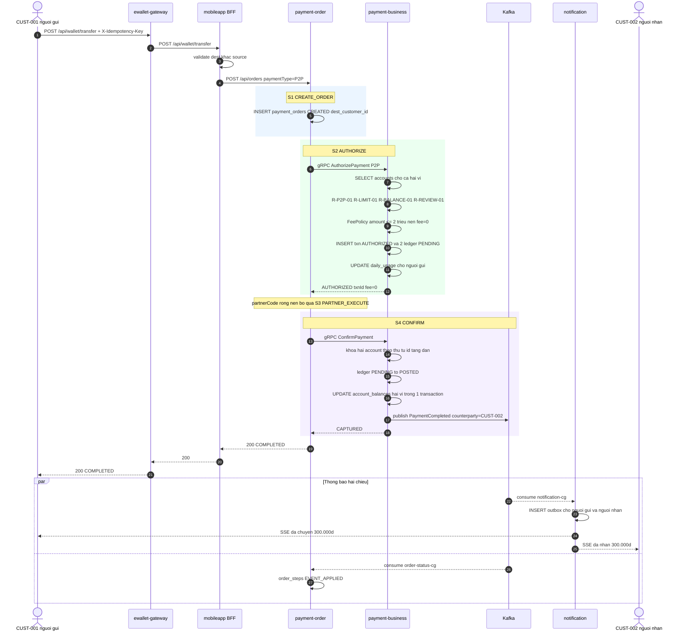
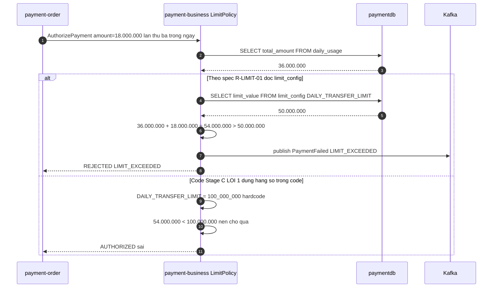

# F3 — Chuyển tiền P2P giữa hai ví

| | |
|---|---|
| **Slug** | `p2p-transfer` |
| **Loại** | Giao dịch ghi, hoàn toàn nội bộ |
| **Actor** | Khách hàng (người gửi) |
| **Trigger** | Khách chọn "Chuyển tiền" tới một khách hàng khác trong hệ |
| **Service đi qua** | gateway → mobileapp → order → business → Kafka → notification + order |
| **Khác F1/F2 ở đâu** | **Không** đi qua `third-party` và `partner-sim`. Saga chỉ 3 bước. Có **hai** người nhận thông báo. |
| **Lỗi có chủ đích chạm vào** | **#1 (hạn mức ngày)** · #2 + #5 (nhánh HELD) |

---

# PHẦN 1 — REQUIREMENT

## 1.1 Mục tiêu

Chuyển tiền từ ví khách A sang ví khách B trong cùng hệ thống, tức thời, không qua đối tác.
Đây là flow **đối chứng** với F1/F2: cùng xương sống order → business → Kafka nhưng **thiếu nhánh third-party**,
dùng để kiểm chứng impact analysis (sửa `third-party` **không** ảnh hưởng F3).

## 1.2 Phạm vi

**Trong phạm vi**: kiểm tra hai ví, hạn mức, số dư, phí, ghi sổ kép, thông báo cho **cả hai** bên.
**Ngoài phạm vi**: chuyển tiền liên ngân hàng, chuyển tiền theo lịch, nhắc nợ.

## 1.3 Tiền điều kiện

1. Ví người gửi `ACTIVE`, số dư ≥ `amount + fee`.
2. Ví người nhận tồn tại và `ACTIVE`.
3. Người gửi ≠ người nhận.

## 1.4 Hậu điều kiện (khi thành công)

1. Ví người gửi giảm `amount + fee`, ví người nhận tăng đúng `amount`.
2. Có 2 hoặc 4 `ledger_entries` `POSTED` (4 khi có phí), tổng bằng 0.
3. `daily_usage` của **người gửi** tăng `amount_vnd`. Người nhận **không** bị tính hạn mức.
4. Một event `PaymentCompleted` với `counterpartyCustomerId` = người nhận.
5. Notification tạo **2** bản ghi outbox: báo trừ tiền cho người gửi, báo nhận tiền cho người nhận.

## 1.5 Luồng chính

| # | Bước | Thực hiện bởi |
|---|---|---|
| 1 | Khách gửi `POST /api/wallet/transfer` kèm `X-Idempotency-Key` | Client → gateway |
| 2 | BFF validate: `destCustomerId` khác `customerId`, `amount` > 0 | mobileapp |
| 3 | BFF gọi `POST /api/orders` với `paymentType = P2P` | mobileapp → order |
| 4 | **S1 CREATE_ORDER** — ghi `payment_orders` `CREATED`, lưu `dest_customer_id` | order |
| 5 | **S2 AUTHORIZE** — gRPC `AuthorizePayment` | order → business |
| 6 | Business: `R-P2P-01` (tự chuyển cho mình), `R-ACCOUNT-01/02` cho **cả hai** ví, `R-CURRENCY-01`, `R-AMOUNT-01/02`, `R-LIMIT-01`, `R-BALANCE-01`, `R-REVIEW-01`; phí `R-FEE-04`; ghi txn `AUTHORIZED` + ledger `PENDING`; cộng `daily_usage` người gửi | business |
| 7 | **(bỏ qua S3 PARTNER_EXECUTE)** — `partnerCode` rỗng nên saga nhảy thẳng sang S4 | order |
| 8 | **S4 CONFIRM** — gRPC `ConfirmPayment`: ledger `POSTED`, cập nhật số dư **hai** ví, txn `CAPTURED` | order → business |
| 9 | Business publish `PaymentCompleted` (có `counterpartyCustomerId`) | business → Kafka |
| 10 | Order `COMPLETED`, trả `200` | order → BFF → client |
| 11 | Đuôi async: notification tạo 2 thông báo (gửi & nhận), order-status ghi `EVENT_APPLIED` | Kafka |

## 1.6 Luồng phụ & ngoại lệ

| Mã | Điều kiện | Xử lý | Kết quả |
|---|---|---|---|
| **C1** | `destCustomerId == customerId` | `R-P2P-01` | `422 SELF_TRANSFER_NOT_ALLOWED` |
| **C2** | Ví người nhận không tồn tại | `R-ACCOUNT-01` | `422 ACCOUNT_NOT_FOUND` |
| **C3** | Ví người nhận bị khoá | `R-ACCOUNT-02` | `422 ACCOUNT_INACTIVE` |
| **C4** | Số dư không đủ (tính cả phí) | `R-BALANCE-01` | `422 INSUFFICIENT_FUNDS` |
| **C5** | `amount > 30.000.000` | `R-AMOUNT-02` | `422 AMOUNT_TOO_LARGE` |
| **C6** | Tổng ngày vượt 50.000.000 | `R-LIMIT-01` | `422 LIMIT_EXCEEDED` — **lỗi #1 làm ca này sai** |
| **C7** | `amount ≥ 20.000.000` | `R-REVIEW-01` → `HELD`, giữ tiền, publish `PaymentHeld` | `202 HELD` — **lỗi #2, #5** |
| **C8** | Hai request cùng lúc từ cùng ví | Khoá bi quan trên `account_balances` theo `account_id` tăng dần theo UUID để tránh deadlock | request sau chờ, không âm số dư |
| **C9** | `ConfirmPayment` lỗi | Retry 2 lần → bù trừ (F4) | `502`, order `REFUNDED` |

## 1.7 Business rule của flow

| Mã | Điều kiện | Hành động | Severity |
|---|---|---|---|
| `R-P2P-01` | `sourceAccountId == destAccountId` | Từ chối `SELF_TRANSFER_NOT_ALLOWED` | must |
| `R-P2P-02` | `paymentType = P2P` | Không gọi `third-party`, saga bỏ bước S3 | must |
| `R-P2P-03` | `amount ≤ 2.000.000` | Phí = 0; ngược lại phí = 2.200đ (`R-FEE-04`) | must |
| `R-P2P-04` | Giao dịch thành công | Thông báo cho **cả** người gửi và người nhận | must |
| `R-P2P-05` | Hai ví khác `currency` | Từ chối `CURRENCY_MISMATCH` — demo chỉ hỗ trợ chuyển cùng loại tiền | must |
| `R-P2P-06` | Ghi sổ | Cập nhật số dư hai ví trong **cùng một transaction DB** | must |
| `R-P2P-07` | Khoá số dư | Lấy khoá theo thứ tự `account_id` tăng dần để tránh deadlock chéo | should |

## 1.8 NFR

| Mã | metric | operator | threshold | unit |
|---|---|---|---|---|
| `NFR-LAT-01` | `latency_p95` gRPC `AuthorizePayment` | `<` | 500 | ms |
| `NFR-LAT-03` | `latency_p95` end-to-end `POST /api/wallet/transfer` | `<` | 800 | ms |
| `NFR-ERR-01` | `error_rate` | `<` | 1 | percent |

F3 có ngưỡng end-to-end chặt hơn F1/F2 (800ms vs 2000ms) vì **không** có hop ra ngoài.

## 1.9 Acceptance criteria

```gherkin
Scenario: Chuyen tien thanh cong khong phi
  Given CUST-001 co 5.000.000d va CUST-002 co 1.000.000d
  When CUST-001 chuyen 300.000d cho CUST-002
  Then response 200 status=COMPLETED va fee=0
  And CUST-001 con 4.700.000d
  And CUST-002 co 1.300.000d
  And co dung 2 ledger_entries POSTED cung txn_id
  And notification_outbox co 2 ban ghi

Scenario: Chuyen tien tren 2 trieu thi co phi
  When CUST-003 chuyen 3.000.000d cho CUST-002
  Then fee=2200 va CUST-003 bi tru 3.002.200d

Scenario: Vuot han muc ngay bi tu choi
  Given CUST-003 da chuyen 18.000.000d hai lan trong ngay tong 36.000.000d
  When CUST-003 chuyen tiep 18.000.000d
  Then tong ngay se la 54.000.000d vuot 50.000.000d
  And response phai la 422 LIMIT_EXCEEDED    # LOI #1 lam buoc nay that bai vi code cho toi 100tr

Scenario: Chuyen tien lon bi treo cho duyet
  When CUST-003 chuyen 25.000.000d cho CUST-002
  Then response 202 status=HELD
  And tien bi giu chua vao vi nguoi nhan
  And co event PaymentHeld                   # LOI #2 lam buoc nay that bai
```

---

# PHẦN 2 — DESIGN

## 2.1 Service tham gia

| Service | Vai trò | Ghi chú |
|---|---|---|
| `ewallet-gateway` | Route | |
| `mobileapp` | Validate, DTO | |
| `payment-order` | Saga **3 bước** (S1, S2, S4) | `PaymentSagaOrchestrator` rẽ nhánh theo `partnerCode` rỗng |
| `payment-business` | Rule + sổ kép hai ví + publish | `LimitPolicy`, `FeePolicy`, `ReviewPolicy`, `LedgerService` |
| `notification` | 2 thông báo cho 2 khách | `NotificationRouter` |

**Không** có `third-party`, **không** có `partner-sim`, **không** có WebSocket.

## 2.2 Sequence diagram — happy path



## 2.3 Sequence diagram — vượt hạn mức ngày (chạm lỗi #1)



Điểm mấu chốt để platform bắt lỗi #1: cùng một khái niệm hạn mức tồn tại ở **ba nơi** —
spec (`R-LIMIT-01` = 50tr), DB (`limit_config` = 50tr), code (hằng số = 100tr).
Code Indexer phải trích được hằng số, Doc Indexer phải trích được rule, và platform so ba nguồn.

## 2.4 Dữ liệu thay đổi

| DB | Bảng | Thao tác |
|---|---|---|
| `orderdb` | `payment_orders` | INSERT + 3 UPDATE (`AUTHORIZING`, `CONFIRMING`, `COMPLETED`) |
| `orderdb` | `order_steps` | 3–4 INSERT (không có `PARTNER_EXECUTE`) |
| `paymentdb` | `accounts` | SELECT × 2 (ví gửi + ví nhận) |
| `paymentdb` | `payment_transactions` | INSERT → UPDATE |
| `paymentdb` | `ledger_entries` | 2 hoặc 4 INSERT → UPDATE |
| `paymentdb` | `account_balances` | UPDATE × 2 (khoá theo `account_id` tăng dần) |
| `paymentdb` | `daily_usage` | UPSERT chỉ cho người gửi |
| `notifdb` | `notification_outbox` | 2 INSERT |

### Bút toán kép của F3 (3.000.000đ, phí 2.200đ)

| # | account | direction | amount | entry_type |
|---|---|---|---|---|
| 1 | ví CUST-003 | `DEBIT` | 3.000.000 | `PAYMENT` |
| 2 | ví CUST-002 | `CREDIT` | 3.000.000 | `PAYMENT` |
| 3 | ví CUST-003 | `DEBIT` | 2.200 | `FEE` |
| 4 | `SYSTEM_FEE` | `CREDIT` | 2.200 | `FEE` |

## 2.5 Quan sát kỳ vọng

```
ewallet-gateway   POST /api/wallet/transfer          (SERVER, root)
└─ mobileapp      POST /api/wallet/transfer          (SERVER)
   └─ order       POST /api/orders                   (SERVER)
      ├─ business .../AuthorizePayment               (SERVER, rpc)
      ├─ business .../ConfirmPayment                 (SERVER, rpc)
      │  └─ business publish ewallet.payment.events  (PRODUCER)
      └─ order    INSERT order_steps                 (CLIENT, db)
```

| Đặc điểm | So với F1 |
|---|---|
| Số service trong trace | **4** (thay vì 6) |
| Số span rpc | **2** (thay vì 3) |
| Có span HTTP client ra ngoài | **không** |
| `p95` end-to-end | thấp hơn rõ rệt |

**Giá trị demo**: đây là bằng chứng cho impact analysis — sửa `third-party` thì `FlowObservation` của
`p2p-transfer` **không đổi**, còn `topup-partner` và `bill-telco-payment` đổi.

## 2.6 Lỗi có chủ đích chạm vào F3

| # | Biểu hiện | Cách demo |
|---|---|---|
| **#1** | 3 lần chuyển 18tr trong ngày đều qua, tổng 54tr > 50tr | `scripts/demo-flows.ps1 -Flow F3-limit` |
| **#2** | Chuyển 25tr → HELD nhưng notification im lặng | so trace HELD với trace COMPLETED |
| **#5** | `AuthorizePayment` nhánh HELD > 700ms | Jaeger, so p95 hai nhánh |

---

# PHẦN 3 — TEST & DEMO

## 3.1 Kịch bản demo

```bash
# 1. Chuyen tien nho khong phi
curl -s -X POST http://localhost:18080/api/wallet/transfer \
  -H "Content-Type: application/json" -H "X-Idempotency-Key: $(uuidgen)" \
  -d '{"customerId":"CUST-001","destCustomerId":"CUST-002","amount":300000,"currency":"VND","message":"tra tien com trua"}'

# 2. Chuyen tien co phi
curl -s -X POST http://localhost:18080/api/wallet/transfer \
  -H "Content-Type: application/json" -H "X-Idempotency-Key: $(uuidgen)" \
  -d '{"customerId":"CUST-003","destCustomerId":"CUST-002","amount":3000000,"currency":"VND","message":"gop von"}'

# 3. Cham LOI #1 - chay 3 lan, lan thu 3 le ra phai bi tu choi
for i in 1 2 3; do
  curl -s -X POST http://localhost:18080/api/wallet/transfer \
    -H "Content-Type: application/json" -H "X-Idempotency-Key: $(uuidgen)" \
    -d '{"customerId":"CUST-003","destCustomerId":"CUST-002","amount":18000000,"currency":"VND"}'
  echo
done
curl -s http://localhost:18083/admin/accounts/CUST-003/balance   # xem daily_usage vuot 50tr

# 4. Cham LOI #2 va #5 - nhanh HELD
curl -s -X POST http://localhost:18080/api/wallet/transfer \
  -H "Content-Type: application/json" -H "X-Idempotency-Key: $(uuidgen)" \
  -d '{"customerId":"CUST-003","destCustomerId":"CUST-002","amount":25000000,"currency":"VND"}'
```

## 3.2 Test suite (Stage E)

F3 **có** test đầy đủ: unit test `LimitPolicy` (viết theo hằng số 100tr trong code — nên test **xanh**
dù spec nói 50tr), unit test `FeePolicy`, integration test happy path + `INSUFFICIENT_FUNDS`.
Đây là điểm minh hoạ: *test xanh không có nghĩa là đúng spec*.
