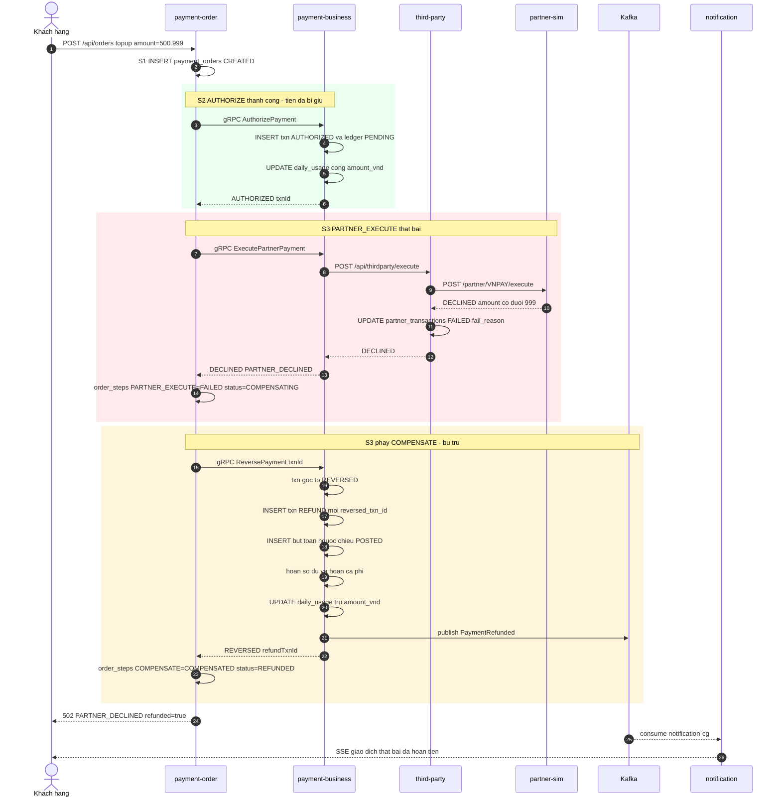
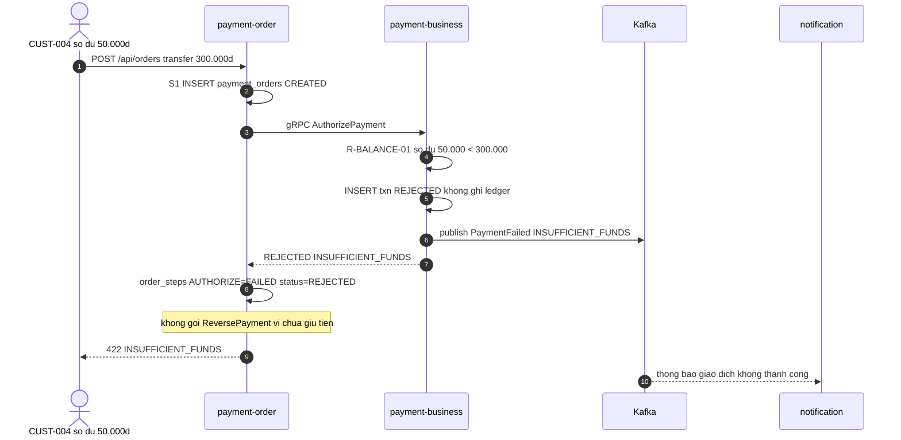
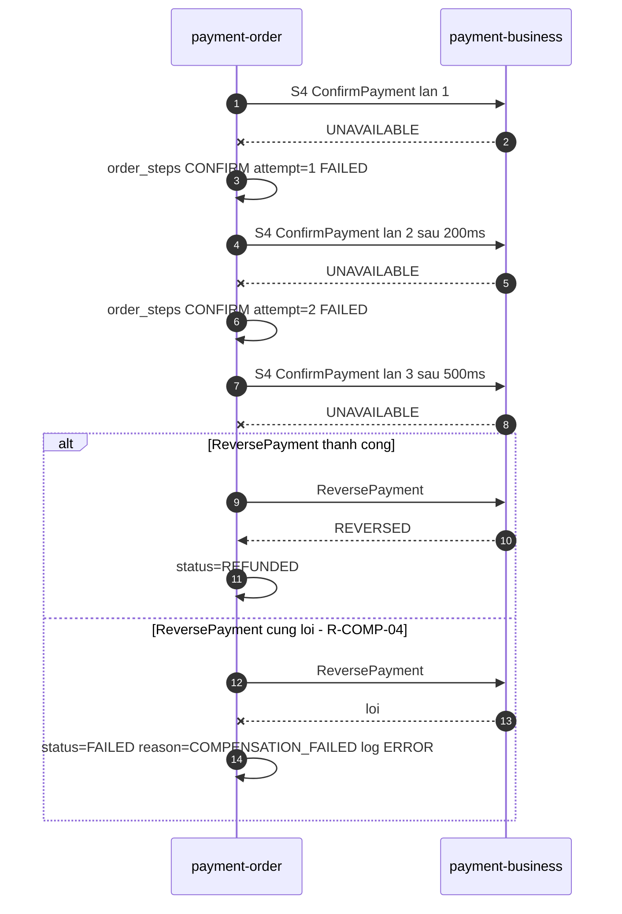

# F4 — Giao dịch lỗi & hoàn tiền (compensation)

| | |
|---|---|
| **Slug** | `failure-refund` |
| **Loại** | Nhánh bù trừ của F1/F2/F3 + hoàn tiền chủ động |
| **Actor** | Hệ thống (tự động) hoặc Ops (hoàn tiền thủ công) |
| **Trigger** | Một bước sau `AUTHORIZE` thất bại, **hoặc** Ops gọi `POST /api/orders/{id}/refund` |
| **Service đi qua** | order → business (→ third-party) → Kafka → notification |
| **Đặc điểm** | Đây là đường **hay bị bỏ sót khi test** — mục tiêu demo test gap và nhánh compensation |
| **Lỗi có chủ đích chạm vào** | Không chứa lỗi trực tiếp, nhưng là đường đối chứng cho test gap (#3) |

---

# PHẦN 1 — REQUIREMENT

## 1.1 Mục tiêu

Đảm bảo **không có tiền bị treo sai**: khi giao dịch đã giữ tiền nhưng không thể hoàn tất,
hệ thống phải tự động trả tiền về ví khách, sổ cái vẫn cân, và khách được thông báo.

## 1.2 Bốn kịch bản

| Mã | Tên | Đã giữ tiền chưa | Cần bù trừ | Event cuối |
|---|---|---|---|---|
| **F4a** | Đối tác từ chối ở bước S3 | Rồi | **Có** | `PaymentRefunded` |
| **F4b** | Business từ chối ở bước S2 | Chưa | Không | `PaymentFailed` |
| **F4c** | `ConfirmPayment` lỗi ở bước S4 | Rồi | **Có** | `PaymentRefunded` |
| **F4d** | Ops hoàn tiền chủ động sau khi đã `COMPLETED` | Rồi (đã chốt) | **Có** (reverse txn đã capture) | `PaymentRefunded` |

## 1.3 Tiền điều kiện

- F4a/F4c: đã có `payment_transactions.status = AUTHORIZED` và ledger `PENDING`.
- F4d: `payment_orders.status = COMPLETED` và `payment_transactions.status = CAPTURED`.

## 1.4 Hậu điều kiện (F4a — bù trừ tự động)

1. `payment_orders.status = REFUNDED`, `reason_code = PARTNER_DECLINED` (hoặc `PARTNER_TIMEOUT`).
2. `order_steps` có `PARTNER_EXECUTE = FAILED` **và** `COMPENSATE = COMPENSATED`.
3. `payment_transactions` gốc → `REVERSED`. Sinh **transaction mới** `paymentType = REFUND`,
   `reversed_txn_id` trỏ về txn gốc.
4. `ledger_entries` gốc → `REVERSED`; thêm 2 (hoặc 4) bút toán **ngược chiều** với `txn_id` mới, `entry_type = REFUND`.
5. Số dư ví **trở lại đúng giá trị trước giao dịch** (kể cả phí — `R-FEE-05`).
6. `daily_usage` bị **trừ lại** `amount_vnd` (`R-USAGE-02`).
7. Event `PaymentRefunded` được publish.
8. Client nhận `502` (declined) hoặc `504` (timeout) — **sau khi** bù trừ xong.

## 1.5 Luồng chính F4a — đối tác từ chối

| # | Bước | Thực hiện bởi |
|---|---|---|
| 1–8 | Giống F1 bước 1–8 (tạo đơn, authorize thành công, tiền đã giữ) | — |
| 9 | **S3 PARTNER_EXECUTE** — order gọi `ExecutePartnerPayment` | order → business |
| 10 | Business gọi third-party, third-party gọi partner-sim | business → third-party → partner-sim |
| 11 | Partner-sim trả `DECLINED` (số tiền có đuôi `999`) | partner-sim |
| 12 | Third-party ghi `partner_transactions = FAILED`, `fail_reason = PARTNER_DECLINED` | third-party |
| 13 | Business trả `DECLINED` cho order, **không** tự bù trừ | business → order |
| 14 | Order ghi `order_steps PARTNER_EXECUTE = FAILED`, đặt order `COMPENSATING` | order |
| 15 | **S3' COMPENSATE** — order gọi gRPC `ReversePayment` | order → business |
| 16 | Business: txn gốc → `REVERSED`; tạo txn `REFUND` mới; ghi bút toán ngược; hoàn số dư; trừ `daily_usage` | business |
| 17 | Business publish `PaymentRefunded` | business → Kafka |
| 18 | Order ghi `order_steps COMPENSATE = COMPENSATED`, đặt order `REFUNDED` | order |
| 19 | Order trả lỗi `502 PARTNER_DECLINED` kèm `refunded: true` lên BFF → client | order → BFF → client |
| 20 | Đuôi async: notification báo "giao dịch thất bại, đã hoàn tiền" | Kafka → notification |

## 1.6 Luồng F4b — business từ chối (không bù trừ)

Business từ chối **ngay trong** `AuthorizePayment`, trước khi ghi ledger:

1. Rule vi phạm (`INSUFFICIENT_FUNDS` / `LIMIT_EXCEEDED` / `ACCOUNT_INACTIVE`).
2. Business ghi `payment_transactions` với `status = REJECTED` (để có dấu vết), **không** ghi ledger,
   **không** cộng `daily_usage`.
3. Business publish `PaymentFailed`.
4. Order → `REJECTED`, trả `422`.

Khác biệt cốt lõi với F4a: **không có bút toán nào cần đảo**, nên không có bước `COMPENSATE`.

## 1.7 Luồng F4c — confirm lỗi

1. S4 `ConfirmPayment` ném lỗi hạ tầng (DB timeout / gRPC unavailable).
2. Order retry **2 lần**, backoff 200ms/500ms, ghi `order_steps CONFIRM` với `attempt` tăng dần.
3. Vẫn lỗi → order `COMPENSATING` → `ReversePayment` → `REFUNDED`.
4. Nếu `ReversePayment` **cũng** lỗi → order `FAILED` với `reason_code = COMPENSATION_FAILED`
   và ghi log mức `ERROR` — đây là ca cần người can thiệp (`R-COMP-04`).

## 1.8 Luồng F4d — hoàn tiền chủ động

1. Ops gọi `POST /api/orders/{orderId}/refund` với `{"reason":"CUSTOMER_REQUEST"}`.
2. Order kiểm tra order đang `COMPLETED`, chưa từng hoàn.
3. Order gọi `ReversePayment` với `txn_id` đã `CAPTURED`.
4. Business đảo bút toán đã `POSTED` (không sửa dòng gốc — `R-LEDGER-02`), hoàn số dư, publish `PaymentRefunded`.
5. Order → `REFUNDED`, trả `200`.

## 1.9 Business rule của flow

| Mã | Điều kiện | Hành động | Severity |
|---|---|---|---|
| `R-COMP-01` | Bất kỳ bước nào **sau** `AUTHORIZE` thất bại | Order **bắt buộc** gọi `ReversePayment` trước khi trả lỗi cho client | must |
| `R-COMP-02` | Bù trừ | Không sửa/xoá bút toán gốc. Chỉ thêm bút toán ngược với `txn_id` mới (`R-LEDGER-02`) | must |
| `R-COMP-03` | Bù trừ | Hoàn **cả phí** (`R-FEE-05`) và trừ lại `daily_usage` (`R-USAGE-02`) | must |
| `R-COMP-04` | `ReversePayment` thất bại | Order → `FAILED`, `reason_code = COMPENSATION_FAILED`, log `ERROR`, **không** im lặng | must |
| `R-COMP-05` | Gọi `ReversePayment` nhiều lần cho cùng `txn_id` | Idempotent — lần 2 trở đi trả kết quả cũ, không sinh bút toán mới | must |
| `R-COMP-06` | Order đã `REFUNDED` | Từ chối hoàn tiền lần nữa `409 ALREADY_REFUNDED` | must |
| `R-COMP-07` | Order đang `HELD` | **Không** tự bù trừ. Tiền tiếp tục bị giữ tới khi có quyết định duyệt/từ chối thủ công | must |
| `R-COMP-08` | Bù trừ xong | Trả cho client mã lỗi gốc (`502`/`504`) kèm cờ `refunded = true`, không trả `200` | must |

## 1.10 NFR

| Mã | metric | operator | threshold | unit |
|---|---|---|---|---|
| `NFR-COMP-01` | `latency_p95` toàn bộ nhánh bù trừ (từ lúc partner trả lỗi đến khi order `REFUNDED`) | `<` | 1000 | ms |
| `NFR-COMP-02` | Tỉ lệ bù trừ thất bại (`COMPENSATION_FAILED`) | `<` | 0.1 | percent |
| `NFR-TIMEOUT-01` | timeout gọi partner | `<=` | 3000 | ms |

## 1.11 Acceptance criteria

```gherkin
Scenario: Doi tac tu choi thi tien phai duoc hoan
  Given CUST-001 co so du 5.000.000d
  When khach nap tien 500.999d qua VNPAY va partner-sim tra DECLINED
  Then response 502 va body co refunded=true
  And so du CUST-001 van la 5.000.000d
  And payment_orders.status=REFUNDED
  And co 4 ledger_entries cho don nay 2 goc REVERSED va 2 nguoc chieu POSTED
  And co event PaymentRefunded tren ewallet.payment.events
  And daily_usage cua CUST-001 khong tang

Scenario: Doi tac timeout thi cung phai hoan tien
  When khach nap tien 500.888d va partner-sim ngu 5 giay
  Then third-party timeout sau 3 giay
  And response 504 va order o trang thai REFUNDED

Scenario: So du khong du thi khong can bu tru
  Given CUST-004 co so du 50.000d
  When CUST-004 chuyen 300.000d cho CUST-002
  Then response 422 INSUFFICIENT_FUNDS
  And khong co ledger_entries nao duoc tao
  And co event PaymentFailed

Scenario: Hoan tien hai lan phai bi tu choi
  Given mot don da REFUNDED
  When Ops goi lai POST /api/orders/{id}/refund
  Then response 409 ALREADY_REFUNDED
  And khong co but toan moi
```

---

# PHẦN 2 — DESIGN

## 2.1 Nguyên tắc thiết kế

1. **Bù trừ do orchestrator quyết định, không do service con tự làm.** `payment-business` chỉ thi hành
   lệnh `ReversePayment`; `payment-order` là nơi quyết định khi nào cần bù trừ. Nhờ vậy nhánh compensation
   nằm gọn trong một class, dễ chỉ ra khi phân tích call graph.
2. **Bù trừ bằng bút toán ngược, không bằng xoá/sửa.** Sổ cái là append-only.
3. **Client luôn nhận đúng sự thật.** Không trả `200` cho giao dịch đã bị hoàn.

## 2.2 Sequence diagram — F4a đối tác từ chối



## 2.3 Sequence diagram — F4b business từ chối (không bù trừ)



## 2.4 Sequence diagram — F4c confirm lỗi có retry



## 2.5 Dữ liệu thay đổi (F4a)

| DB | Bảng | Thao tác |
|---|---|---|
| `orderdb` | `payment_orders` | UPDATE `COMPENSATING` → `REFUNDED`, ghi `reason_code` |
| `orderdb` | `order_steps` | INSERT `PARTNER_EXECUTE=FAILED`, INSERT `COMPENSATE=COMPENSATED` |
| `paymentdb` | `payment_transactions` | UPDATE txn gốc → `REVERSED`; INSERT txn `REFUND` mới |
| `paymentdb` | `ledger_entries` | UPDATE 2 dòng gốc → `REVERSED`; INSERT 2 dòng ngược `POSTED` |
| `paymentdb` | `account_balances` | UPDATE hoàn tiền |
| `paymentdb` | `daily_usage` | UPDATE trừ lại |
| `thirdpartydb` | `partner_transactions` | UPDATE `FAILED` + `fail_reason` |
| `notifdb` | `notification_outbox` | INSERT thông báo hoàn tiền |

### Bút toán trước và sau khi bù trừ (nạp 500.999đ)

| txn | # | account | direction | amount | entry_type | status |
|---|---|---|---|---|---|---|
| gốc | 1 | `SYSTEM_SUSPENSE` | `DEBIT` | 500.999 | `PAYMENT` | `REVERSED` |
| gốc | 2 | ví khách | `CREDIT` | 500.999 | `PAYMENT` | `REVERSED` |
| refund | 3 | ví khách | `DEBIT` | 500.999 | `REFUND` | `POSTED` |
| refund | 4 | `SYSTEM_SUSPENSE` | `CREDIT` | 500.999 | `REFUND` | `POSTED` |

Tổng bốn dòng = 0 → sổ cân. Bút toán gốc vẫn còn nguyên để truy vết.

## 2.6 Quan sát kỳ vọng

```
ewallet-gateway   POST /api/wallet/topup                (SERVER, root, status=ERROR)
└─ mobileapp      POST /api/wallet/topup                (SERVER, status=ERROR)
   └─ order       POST /api/orders                      (SERVER, status=ERROR)
      ├─ business .../AuthorizePayment                  (SERVER, rpc, OK)
      ├─ business .../ExecutePartnerPayment             (SERVER, rpc, ERROR)
      │  └─ third-party POST /api/thirdparty/execute    (SERVER, ERROR)
      │     └─ partner-sim POST /partner/VNPAY/execute  (SERVER, 200 nhung body DECLINED)
      └─ business .../ReversePayment                    (SERVER, rpc, OK)
         └─ business publish ewallet.payment.events     (PRODUCER, PaymentRefunded)
```

| Dấu hiệu nhận biết flow F4 trong trace | |
|---|---|
| Có span `ReversePayment` | chỉ F4 mới có |
| Span root `status = ERROR` nhưng flow **hoàn tất đúng** | không phải regression, là hành vi đúng |
| Event cuối là `PaymentRefunded` | phân biệt với `PaymentFailed` (F4b) |

> **Lưu ý cho Trace Analyzer**: F4 làm `error_rate` của F1/F2 tăng. Phải tách baseline theo
> `flow_slug = failure-refund` (nhận biết bằng sự có mặt của span `ReversePayment`), nếu không
> baseline của F1 sẽ bị nhiễu.

## 2.7 Vì sao F4 là "đường hay bị bỏ sót"

| Lý do | Hệ quả |
|---|---|
| Cần dựng được lỗi từ đối tác mới chạy tới | Test tích hợp thường mock đối tác trả `SUCCESS` |
| Nhánh `catch` + gọi bù trừ nằm sâu trong orchestrator | Coverage dòng có thể xanh mà nhánh vẫn chưa chạy |
| Ở production nhánh này chạy **rất ít** | Không có trace → không có baseline → regression không bị phát hiện |

Đây chính là dạng vấn đề platform phải chỉ ra: **runtime có đi qua nhưng test không chạm**, hoặc ngược lại
**test có phủ nhưng runtime chưa từng đi qua** (dead branch).

---

# PHẦN 3 — TEST & DEMO

## 3.1 Kịch bản demo

```bash
# F4a - doi tac tu choi (so tien co duoi 999)
curl -i -X POST http://localhost:18080/api/wallet/topup \
  -H "Content-Type: application/json" -H "X-Idempotency-Key: $(uuidgen)" \
  -d '{"customerId":"CUST-001","amount":500999,"currency":"VND","partnerCode":"VNPAY","partnerAccountRef":"9704000000001234"}'
curl -s http://localhost:18083/admin/accounts/CUST-001/balance   # so du phai khong doi

# F4a bien the timeout (duoi 888)
curl -i -X POST http://localhost:18080/api/wallet/topup \
  -H "Content-Type: application/json" -H "X-Idempotency-Key: $(uuidgen)" \
  -d '{"customerId":"CUST-001","amount":500888,"currency":"VND","partnerCode":"VNPAY","partnerAccountRef":"9704000000001234"}'

# F4b - so du khong du
curl -i -X POST http://localhost:18080/api/wallet/transfer \
  -H "Content-Type: application/json" -H "X-Idempotency-Key: $(uuidgen)" \
  -d '{"customerId":"CUST-004","destCustomerId":"CUST-002","amount":300000,"currency":"VND"}'

# F4d - Ops hoan tien mot don da COMPLETED
ORDER_ID=<orderId cua don da thanh cong>
curl -i -X POST http://localhost:18080/orders/$ORDER_ID/refund \
  -H "Content-Type: application/json" -d '{"reason":"CUSTOMER_REQUEST"}'

# Kiem tra but toan
curl -s http://localhost:18083/admin/transactions/$ORDER_ID
```

## 3.2 Kiểm chứng

1. Số dư sau F4a **bằng** số dư trước giao dịch.
2. `GET /admin/transactions/{orderId}` trả 4 bút toán, 2 `REVERSED` + 2 `POSTED`, tổng = 0.
3. Jaeger: trace có span `ReversePayment` và event cuối là `PaymentRefunded`.
4. SSE stream nhận được thông báo "đã hoàn tiền".

## 3.3 Test suite (Stage E)

F4 **có** test cho F4a và F4b (dùng WireMock/partner-sim với số tiền đuôi 999).
F4c (`ConfirmPayment` lỗi) và F4d (hoàn tiền chủ động) **có test đơn vị nhưng không có integration test** —
tạo ra một test gap nhẹ, khác với lỗi #3 (F1 hoàn toàn không có test).
