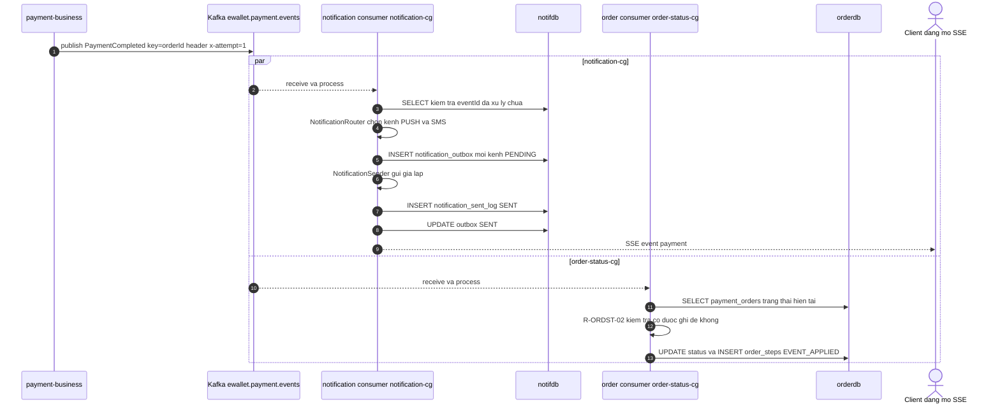
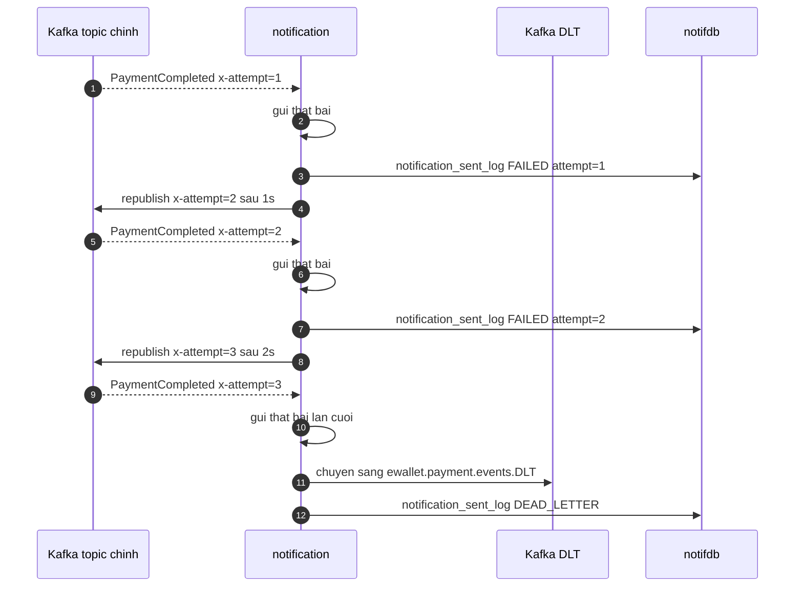
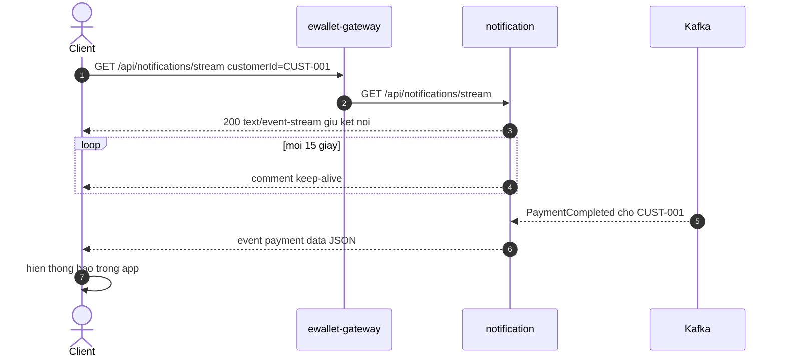

# F5 — Thông báo bất đồng bộ (đuôi chung của mọi flow)

| | |
|---|---|
| **Slug** | `async-notification` |
| **Loại** | Bất đồng bộ, hướng sự kiện |
| **Actor** | Hệ thống (không có người bấm) |
| **Trigger** | `payment-business` publish event lên `ewallet.payment.events` |
| **Service đi qua** | business → Kafka → notification (`notification-cg`) + order (`order-status-cg`) → SSE tới client |
| **Đặc điểm** | **Một topic, hai consumer group, hai mục đích khác nhau**. Trace phải xuyên qua message queue. |
| **Lỗi có chủ đích chạm vào** | #2 (không có `PaymentHeld` để mà nhận) |

---

# PHẦN 1 — REQUIREMENT

## 1.1 Mục tiêu

Tách việc "thông báo cho khách" và "chốt trạng thái đơn" ra khỏi đường đồng bộ, để:
- Client nhận phản hồi nhanh, không chờ gửi SMS/push.
- Khi notification chết, giao dịch **vẫn đúng** — chỉ thông báo bị chậm.

## 1.2 Phạm vi

**Trong phạm vi**: tiêu thụ event, định tuyến kênh, ghi outbox, gửi (giả lập), đẩy SSE, retry, DLT,
và consumer thứ hai cập nhật trạng thái đơn.
**Ngoài phạm vi**: tích hợp nhà cung cấp SMS/push thật, template đa ngôn ngữ, opt-out.

## 1.3 Hai consumer group trên cùng một topic

| Consumer group | Service | Mục đích | Hệ quả khi lỗi |
|---|---|---|---|
| `notification-cg` | `ewallet-notification` | Sinh thông báo cho khách | Khách không nhận được báo, tiền vẫn đúng |
| `order-status-cg` | `ewallet-payment-order` | Chốt trạng thái đơn bất đồng bộ, ghi `order_steps EVENT_APPLIED` | Đơn thiếu dấu vết async, trạng thái đồng bộ vẫn đúng |

Hai group **độc lập offset**. Một group lỗi không chặn group kia.

## 1.4 Luồng chính

| # | Bước | Thực hiện bởi |
|---|---|---|
| 1 | Business publish event (key = `orderId`, header `eventType`, `x-attempt=1`) | business → Kafka |
| 2 | `notification-cg` nhận, deserialize, kiểm tra `eventId` đã xử lý chưa (`R-NOTIF-05`) | notification |
| 3 | `NotificationRouter` chọn kênh theo `eventType` + `amount` (`R-NOTIF-01`) | notification |
| 4 | Ghi `notification_outbox` một dòng cho **mỗi kênh**, trạng thái `PENDING` | notification |
| 5 | `NotificationSender` "gửi" (giả lập), ghi `notification_sent_log` `SENT` | notification |
| 6 | Cập nhật outbox `SENT` | notification |
| 7 | Đẩy SSE tới mọi kết nối đang mở của `customerId` (và của `counterpartyCustomerId` nếu có) | notification → client |
| 8 | Song song: `order-status-cg` nhận cùng event, ánh xạ `eventType` → trạng thái đơn | order |
| 9 | Order cập nhật `payment_orders.status` **chỉ khi** trạng thái mới hợp lệ (`R-ORDST-02`), ghi `order_steps EVENT_APPLIED` | order |

## 1.5 Luồng phụ & ngoại lệ

| Mã | Điều kiện | Xử lý | Kết quả |
|---|---|---|---|
| **D1** | Không có client nào đang mở SSE | Vẫn ghi outbox + sent_log, bỏ qua bước đẩy | Thông báo còn trong outbox để app đọc sau |
| **D2** | Gửi thất bại lần 1 | Retry sau 1s, `x-attempt=2` | |
| **D3** | Thất bại đủ 3 lần | Đẩy sang `ewallet.payment.events.DLT`, ghi `notification_sent_log.result = DEAD_LETTER` | Không mất event |
| **D4** | Event trùng (`eventId` đã có) | Bỏ qua, không tạo outbox mới (`R-NOTIF-05`) | Idempotent |
| **D5** | Event `PaymentHeld` không bao giờ tới | Khách không biết đơn bị treo | **Đây chính là hệ quả lỗi #2** |
| **D6** | JSON sai định dạng | Không retry (lỗi vĩnh viễn), đẩy thẳng DLT | |
| **D7** | `order-status-cg` nhận event của đơn đã ở trạng thái kết thúc khác | Bỏ qua, ghi log `WARN`, không ghi đè (`R-ORDST-02`) | Không có race giữa đồng bộ và bất đồng bộ |

## 1.6 Business rule của flow

| Mã | Điều kiện | Hành động | Severity |
|---|---|---|---|
| `R-NOTIF-01` | Định tuyến kênh | `PaymentCompleted` → `PUSH`, thêm `SMS` nếu `amountVnd ≥ 10.000.000`; `PaymentFailed` → `PUSH`; `PaymentHeld` → `PUSH` + `EMAIL`; `PaymentRefunded` → `PUSH` + `SMS` | must |
| `R-NOTIF-02` | Event có `counterpartyCustomerId` (P2P) | Tạo thông báo cho **cả hai** khách, nội dung khác nhau | must |
| `R-NOTIF-03` | Gửi thất bại | Retry tối đa **3 lần**, backoff 1s/2s/4s, tăng header `x-attempt` | must |
| `R-NOTIF-04` | Hết lượt retry | Chuyển `ewallet.payment.events.DLT`, ghi `result = DEAD_LETTER`, **không** nuốt lỗi | must |
| `R-NOTIF-05` | Cùng `eventId` + `channel` đã có trong outbox | Bỏ qua (unique index `uq_outbox_event_channel`) | must |
| `R-NOTIF-06` | Client mở SSE | Chỉ nhận thông báo của đúng `customerId` của mình | must |
| `R-NOTIF-07` | Nội dung thông báo | Không chứa số tài khoản đầy đủ, chỉ 4 số cuối | should |
| `R-ORDST-01` | `order-status-cg` nhận event | Ánh xạ `PaymentCompleted → COMPLETED`, `PaymentFailed → FAILED`, `PaymentHeld → HELD`, `PaymentRefunded → REFUNDED` | must |
| `R-ORDST-02` | Trạng thái hiện tại đã là terminal khác | **Không** ghi đè, chỉ ghi `order_steps` + log `WARN` | must |
| `R-ORDST-03` | Mỗi event | Ghi đúng 1 `order_steps` `EVENT_APPLIED`, idempotent theo `eventId` | must |

## 1.7 NFR

| Mã | metric | operator | threshold | unit |
|---|---|---|---|---|
| `NFR-LAT-05` | `latency_p95` từ lúc publish tới lúc ghi `notification_sent_log` | `<` | 5000 | ms |
| `NFR-NOTIF-01` | Tỉ lệ event rơi vào DLT | `<` | 1 | percent |
| `NFR-NOTIF-02` | Consumer lag của `notification-cg` | `<` | 100 | messages |

## 1.8 Acceptance criteria

```gherkin
Scenario: Mot event den ca hai consumer group
  When business publish PaymentCompleted cho don X
  Then notification tao ban ghi notification_outbox cho don X
  And order ghi order_steps EVENT_APPLIED cho don X
  And hai consumer group co offset doc lap

Scenario: Chuyen tien P2P sinh hai thong bao
  When co event PaymentCompleted voi counterpartyCustomerId
  Then notification_outbox co 2 ban ghi cho 2 customerId khac nhau

Scenario: Giao dich lon gui them SMS
  When co event PaymentCompleted voi amountVnd = 15.000.000
  Then notification_outbox co 2 ban ghi channel PUSH va SMS

Scenario: Gui that bai 3 lan thi vao DLT
  Given notification duoc cau hinh loi cho CUST-DLQ
  When co event PaymentCompleted cho CUST-DLQ
  Then co 3 lan thu voi x-attempt 1 2 3
  And message cuoi cung nam o ewallet.payment.events.DLT
  And notification_sent_log ghi DEAD_LETTER

Scenario: Don bi treo thi khach phai duoc bao
  When mot don vao trang thai HELD
  Then phai co event PaymentHeld va thong bao PUSH cong EMAIL
  # LOI #2 lam kich ban nay that bai - khong co event nen khong co thong bao
```

---

# PHẦN 2 — DESIGN

## 2.1 Sequence diagram — fan-out hai consumer group



## 2.2 Sequence diagram — retry và dead letter



**Yêu cầu với Trace Analyzer**: ba lần thử này là **cùng một** `messaging.message.id`.
Baseline latency/rps chỉ tính lần `x-attempt = 1`; `retry` và `dead_letter` đếm riêng
(xem `collector-data-contract.md` §3 mục 5). Nếu tính gộp, baseline của F5 sẽ bị thổi phồng.

## 2.3 Sequence diagram — SSE kết nối dài



Span của SSE là **span kết nối dài** — kéo dài nhiều phút. Đây là ca kiểm chứng cho Trace Analyzer:
không được tính span này vào `latency_p95` của flow nghiệp vụ, nếu không p95 sẽ vô nghĩa.

## 2.4 Bảng định tuyến kênh (`R-NOTIF-01`)

| eventType | `amountVnd` | Kênh | Nội dung mẫu |
|---|---|---|---|
| `PaymentCompleted` | < 10.000.000 | `PUSH` | `Giao dich thanh cong 500.000d. So du 5.500.000d` |
| `PaymentCompleted` | ≥ 10.000.000 | `PUSH` + `SMS` | như trên |
| `PaymentCompleted` (P2P, người nhận) | mọi giá trị | `PUSH` | `Ban da nhan 300.000d tu CUST-001` |
| `PaymentFailed` | mọi giá trị | `PUSH` | `Giao dich khong thanh cong. Ly do LIMIT_EXCEEDED` |
| `PaymentHeld` | mọi giá trị | `PUSH` + `EMAIL` | `Giao dich dang cho ra soat` |
| `PaymentRefunded` | mọi giá trị | `PUSH` + `SMS` | `Giao dich that bai. Da hoan 500.999d vao vi` |

## 2.5 Dữ liệu thay đổi

| DB | Bảng | Thao tác |
|---|---|---|
| `notifdb` | `notification_outbox` | 1–2 INSERT mỗi event, UPDATE `PENDING → SENT` |
| `notifdb` | `notification_sent_log` | 1 INSERT mỗi lần thử |
| `orderdb` | `payment_orders` | UPDATE status (chỉ khi hợp lệ) |
| `orderdb` | `order_steps` | INSERT `EVENT_APPLIED` |

## 2.6 Quan sát kỳ vọng

```
(trace tiếp nối từ F1/F2/F3/F4)
business    publish ewallet.payment.events         (PRODUCER, messaging.operation=publish)
├─ notification  ewallet.payment.events process    (CONSUMER, group=notification-cg)
│  ├─ notification INSERT notification_outbox      (CLIENT, db)
│  └─ notification INSERT notification_sent_log    (CLIENT, db)
└─ order         ewallet.payment.events process    (CONSUMER, group=order-status-cg)
   └─ order       UPDATE payment_orders            (CLIENT, db)
```

| Attribute cần thu | Giá trị |
|---|---|
| `messaging.system` | `kafka` |
| `messaging.destination.name` | `ewallet.payment.events` hoặc `ewallet.payment.events.DLT` |
| `messaging.operation` | `publish` · `receive` · `process` |
| `messaging.kafka.consumer.group` | `notification-cg` · `order-status-cg` |
| header `x-attempt` | 1 / 2 / 3 |

**Bản đồ pub/sub mà Trace Analyzer phải dựng được**:

```
ewallet-payment-business --PRODUCES--> ewallet.payment.events
ewallet.payment.events   --DELIVERS--> notification-cg  --> ewallet-notification
ewallet.payment.events   --DELIVERS--> order-status-cg  --> ewallet-payment-order
```

## 2.7 Vì sao F5 quan trọng với platform

| Điều cần chứng minh | Cách F5 chứng minh |
|---|---|
| Trace **xuyên message queue** | 1 trace duy nhất nối producer span với 2 consumer span khác service |
| Một thay đổi ảnh hưởng nhiều nơi theo cách khác nhau | Đổi schema event → notification hỏng cách khác order hỏng |
| Nhánh thiếu event lộ ra qua trace | Lỗi #2: trace HELD không có nhánh producer nào |
| Retry/DLQ không được làm lệch baseline | Phân loại `first_attempt / retry / dead_letter` |
| Kết nối dài không được tính vào latency flow | Span SSE dài hàng phút |

---

# PHẦN 3 — TEST & DEMO

## 3.1 Kịch bản demo

```bash
# 1. Mo SSE o mot terminal rieng (giu ket noi)
curl -N "http://localhost:18080/api/notifications/stream?customerId=CUST-001"

# 2. O terminal khac chay bat ky flow ghi nao - vd F3
curl -s -X POST http://localhost:18080/api/wallet/transfer \
  -H "Content-Type: application/json" -H "X-Idempotency-Key: $(uuidgen)" \
  -d '{"customerId":"CUST-001","destCustomerId":"CUST-002","amount":300000,"currency":"VND"}'
# -> terminal SSE phai hien event payment ngay lap tuc

# 3. Xem outbox
curl -s "http://localhost:18085/api/notifications?customerId=CUST-001&limit=10"

# 4. Demo retry + DLT bang khach CUST-DLQ
curl -s -X POST http://localhost:18080/api/wallet/transfer \
  -H "Content-Type: application/json" -H "X-Idempotency-Key: $(uuidgen)" \
  -d '{"customerId":"CUST-DLQ","destCustomerId":"CUST-002","amount":100000,"currency":"VND"}'

# 5. Doc DLT
docker exec -it ewallet-demo-kafka-1 /opt/kafka/bin/kafka-console-consumer.sh \
  --bootstrap-server localhost:9092 --topic ewallet.payment.events.DLT --from-beginning --max-messages 5

# 6. Xem 2 consumer group
docker exec -it ewallet-demo-kafka-1 /opt/kafka/bin/kafka-consumer-groups.sh \
  --bootstrap-server localhost:9092 --describe --all-groups
```

## 3.2 Kiểm chứng

1. `kafka-consumer-groups --describe --all-groups` phải hiện **đúng 2 group** trên cùng topic, lag ≈ 0.
2. Jaeger: chọn trace của giao dịch, phải thấy 2 span consumer khác `service.name` nối vào cùng producer span.
3. So trace giao dịch `COMPLETED` với trace `HELD` — trace `HELD` không có nhánh Kafka nào (lỗi #2).

## 3.3 Cấu hình để demo lỗi gửi

Thêm vào `ewallet-notification/src/main/resources/application.yml`:

```yaml
notification:
  fail-customer: ${NOTIFICATION_FAIL_CUSTOMER:CUST-DLQ}   # gui that bai co chu dich de demo retry + DLT
  retry:
    max-attempts: 3
    backoff-ms: 1000
```

Đây **không** phải lỗi có chủ đích trong hợp đồng 6 lỗi — nó là công tắc để sinh dữ liệu retry/DLQ.

## 3.4 Test suite (Stage E)

F5 **có** test: `@EmbeddedKafka` cho listener, unit test `NotificationRouter` cho từng `eventType`,
test idempotency theo `eventId`, test DLT sau 3 lần thử.
