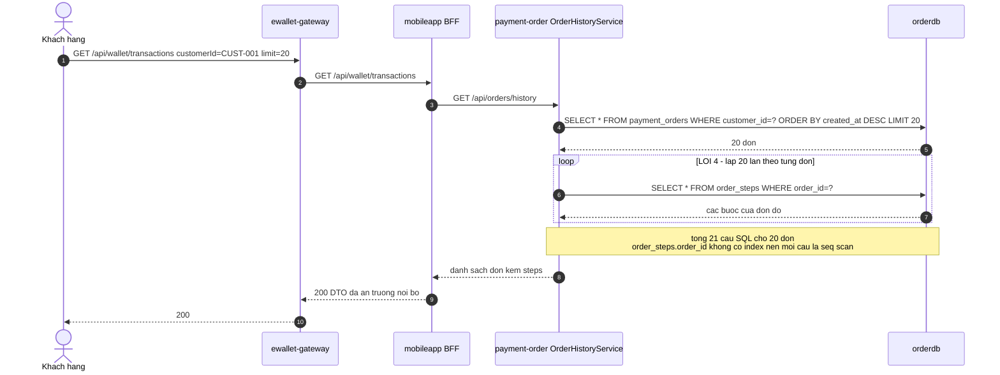
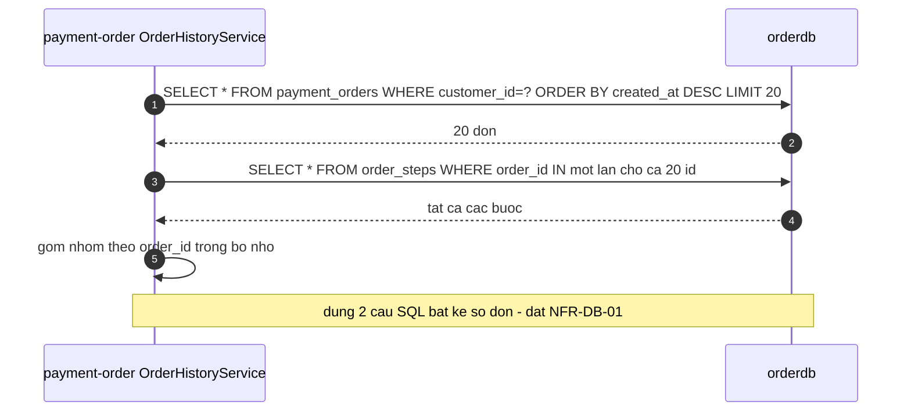

# F6 — Tra cứu lịch sử giao dịch (flow đọc)

| | |
|---|---|
| **Slug** | `transaction-history` |
| **Loại** | Chỉ đọc, đồng bộ |
| **Actor** | Khách hàng (app) hoặc Ops (qua route nội bộ) |
| **Trigger** | Khách mở tab "Lịch sử" trong app |
| **Service đi qua** | gateway → mobileapp → order → `orderdb` |
| **Đặc điểm** | Flow ngắn nhất, **không** gọi business / third-party / Kafka. Là nơi chứa lỗi DB (#4). |
| **Lỗi có chủ đích chạm vào** | **#4 (N+1 query + thiếu index)** |

> `architecture.md` §6 gọi đây là "flow đọc lịch sử". Tách thành F6 để có spec, rule và NFR riêng
> cho `database-quality-library` (Topic #80) đối chiếu.

---

# PHẦN 1 — REQUIREMENT

## 1.1 Mục tiêu

Hiển thị danh sách giao dịch gần nhất của khách kèm tiến trình xử lý từng đơn (các bước saga),
để khách tự đối chiếu và để Ops điều tra khi có khiếu nại.

## 1.2 Phạm vi

**Trong phạm vi**: liệt kê đơn theo khách, sắp xếp mới nhất trước, kèm các bước xử lý của mỗi đơn, phân trang.
**Ngoài phạm vi**: lọc theo khoảng ngày/loại giao dịch, xuất file, thống kê tổng hợp.

## 1.3 Tiền điều kiện

Khách đã có ít nhất một đơn trong `payment_orders`.

## 1.4 Luồng chính

| # | Bước | Thực hiện bởi |
|---|---|---|
| 1 | Khách gửi `GET /api/wallet/transactions?customerId=CUST-001&limit=20` | Client → gateway |
| 2 | Gateway route sang BFF | gateway |
| 3 | BFF gọi `GET /api/orders/history?customerId=...&limit=...` | mobileapp → order |
| 4 | Order truy vấn `payment_orders` theo `customer_id`, sắp xếp `created_at DESC`, giới hạn `limit` | order → `orderdb` |
| 5 | Với **mỗi** đơn, order truy vấn `order_steps` để lấy tiến trình | order → `orderdb` |
| 6 | Order gộp kết quả, trả danh sách | order |
| 7 | BFF map sang DTO client (ẩn trường nội bộ), trả `200` | mobileapp → client |

> Bước 4 + 5 chính là chỗ cài lỗi #4: bước 5 chạy **N lần** thay vì một truy vấn gộp.

## 1.5 Luồng phụ & ngoại lệ

| Mã | Điều kiện | Kết quả |
|---|---|---|
| **E1** | Khách chưa có giao dịch | `200` với `items: []`, `count: 0` |
| **E2** | Thiếu `customerId` | `400 MISSING_PARAMETER` |
| **E3** | `limit` > 100 | Kẹp về 100 (`R-HIST-03`) |
| **E4** | `limit` ≤ 0 hoặc không phải số | Dùng mặc định 20 |
| **E5** | Ops gọi qua route nội bộ `/orders/history` | Trả **đầy đủ** trường nội bộ (không ẩn) |

## 1.6 Business rule của flow

| Mã | Điều kiện | Hành động | Severity |
|---|---|---|---|
| `R-HIST-01` | Mọi truy vấn lịch sử | Chỉ trả đơn của đúng `customerId` được yêu cầu | must |
| `R-HIST-02` | Sắp xếp | `created_at DESC` (mới nhất trước) | must |
| `R-HIST-03` | `limit` | Mặc định 20, tối đa **100** | must |
| `R-HIST-04` | Trường trả về cho client | Ẩn `source_account_id`, `dest_account_id`, `idempotency_key` | must |
| `R-HIST-05` | Mỗi đơn | Kèm danh sách `order_steps` sắp xếp theo `created_at` tăng dần | should |
| `R-HIST-06` | Truy vấn dữ liệu | Lấy các bước của **nhiều đơn bằng một truy vấn** (`IN` hoặc `JOIN`), **không** lặp truy vấn theo từng đơn | must |
| `R-HIST-07` | Cột dùng để lọc/nối | Phải có index: `payment_orders(customer_id, created_at)` và `order_steps(order_id)` | must |

> ⚠️ `R-HIST-06` và `R-HIST-07` là hai rule mà code Stage C **cố ý vi phạm** — đó là lỗi #4.
> Spec vẫn phải ghi đúng, vì platform đối chiếu spec ↔ runtime.

## 1.7 NFR

| Mã | metric | operator | threshold | unit |
|---|---|---|---|---|
| `NFR-LAT-04` | `latency_p95` của `GET /api/orders/history` | `<` | 300 | ms |
| `NFR-DB-01` | Số câu SQL cho một lần gọi API | `<=` | 2 | queries |
| `NFR-DB-02` | `latency_p95` mỗi câu SQL | `<` | 50 | ms |

`NFR-DB-01` là NFR đặc thù cho `database-quality-library` — nó biến "N+1" từ khái niệm mơ hồ thành
một ngưỡng đo được.

## 1.8 Acceptance criteria

```gherkin
Scenario: Tra cuu lich su tra ve don moi nhat truoc
  Given CUST-001 co 5 don
  When goi GET /api/wallet/transactions customerId=CUST-001 limit=20
  Then response 200 va count=5
  And don dau tien la don co created_at lon nhat
  And moi don co danh sach steps

Scenario: Gioi han limit toi da
  When goi voi limit=500
  Then he thong chi tra toi da 100 don

Scenario: Khach chua co giao dich
  When goi voi customerId=CUST-NEW
  Then response 200 va items rong

Scenario: So cau SQL phai khong phu thuoc so don
  Given CUST-001 co 50 don
  When goi GET /api/orders/history limit=50
  Then tong so cau SQL phai <= 2       # LOI #4 lam kich ban nay that bai voi 51 cau
```

---

# PHẦN 2 — DESIGN

## 2.1 Service tham gia

| Service | Vai trò | Class chính |
|---|---|---|
| `ewallet-gateway` | Route `/api/wallet/**` → BFF; route `/orders/**` → order (Ops) | — |
| `mobileapp` | Gọi order, map DTO, ẩn trường nội bộ | `web.WalletController`, `client.OrderClient` |
| `payment-order` | Truy vấn `orderdb` | `web.OrderController`, `history.OrderHistoryService`, `repo.PaymentOrderRepository`, `repo.OrderStepRepository` |

Không có gRPC, không có Kafka, không có HTTP ra ngoài.

## 2.2 Sequence diagram — hiện trạng có lỗi #4



## 2.3 Sequence diagram — cách làm đúng theo spec



Hai sơ đồ trên đặt cạnh nhau chính là "bằng chứng trực quan" mà AI Agent phải tự rút ra được
từ Knowledge Graph, không cần người chỉ.

## 2.4 Chi tiết lỗi có chủ đích #4

| Thành phần | Cài đặt cố ý sai |
|---|---|
| Truy vấn | Vòng lặp `for (order : orders) { stepRepo.findByOrderId(order.getId()) }` — N+1 |
| Index | **Không** tạo index trên `order_steps(order_id)` (đã ghi chú trong `V1__init.sql`) |
| Index | **Không** tạo index trên `payment_orders(customer_id)` (ghi chú trong `V2__business.sql`) |
| Hệ quả đo được | `SqlPattern.call_count` của `SELECT ... FROM order_steps WHERE order_id = ?` cao bất thường |

**Điều `database-quality-library` (Topic #80) phải bắt được:**

| Rule | Bằng chứng |
|---|---|
| `N_PLUS_ONE` | Cùng một `normalized_sql` được gọi N lần trong một request, `called_from = OrderHistoryService:<line>` |
| `MISSING_INDEX` | `order_steps.order_id` và `payment_orders.customer_id` không có index (từ `schema-snapshot`) |
| `SLOW_QUERY` | `p95_ms` tăng theo số dòng khi dữ liệu lớn |

**Điều Trace Analyzer phải bắt được:**

| Dấu hiệu | Giá trị |
|---|---|
| Số span `db` trong 1 trace | 21 (thay vì 2) |
| `db.statement` lặp lại | cùng câu, khác tham số |
| `latency_p95` endpoint | vượt `NFR-LAT-04` khi dữ liệu nhiều |

Hai nguồn này **độc lập** cùng chỉ về một chỗ — đó là giá trị của việc hợp nhất trong Knowledge Graph.

## 2.5 Dữ liệu truy cập

| DB | Bảng | Thao tác | Số lần |
|---|---|---|---|
| `orderdb` | `payment_orders` | SELECT theo `customer_id` | 1 |
| `orderdb` | `order_steps` | SELECT theo `order_id` | **N** (đúng ra là 1) |

Không ghi dữ liệu. Không phát event.

## 2.6 Quan sát kỳ vọng

```
ewallet-gateway   GET /api/wallet/transactions        (SERVER, root)
└─ mobileapp      GET /api/wallet/transactions        (SERVER)
   └─ order       GET /api/orders/history             (SERVER)
      ├─ order    SELECT payment_orders               (CLIENT, db)
      ├─ order    SELECT order_steps                  (CLIENT, db)   <- lap N lan
      ├─ order    SELECT order_steps                  (CLIENT, db)
      └─ ...
```

**Baseline gợi ý**: với 5 đơn → 6 span DB, p95 ≈ 30–60ms. Với 50 đơn → 51 span DB, p95 tăng tuyến tính.
Chính độ dốc tuyến tính này là dấu hiệu N+1, không phải giá trị tuyệt đối.

## 2.7 Cách tạo dữ liệu để lỗi #4 lộ rõ

Lỗi N+1 chỉ nhìn thấy khi có đủ dữ liệu. Trước khi demo:

```bash
# Tao 50 giao dich nho cho CUST-001 de lich su du dai
for i in $(seq 1 50); do
  curl -s -X POST http://localhost:18080/api/wallet/transfer \
    -H "Content-Type: application/json" -H "X-Idempotency-Key: $(uuidgen)" \
    -d '{"customerId":"CUST-001","destCustomerId":"CUST-002","amount":10000,"currency":"VND"}' > /dev/null
done
```

Sau đó gọi lịch sử và xem dashboard db-quality của order ở <http://localhost:19082>.

---

# PHẦN 3 — TEST & DEMO

## 3.1 Kịch bản demo

```bash
# 1. Duong client qua BFF
curl -s "http://localhost:18080/api/wallet/transactions?customerId=CUST-001&limit=20"

# 2. Duong noi bo Ops - qua gateway route /orders/**
curl -s "http://localhost:18080/orders/history?customerId=CUST-001&limit=20"

# 3. Goi thang service order
curl -s "http://localhost:18082/api/orders/history?customerId=CUST-001&limit=50"

# 4. Bat lỗi #4 bang dashboard db-quality cua order
curl -s -X POST http://localhost:19082/analyze-now
curl -s http://localhost:19082/findings | jq '.[] | select(.rule=="N_PLUS_ONE")'
curl -s http://localhost:19082/collected-queries | jq '.[] | {sql: .normalizedSql, count: .callCount, from: .calledFrom}'
```

## 3.2 Kiểm chứng

1. Dashboard db-quality của order (<http://localhost:19082>) hiện finding `N_PLUS_ONE` với `calledFrom`
   trỏ đúng vào `OrderHistoryService`.
2. `schema-snapshot` cho thấy `order_steps` không có index trên `order_id` → finding `MISSING_INDEX`.
3. Jaeger: một trace của `GET /api/orders/history` có ~51 span DB khi có 50 đơn.
4. Gọi lại với `limit=5` → chỉ 6 span DB → chứng minh số query phụ thuộc số đơn.

## 3.3 Test suite (Stage E)

F6 **có** test chức năng (trả đúng đơn, đúng thứ tự, đúng `limit`) — và test này **xanh**,
vì N+1 không làm sai kết quả, chỉ làm chậm. Đây là minh hoạ trực tiếp cho luận điểm của đề tài:
*"test coverage cao nhưng vẫn có bug ở production, vì những gì test kiểm tra và runtime behavior thực tế
là hai tập khác nhau"*.
